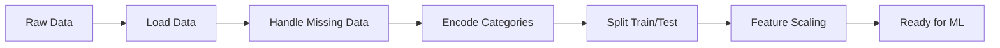

# Bài 0: Data Preprocessing (Tiền xử lý dữ liệu)

## Tổng quan
Data Preprocessing là bước quan trọng nhất trong Machine Learning. Dữ liệu thô thường không sạch, thiếu giá trị, hoặc có định dạng không phù hợp. Bước này chuẩn bị dữ liệu để model học tốt hơn.



## Các thư viện cần thiết

### 1. **NumPy** - Xử lý mảng số học
```python
import numpy as np
```
- **Mục đích**: Làm việc với arrays (mảng) và ma trận
- **Cú pháp quan trọng**:
  - `np.array([1, 2, 3])` - tạo mảng
  - `np.nan` - giá trị bị thiếu (Not a Number)
  - `arr[:, 1:3]` - slicing: lấy tất cả hàng, cột từ 1 đến 2

### 2. **Pandas** - Đọc và xử lý CSV
```python
import pandas as pd
```
- **Mục đích**: Đọc file CSV, Excel và thao tác với bảng dữ liệu (DataFrame)
- **Cú pháp quan trọng**:
  ```python
  dataset = pd.read_csv('Data.csv')  # Đọc file CSV
  X = dataset.iloc[:, :-1].values     # Lấy tất cả cột trừ cột cuối (features)
  y = dataset.iloc[:, -1].values      # Lấy cột cuối (target/label)
  ```
  - `iloc[rows, cols]` - chọn theo vị trí
  - `:-1` - tất cả trừ phần tử cuối
  - `.values` - chuyển DataFrame thành NumPy array

### 3. **Matplotlib** - Vẽ biểu đồ
```python
import matplotlib.pyplot as plt
```
- **Mục đích**: Visualize dữ liệu và kết quả
- **Cú pháp**:
  ```python
  plt.scatter(X, y)  # Vẽ scatter plot
  plt.show()         # Hiển thị chart
  ```

## Các bước preprocessing chi tiết

### Bước 1: Load dữ liệu
```python
dataset = pd.read_csv('Data.csv')
X = dataset.iloc[:, :-1].values  # Features (input)
y = dataset.iloc[:, -1].values   # Target (output)
```
**Giải thích**:
- `X` = các cột đầu vào (ví dụ: tuổi, lương)
- `y` = cột đầu ra/nhãn (ví dụ: có mua sản phẩm hay không)

### Bước 2: Xử lý dữ liệu bị thiếu (Missing Data)
```python
from sklearn.impute import SimpleImputer

imputer = SimpleImputer(missing_values=np.nan, strategy='mean')
imputer.fit(X[:, 1:3])           # Học giá trị trung bình từ cột 1,2
X[:, 1:3] = imputer.transform(X[:, 1:3])  # Thay thế NaN bằng mean
```
**Giải thích**:
- `missing_values=np.nan` - tìm các ô trống
- `strategy='mean'` - thay thế bằng giá trị trung bình
- **Các strategy khác**: `'median'`, `'most_frequent'`, `'constant'`
- **fit()** - tính toán thống kê (mean, median...)
- **transform()** - áp dụng thay đổi

### Bước 3: Encode dữ liệu phân loại (Categorical Data)

#### 3a. Encode cột input (Independent Variable) - One-Hot Encoding
```python
from sklearn.compose import ColumnTransformer
from sklearn.preprocessing import OneHotEncoder

ct = ColumnTransformer(
    transformers=[('encoder', OneHotEncoder(), [0])],  # Encode cột 0
    remainder='passthrough'  # Giữ nguyên các cột khác
)
X = np.array(ct.fit_transform(X))
```
**Giải thích**:
- **One-Hot Encoding**: chuyển category thành binary columns
  - Ví dụ: `['France', 'Spain', 'Germany']` → `[1,0,0], [0,1,0], [0,0,1]`
- **Tại sao**: ML model chỉ hiểu số, không hiểu text
- `[0]` - chỉ số cột cần encode (cột đầu tiên)
- `remainder='passthrough'` - giữ nguyên cột còn lại

#### 3b. Encode cột output (Dependent Variable) - Label Encoding
```python
from sklearn.preprocessing import LabelEncoder

le = LabelEncoder()
y = le.fit_transform(y)  # 'Yes' → 1, 'No' → 0
```
**Giải thích**:
- **Label Encoding**: chuyển category thành số nguyên
  - Ví dụ: `['Yes', 'No', 'Yes']` → `[1, 0, 1]`
- Dùng cho **target variable** khi classification

### Bước 4: Chia Train/Test set
```python
from sklearn.model_selection import train_test_split

X_train, X_test, y_train, y_test = train_test_split(
    X, y,
    test_size=0.2,    # 20% cho test
    random_state=0    # Seed để kết quả reproducible
)
```
**Giải thích**:
- **Train set**: dùng để model học (80%)
- **Test set**: dùng để đánh giá model (20%)
- **random_state**: fix seed để kết quả không đổi mỗi lần chạy
- **Quan trọng**: KHÔNG BAO GIỜ train trên test set!

### Bước 5: Feature Scaling
```python
from sklearn.preprocessing import StandardScaler

sc = StandardScaler()
X_train[:, 3:] = sc.fit_transform(X_train[:, 3:])  # Fit trên train
X_test[:, 3:] = sc.transform(X_test[:, 3:])        # Transform test
```
**Giải thích**:
- **Tại sao**: Các features có đơn vị khác nhau (tuổi: 20-60, lương: 30000-100000) → model bị bias
- **StandardScaler**: $(x - mean) / std$ → giá trị về khoảng ~[-3, 3]
- **Quan trọng**:
  - `fit_transform()` trên **train** (học mean, std)
  - `transform()` trên **test** (dùng mean, std từ train)
  - Không fit trên test để tránh data leakage!
- **Lưu ý**: Không scale cột One-Hot (đã là 0 hoặc 1)

## So sánh fit_transform() vs transform()

| Method | Dùng khi nào | Giải thích |
|--------|--------------|------------|
| `fit_transform(X_train)` | Training data | Học parameters (mean, std) VÀ transform |
| `transform(X_test)` | Test/new data | Chỉ transform, dùng parameters đã học |

## Ví dụ thực tế: Data.csv

Giả sử bạn có file Data.csv:
```
Country,Age,Salary,Purchased
France,44,72000,No
Spain,27,48000,Yes
Germany,30,54000,No
France,38,,Yes
Spain,40,NaN,No
```

**Sau preprocessing**:
1. Missing `Salary` → điền mean
2. `Country` → One-Hot: `[1,0,0]`, `[0,1,0]`, `[0,0,1]`
3. `Purchased` → Label: `Yes=1`, `No=0`
4. Scale `Age`, `Salary` về cùng tỷ lệ

## Sai lầm thường gặp

❌ **Sai**: Fit scaler trên toàn bộ data trước khi split
```python
X = sc.fit_transform(X)  # WRONG!
X_train, X_test = train_test_split(X, y)
```

✅ **Đúng**: Split trước, rồi fit chỉ trên train
```python
X_train, X_test = train_test_split(X, y)
X_train = sc.fit_transform(X_train)
X_test = sc.transform(X_test)
```

## Kết nối với .NET
- Khi deploy model, bạn PHẢI lưu lại `scaler`, `encoder` bằng `joblib`
- Trong .NET, trước khi gọi prediction API, phải encode và scale giống hệt như training
- Ví dụ: nếu training dùng One-Hot cho `Country`, .NET phải gửi array `[1,0,0]` chứ không phải `"France"`

## Bài tập
1. Chạy [data_preprocessing_tools.py](data_preprocessing_tools.py)
2. Thay đổi `strategy='median'` thay vì `'mean'`
3. Thử `test_size=0.3` (30% test)
4. Quan sát `print(X_train)` trước và sau scaling

## Tài liệu tham khảo
- [Sklearn Preprocessing](https://scikit-learn.org/stable/modules/preprocessing.html)
- [Pandas iloc](https://pandas.pydata.org/docs/reference/api/pandas.DataFrame.iloc.html)
