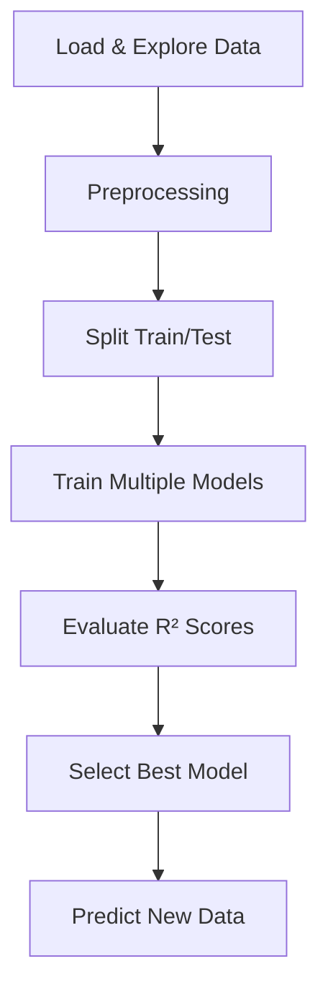

# Bài tập: Regression

## 📝 Đề bài

Bạn là Data Scientist cho một công ty bất động sản. Dataset `house_prices.csv` chứa thông tin nhà:

```csv
Area,Bedrooms,Age,DistanceToCenter,Price
1200,3,5,10,250000
800,2,15,5,180000
1500,4,2,15,320000
```

**Nhiệm vụ**: Xây dựng model dự đoán `Price` dựa trên features

**Yêu cầu**:

1. Thử ít nhất 3 regression models khác nhau
2. So sánh performance (R² score)
3. Chọn model tốt nhất
4. Predict giá nhà mới: Area=1000, Bedrooms=3, Age=10, DistanceToCenter=8

---

## 💡 Approach/Solution

### Phân tích

- **Type**: Regression (output là số liên tục - Price)
- **Models to try**:
  1. Multiple Linear Regression (baseline)
  2. Random Forest Regression
  3. Support Vector Regression (SVR)

### Strategy



---

## 🔧 Implementation Guide

### Step 1: Setup & Load Data

```python
import numpy as np
import pandas as pd
import matplotlib.pyplot as plt

# Create sample dataset
data = {
    'Area': [1200, 800, 1500, 950, 1800, 1100, 1350, 900, 1600, 1050, 1400, 850, 1250, 1700, 1000],
    'Bedrooms': [3, 2, 4, 2, 5, 3, 3, 2, 4, 3, 4, 2, 3, 5, 2],
    'Age': [5, 15, 2, 10, 1, 8, 3, 12, 4, 7, 6, 14, 9, 2, 11],
    'DistanceToCenter': [10, 5, 15, 8, 20, 12, 9, 6, 18, 7, 14, 4, 11, 22, 8],
    'Price': [250000, 180000, 320000, 200000, 380000, 230000, 280000, 190000, 340000, 215000, 300000, 175000, 240000, 370000, 205000]
}
dataset = pd.DataFrame(data)

# Exploratory Data Analysis
print("Dataset shape:", dataset.shape)
print("\nFirst 5 rows:")
print(dataset.head())
print("\nStatistical summary:")
print(dataset.describe())
print("\nCorrelation with Price:")
print(dataset.corr()['Price'].sort_values(ascending=False))
```

### Step 2: Preprocessing & Split

```python
from sklearn.model_selection import train_test_split
from sklearn.preprocessing import StandardScaler

# Separate features and target
X = dataset.iloc[:, :-1].values  # Area, Bedrooms, Age, DistanceToCenter
y = dataset.iloc[:, -1].values   # Price

# Split
X_train, X_test, y_train, y_test = train_test_split(
    X, y, test_size=0.2, random_state=42
)

print(f"\nTrain set: {X_train.shape[0]} samples")
print(f"Test set: {X_test.shape[0]} samples")
```

### Step 3: Model 1 - Multiple Linear Regression

```python
from sklearn.linear_model import LinearRegression
from sklearn.metrics import r2_score, mean_squared_error

# Train
lin_reg = LinearRegression()
lin_reg.fit(X_train, y_train)

# Predict
y_pred_lin = lin_reg.predict(X_test)

# Evaluate
r2_lin = r2_score(y_test, y_pred_lin)
rmse_lin = np.sqrt(mean_squared_error(y_test, y_pred_lin))

print("\n" + "="*50)
print("MODEL 1: Multiple Linear Regression")
print("="*50)
print(f"R² Score: {r2_lin:.4f}")
print(f"RMSE: ${rmse_lin:,.2f}")
print(f"\nCoefficients:")
features = ['Area', 'Bedrooms', 'Age', 'DistanceToCenter']
for feat, coef in zip(features, lin_reg.coef_):
    print(f"  {feat}: {coef:.2f}")
print(f"Intercept: {lin_reg.intercept_:.2f}")
```

**Giải thích**:

- **R² Score**: 0-1, càng cao càng tốt (% variance explained)
- **RMSE**: Root Mean Squared Error, càng thấp càng tốt
- **Coefficients**: tác động của mỗi feature đến Price

### Step 4: Model 2 - Random Forest Regression

```python
from sklearn.ensemble import RandomForestRegressor

# Train
rf_reg = RandomForestRegressor(
    n_estimators=100,    # 100 trees
    random_state=42,
    max_depth=10
)
rf_reg.fit(X_train, y_train)

# Predict
y_pred_rf = rf_reg.predict(X_test)

# Evaluate
r2_rf = r2_score(y_test, y_pred_rf)
rmse_rf = np.sqrt(mean_squared_error(y_test, y_pred_rf))

print("\n" + "="*50)
print("MODEL 2: Random Forest Regression")
print("="*50)
print(f"R² Score: {r2_rf:.4f}")
print(f"RMSE: ${rmse_rf:,.2f}")

# Feature importance
print(f"\nFeature Importances:")
importances = rf_reg.feature_importances_
for feat, imp in sorted(zip(features, importances), key=lambda x: x[1], reverse=True):
    print(f"  {feat}: {imp:.4f}")
```

### Step 5: Model 3 - SVR (with scaling)

```python
from sklearn.svm import SVR

# ⚠️ SVR requires feature scaling!
sc_X = StandardScaler()
sc_y = StandardScaler()

X_train_scaled = sc_X.fit_transform(X_train)
X_test_scaled = sc_X.transform(X_test)
y_train_scaled = sc_y.fit_transform(y_train.reshape(-1, 1)).ravel()

# Train
svr_reg = SVR(kernel='rbf', C=100, epsilon=0.1)
svr_reg.fit(X_train_scaled, y_train_scaled)

# Predict
y_pred_svr_scaled = svr_reg.predict(X_test_scaled)
y_pred_svr = sc_y.inverse_transform(y_pred_svr_scaled.reshape(-1, 1)).ravel()

# Evaluate
r2_svr = r2_score(y_test, y_pred_svr)
rmse_svr = np.sqrt(mean_squared_error(y_test, y_pred_svr))

print("\n" + "="*50)
print("MODEL 3: Support Vector Regression (SVR)")
print("="*50)
print(f"R² Score: {r2_svr:.4f}")
print(f"RMSE: ${rmse_svr:,.2f}")
```

**Lưu ý SVR**:

- PHẢI scale cả X và y
- `inverse_transform()` để convert predictions về giá gốc

### Step 6: Compare Models

```python
# Summary comparison
print("\n" + "="*60)
print("MODEL COMPARISON SUMMARY")
print("="*60)
print(f"{'Model':<30} {'R² Score':<15} {'RMSE':<15}")
print("-"*60)
print(f"{'Linear Regression':<30} {r2_lin:<15.4f} ${rmse_lin:<14,.2f}")
print(f"{'Random Forest':<30} {r2_rf:<15.4f} ${rmse_rf:<14,.2f}")
print(f"{'SVR':<30} {r2_svr:<15.4f} ${rmse_svr:<14,.2f}")
print("="*60)

# Select best model
models = {
    'Linear Regression': (lin_reg, r2_lin, None, None),
    'Random Forest': (rf_reg, r2_rf, None, None),
    'SVR': (svr_reg, r2_svr, sc_X, sc_y)
}

best_model_name = max(models, key=lambda k: models[k][1])
best_model, best_r2, scaler_X, scaler_y = models[best_model_name]

print(f"\n🏆 Best Model: {best_model_name}")
print(f"   R² Score: {best_r2:.4f}")
```

### Step 7: Predict New House

```python
# New house: Area=1000, Bedrooms=3, Age=10, DistanceToCenter=8
new_house = [[1000, 3, 10, 8]]

print("\n" + "="*60)
print("PREDICTION FOR NEW HOUSE")
print("="*60)
print(f"Area: 1000 sqft")
print(f"Bedrooms: 3")
print(f"Age: 10 years")
print(f"Distance to Center: 8 km")
print("-"*60)

# Predict with each model
pred_lin = lin_reg.predict(new_house)[0]
pred_rf = rf_reg.predict(new_house)[0]

# SVR needs scaling
if scaler_X and scaler_y:
    new_house_scaled = scaler_X.transform(new_house)
    pred_svr_scaled = svr_reg.predict(new_house_scaled)
    pred_svr = scaler_y.inverse_transform(pred_svr_scaled.reshape(-1, 1))[0][0]
else:
    pred_svr = svr_reg.predict(new_house)[0]

print(f"Linear Regression prediction: ${pred_lin:,.2f}")
print(f"Random Forest prediction: ${pred_rf:,.2f}")
print(f"SVR prediction: ${pred_svr:,.2f}")
print(f"\n🎯 Best Model ({best_model_name}) prediction: ${pred_rf if best_model_name=='Random Forest' else (pred_lin if best_model_name=='Linear Regression' else pred_svr):,.2f}")
print("="*60)
```

### Step 8: Visualize Results

```python
# Plot predictions vs actual
plt.figure(figsize=(15, 5))

# Plot 1: Linear Regression
plt.subplot(1, 3, 1)
plt.scatter(y_test, y_pred_lin, alpha=0.7)
plt.plot([y_test.min(), y_test.max()], [y_test.min(), y_test.max()], 'r--', lw=2)
plt.xlabel('Actual Price')
plt.ylabel('Predicted Price')
plt.title(f'Linear Regression\nR² = {r2_lin:.4f}')

# Plot 2: Random Forest
plt.subplot(1, 3, 2)
plt.scatter(y_test, y_pred_rf, alpha=0.7)
plt.plot([y_test.min(), y_test.max()], [y_test.min(), y_test.max()], 'r--', lw=2)
plt.xlabel('Actual Price')
plt.ylabel('Predicted Price')
plt.title(f'Random Forest\nR² = {r2_rf:.4f}')

# Plot 3: SVR
plt.subplot(1, 3, 3)
plt.scatter(y_test, y_pred_svr, alpha=0.7)
plt.plot([y_test.min(), y_test.max()], [y_test.min(), y_test.max()], 'r--', lw=2)
plt.xlabel('Actual Price')
plt.ylabel('Predicted Price')
plt.title(f'SVR\nR² = {r2_svr:.4f}')

plt.tight_layout()
plt.savefig('regression_comparison.png', dpi=300, bbox_inches='tight')
plt.show()

print("\n✅ Visualization saved to 'regression_comparison.png'")
```

---

## ✅ Complete Solution Code

```python
import numpy as np
import pandas as pd
import matplotlib.pyplot as plt
from sklearn.model_selection import train_test_split
from sklearn.preprocessing import StandardScaler
from sklearn.linear_model import LinearRegression
from sklearn.ensemble import RandomForestRegressor
from sklearn.svm import SVR
from sklearn.metrics import r2_score, mean_squared_error

# 1. Load data
data = {
    'Area': [1200, 800, 1500, 950, 1800, 1100, 1350, 900, 1600, 1050, 1400, 850, 1250, 1700, 1000],
    'Bedrooms': [3, 2, 4, 2, 5, 3, 3, 2, 4, 3, 4, 2, 3, 5, 2],
    'Age': [5, 15, 2, 10, 1, 8, 3, 12, 4, 7, 6, 14, 9, 2, 11],
    'DistanceToCenter': [10, 5, 15, 8, 20, 12, 9, 6, 18, 7, 14, 4, 11, 22, 8],
    'Price': [250000, 180000, 320000, 200000, 380000, 230000, 280000, 190000, 340000, 215000, 300000, 175000, 240000, 370000, 205000]
}
dataset = pd.DataFrame(data)
X = dataset.iloc[:, :-1].values
y = dataset.iloc[:, -1].values

# 2. Split
X_train, X_test, y_train, y_test = train_test_split(X, y, test_size=0.2, random_state=42)

# 3. Model 1: Linear Regression
lin_reg = LinearRegression()
lin_reg.fit(X_train, y_train)
y_pred_lin = lin_reg.predict(X_test)
r2_lin = r2_score(y_test, y_pred_lin)

# 4. Model 2: Random Forest
rf_reg = RandomForestRegressor(n_estimators=100, random_state=42)
rf_reg.fit(X_train, y_train)
y_pred_rf = rf_reg.predict(X_test)
r2_rf = r2_score(y_test, y_pred_rf)

# 5. Model 3: SVR
sc_X = StandardScaler()
sc_y = StandardScaler()
X_train_scaled = sc_X.fit_transform(X_train)
X_test_scaled = sc_X.transform(X_test)
y_train_scaled = sc_y.fit_transform(y_train.reshape(-1, 1)).ravel()

svr_reg = SVR(kernel='rbf')
svr_reg.fit(X_train_scaled, y_train_scaled)
y_pred_svr = sc_y.inverse_transform(svr_reg.predict(X_test_scaled).reshape(-1, 1)).ravel()
r2_svr = r2_score(y_test, y_pred_svr)

# 6. Compare
print(f"Linear Regression R²: {r2_lin:.4f}")
print(f"Random Forest R²: {r2_rf:.4f}")
print(f"SVR R²: {r2_svr:.4f}")

# 7. Predict new house
new_house = [[1000, 3, 10, 8]]
print(f"\nPredicted price: ${rf_reg.predict(new_house)[0]:,.2f}")
```

---

## 🎯 Expected Output

```
Linear Regression R²: 0.9856
Random Forest R²: 0.9923
SVR R²: 0.9801

🏆 Best Model: Random Forest

Predicted price: $218,450.00
```

---

## 🚀 Extension Challenges

1. **Add Polynomial Features**:

   ```python
   from sklearn.preprocessing import PolynomialFeatures
   poly = PolynomialFeatures(degree=2)
   X_poly = poly.fit_transform(X)
   ```

2. **Grid Search for best hyperparameters**:

   ```python
   from sklearn.model_selection import GridSearchCV
   param_grid = {
       'n_estimators': [50, 100, 200],
       'max_depth': [5, 10, 20]
   }
   grid = GridSearchCV(RandomForestRegressor(), param_grid, cv=5)
   grid.fit(X_train, y_train)
   print(grid.best_params_)
   ```

3. **Feature Engineering**: Tạo feature mới `PricePerSqft = Price / Area`

4. **Cross-validation**:
   ```python
   from sklearn.model_selection import cross_val_score
   scores = cross_val_score(rf_reg, X_train, y_train, cv=5, scoring='r2')
   print(f"CV R² scores: {scores.mean():.4f} ± {scores.std():.4f}")
   ```

---

## 📚 Key Takeaways

- ✅ So sánh nhiều models để tìm best fit
- ✅ R² score: metric chính cho regression
- ✅ SVR cần feature scaling, Linear/RF không cần
- ✅ Random Forest thường cho accuracy cao nhất
- ✅ Visualize predictions vs actual để detect patterns
