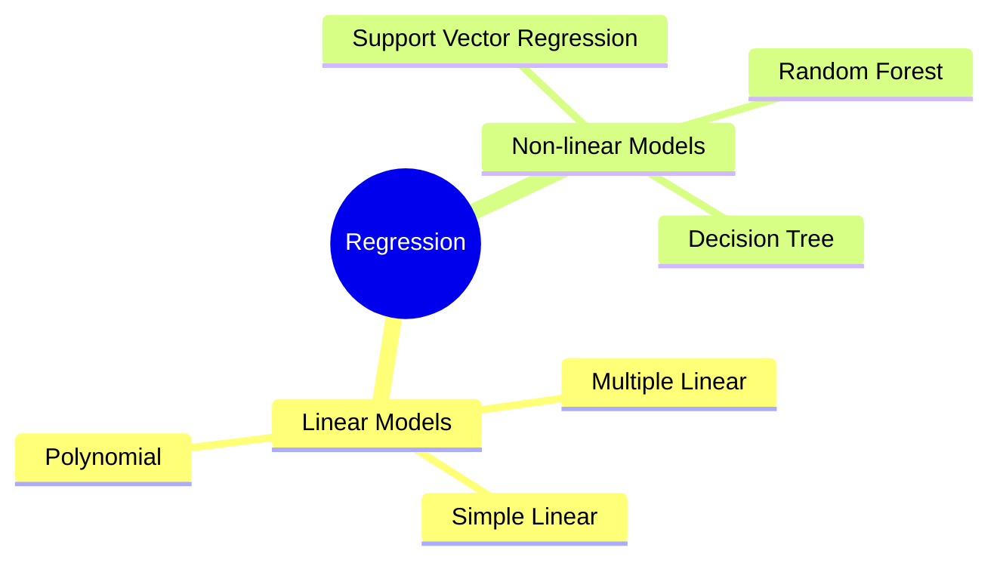
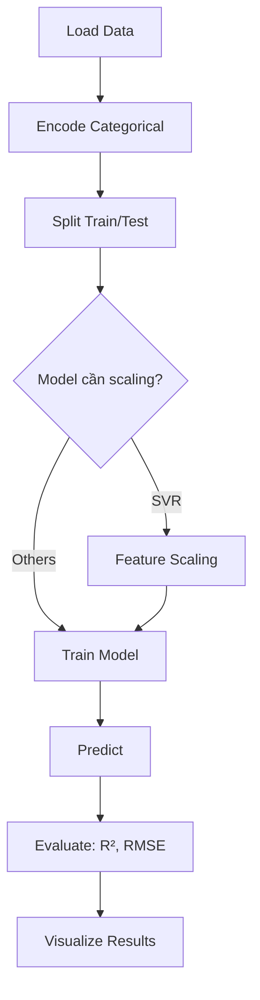

# Bài 1: Regression (Hồi quy)

## Tổng quan
**Regression** dự đoán giá trị **liên tục** (continuous value). Ví dụ: dự đoán giá nhà, lương, nhiệt độ, giá cổ phiếu.



## Khi nào dùng Regression?
- Output là **số** (không phải category)
- Ví dụ: giá nhà ($150,000), lương ($75,000), doanh số (1.2M)

## 1. Simple Linear Regression

### Công thức toán học
$$y = b_0 + b_1 \cdot x$$
- $y$ = giá trị dự đoán
- $x$ = input feature
- $b_0$ = intercept (hệ số chặn)
- $b_1$ = slope (hệ số góc)

### Ví dụ: Dự đoán lương dựa trên kinh nghiệm
**Dataset**: `Salary_Data.csv` (YearsExperience, Salary)

```python
# 1. Import thư viện
import numpy as np
import pandas as pd
from sklearn.model_selection import train_test_split
from sklearn.linear_model import LinearRegression
import matplotlib.pyplot as plt

# 2. Load data
dataset = pd.read_csv('Salary_Data.csv')
X = dataset.iloc[:, :-1].values  # YearsExperience
y = dataset.iloc[:, -1].values   # Salary

# 3. Split train/test
X_train, X_test, y_train, y_test = train_test_split(
    X, y, test_size=1/3, random_state=0
)

# 4. Train model
regressor = LinearRegression()
regressor.fit(X_train, y_train)

# 5. Predict
y_pred = regressor.predict(X_test)

# 6. Visualize
plt.scatter(X_train, y_train, color='red')      # Training points
plt.plot(X_train, regressor.predict(X_train), color='blue')  # Line
plt.title('Salary vs Experience (Training set)')
plt.xlabel('Years of Experience')
plt.ylabel('Salary')
plt.show()
```

### Chi tiết syntax

#### LinearRegression()
```python
from sklearn.linear_model import LinearRegression
regressor = LinearRegression()
```
- **fit(X, y)**: học coefficient từ training data
- **predict(X)**: dự đoán giá trị mới
- **coef_**: hệ số $b_1$ (slope)
- **intercept_**: hệ số $b_0$ (intercept)

#### Ví dụ lấy coefficients
```python
print(f"Slope (b1): {regressor.coef_[0]}")
print(f"Intercept (b0): {regressor.intercept_}")
# Output: Slope: 9312.57, Intercept: 26816.19
# → Lương = 26816 + 9312 * số năm kinh nghiệm
```

---

## 2. Multiple Linear Regression

### Công thức
$$y = b_0 + b_1 x_1 + b_2 x_2 + ... + b_n x_n$$
- Nhiều features ($x_1, x_2, ..., x_n$)
- Ví dụ: dự đoán profit dựa trên R&D Spend, Administration, Marketing Spend

### Ví dụ: Dự đoán lợi nhuận startup
**Dataset**: `50_Startups.csv` (R&D, Admin, Marketing, State, Profit)

```python
# 1. Import
from sklearn.linear_model import LinearRegression
from sklearn.compose import ColumnTransformer
from sklearn.preprocessing import OneHotEncoder

# 2. Load data
dataset = pd.read_csv('50_Startups.csv')
X = dataset.iloc[:, :-1].values  # R&D, Admin, Marketing, State
y = dataset.iloc[:, -1].values   # Profit

# 3. Encode categorical 'State'
ct = ColumnTransformer(
    transformers=[('encoder', OneHotEncoder(), [3])],  # Cột 3 = State
    remainder='passthrough'
)
X = np.array(ct.fit_transform(X))

# 4. Split
X_train, X_test, y_train, y_test = train_test_split(X, y, test_size=0.2, random_state=0)

# 5. Train
regressor = LinearRegression()
regressor.fit(X_train, y_train)

# 6. Predict
y_pred = regressor.predict(X_test)

# 7. So sánh y_pred vs y_test
np.set_printoptions(precision=2)
print(np.concatenate((y_pred.reshape(len(y_pred),1), y_test.reshape(len(y_test),1)), 1))
```

### Lưu ý Multiple Regression
- **Không cần Feature Scaling** cho Linear Regression (model tự điều chỉnh coefficients)
- **Phải encode categorical** features (One-Hot Encoding)
- Model tự động tránh **dummy variable trap** (không cần drop cột)

---

## 3. Polynomial Regression

### Công thức
$$y = b_0 + b_1 x + b_2 x^2 + b_3 x^3 + ... + b_n x^n$$
- Dùng khi **quan hệ không tuyến tính** (curved relationship)

### Ví dụ: Dự đoán lương theo vị trí (Position vs Salary)
**Dataset**: `Position_Salaries.csv` (Position level 1-10, Salary không tuyến tính)

```python
from sklearn.linear_model import LinearRegression
from sklearn.preprocessing import PolynomialFeatures

# 1. Load data
dataset = pd.read_csv('Position_Salaries.csv')
X = dataset.iloc[:, 1:-1].values  # Level (1-10)
y = dataset.iloc[:, -1].values    # Salary

# 2. Create polynomial features
poly_reg = PolynomialFeatures(degree=4)  # Degree = bậc đa thức
X_poly = poly_reg.fit_transform(X)
# X_poly = [1, x, x^2, x^3, x^4]

# 3. Train Linear Regression trên polynomial features
lin_reg = LinearRegression()
lin_reg.fit(X_poly, y)

# 4. Predict (ví dụ: level 6.5)
lin_reg.predict(poly_reg.transform([[6.5]]))
```

### Chi tiết PolynomialFeatures
```python
from sklearn.preprocessing import PolynomialFeatures
poly = PolynomialFeatures(degree=3)
```
- **degree**: bậc đa thức (2, 3, 4...)
- **fit_transform(X)**: tạo cột $x, x^2, x^3, ...$
  - Input: `[[2]]` → Output: `[[1, 2, 4, 8]]` (degree=3)
- **include_bias=True** (default): thêm cột `1` cho intercept

### Visualize kết quả
```python
X_grid = np.arange(min(X), max(X), 0.1)  # Smooth curve
X_grid = X_grid.reshape((len(X_grid), 1))
plt.scatter(X, y, color='red')
plt.plot(X_grid, lin_reg.predict(poly_reg.transform(X_grid)), color='blue')
plt.title('Polynomial Regression')
plt.show()
```

---

## 4. Support Vector Regression (SVR)

### Tổng quan
- Model phi tuyến tính mạnh mẽ, dùng **kernel tricks**
- **Quan trọng**: PHẢI **Feature Scaling**!

### Ví dụ
```python
from sklearn.svm import SVR
from sklearn.preprocessing import StandardScaler

# 1. Load data
X = dataset.iloc[:, 1:-1].values
y = dataset.iloc[:, -1].values
y = y.reshape(len(y), 1)  # SVR cần y là 2D

# 2. Feature Scaling (BẮT BUỘC!)
sc_X = StandardScaler()
sc_y = StandardScaler()
X = sc_X.fit_transform(X)
y = sc_y.fit_transform(y)

# 3. Train SVR
regressor = SVR(kernel='rbf')  # Radial Basis Function kernel
regressor.fit(X, y)

# 4. Predict (nhớ inverse transform!)
sc_y.inverse_transform(
    regressor.predict(sc_X.transform([[6.5]])).reshape(-1,1)
)
```

### Chi tiết SVR
```python
from sklearn.svm import SVR
svr = SVR(kernel='rbf', C=1.0, epsilon=0.1)
```
- **kernel**: `'rbf'` (Gaussian), `'linear'`, `'poly'`
- **C**: regularization (càng lớn, fit càng chặt)
- **epsilon**: tube tolerance

### Lưu ý SVR
- ⚠️ **PHẢI scale** cả X và y
- Scale X: `sc_X.fit_transform(X)`
- Scale y: `sc_y.fit_transform(y)`
- Predict: `sc_y.inverse_transform(prediction)`

---

## 5. Decision Tree Regression

### Tổng quan
- Chia data thành các **regions** (branches) và dự đoán giá trị trung bình của mỗi region
- **Không cần Feature Scaling**

### Ví dụ
```python
from sklearn.tree import DecisionTreeRegressor

# 1. Load data
X = dataset.iloc[:, 1:-1].values
y = dataset.iloc[:, -1].values

# 2. Train
regressor = DecisionTreeRegressor(random_state=0)
regressor.fit(X, y)

# 3. Predict
regressor.predict([[6.5]])
```

### Chi tiết DecisionTreeRegressor
```python
from sklearn.tree import DecisionTreeRegressor
dt = DecisionTreeRegressor(max_depth=None, min_samples_split=2, random_state=0)
```
- **max_depth**: độ sâu tối đa (None = không giới hạn)
- **min_samples_split**: số samples tối thiểu để split node
- **min_samples_leaf**: số samples tối thiểu ở leaf node

### Visualize Decision Tree
```python
X_grid = np.arange(min(X), max(X), 0.01)  # High resolution
X_grid = X_grid.reshape((len(X_grid), 1))
plt.scatter(X, y, color='red')
plt.plot(X_grid, regressor.predict(X_grid), color='blue')
plt.title('Decision Tree Regression')
plt.show()
```

---

## 6. Random Forest Regression

### Tổng quan
- **Ensemble** của nhiều Decision Trees
- Mỗi tree train trên subset ngẫu nhiên → average predictions
- **Giảm overfitting** so với single tree

### Ví dụ
```python
from sklearn.ensemble import RandomForestRegressor

# 1. Load data
X = dataset.iloc[:, 1:-1].values
y = dataset.iloc[:, -1].values

# 2. Train với 10 trees
regressor = RandomForestRegressor(n_estimators=10, random_state=0)
regressor.fit(X, y)

# 3. Predict
regressor.predict([[6.5]])
```

### Chi tiết RandomForestRegressor
```python
from sklearn.ensemble import RandomForestRegressor
rf = RandomForestRegressor(
    n_estimators=100,      # Số trees
    max_depth=None,        # Độ sâu
    min_samples_split=2,
    random_state=0
)
```
- **n_estimators**: số lượng trees (10, 100, 500...)
  - Càng nhiều → chính xác hơn nhưng chậm hơn
- **max_features**: số features random mỗi split
- Các param khác giống DecisionTree

---

## So sánh các Regression Models

| Model | Linear? | Feature Scaling? | Interpretable? | Speed | Use Case |
|-------|---------|------------------|----------------|-------|----------|
| Simple Linear | Yes | No | ⭐⭐⭐ | ⚡⚡⚡ | 1 feature, linear |
| Multiple Linear | Yes | No | ⭐⭐⭐ | ⚡⚡⚡ | Multiple features, linear |
| Polynomial | No | No | ⭐⭐ | ⚡⚡ | Curved relationship |
| SVR | No | **YES!** | ⭐ | ⚡ | Non-linear, small dataset |
| Decision Tree | No | No | ⭐⭐ | ⚡⚡ | Non-linear, interpretable |
| Random Forest | No | No | ⭐ | ⚡ | Non-linear, high accuracy |

## Đánh giá Model - R² Score

```python
from sklearn.metrics import r2_score
r2 = r2_score(y_test, y_pred)
print(f"R² Score: {r2}")
```
- **R² (R-squared)**: tỷ lệ variance được model giải thích
- Giá trị: 0 đến 1 (càng gần 1 càng tốt)
- R² = 0.9 → model giải thích 90% variance

## Workflow chung cho Regression



## Bài tập thực hành
1. Chạy [simple_linear_regression.py](1-simple-linear-regression/simple_linear_regression.py) → quan sát R²
2. Chạy [polynomial_regression.py](3-polynominal-linear-regression/polynomial_regression.py) → thử degree=2, 3, 4, 5
3. Chạy [random_forest_regression.py](6-random-forest-regression/random_forest_regression.py) → thử n_estimators=10, 50, 100
4. So sánh R² của các models trên cùng 1 dataset

## Lưu ý cho .NET developers
- Lưu model bằng `joblib`: `joblib.dump(regressor, 'model.pkl')`
- Load trong Python service: `model = joblib.load('model.pkl')`
- Gọi từ .NET qua HTTP API (FastAPI/Flask)
- **Quan trọng**: Preprocessing ở .NET phải giống hệt training (scaling, encoding)

## Tài liệu tham khảo
- [Sklearn Linear Models](https://scikit-learn.org/stable/modules/linear_model.html)
- [Sklearn Ensemble](https://scikit-learn.org/stable/modules/ensemble.html)
- [Sklearn SVR](https://scikit-learn.org/stable/modules/svm.html#regression)
