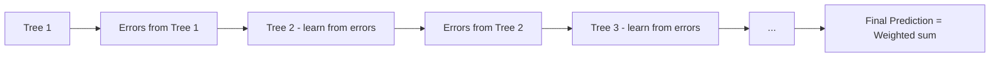
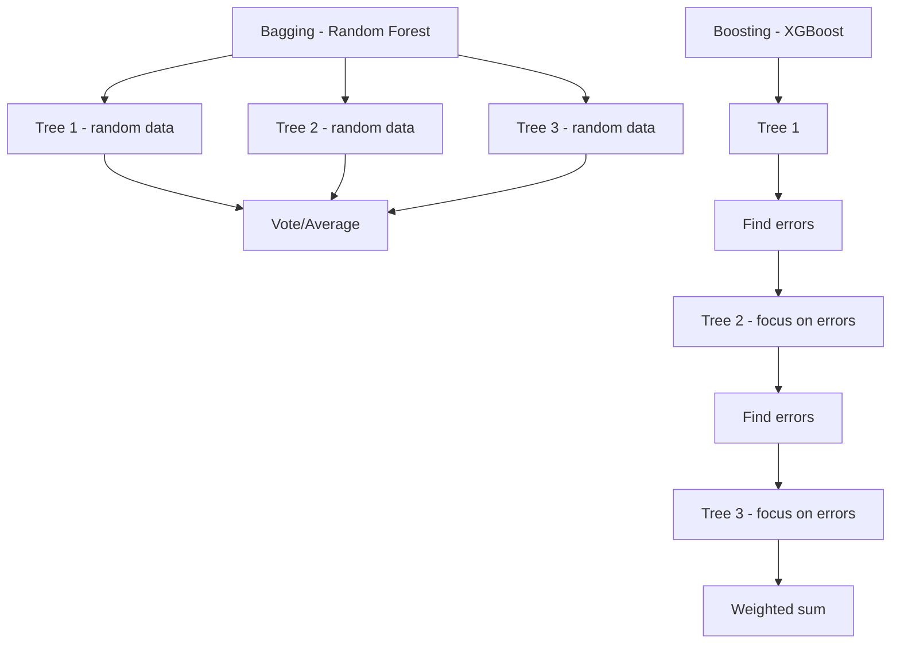
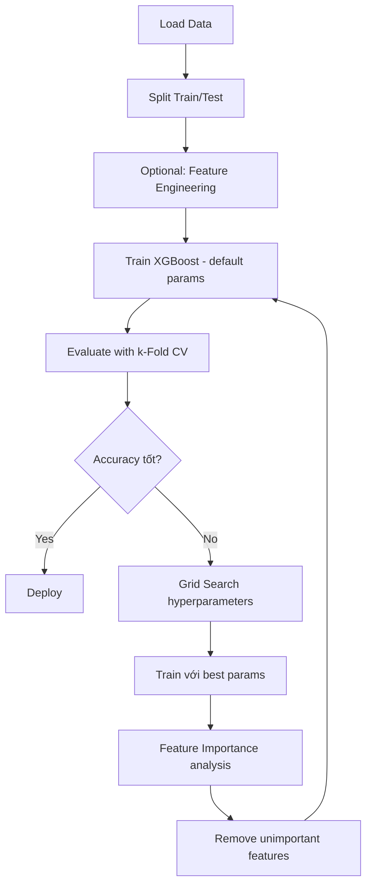

# Bài 10: XGBoost (Extreme Gradient Boosting)

## Tổng quan
**XGBoost** là một trong những **mạnh nhất** và **phổ biến nhất** trong ML competitions (Kaggle).
- **Boosting**: ensemble method - kết hợp nhiều weak learners (decision trees)
- **Gradient Boosting**: train trees tuần tự, mỗi tree sửa lỗi của tree trước
- **XGBoost**: optimized implementation với regularization, parallel processing



**Ưu điểm**:
- ⭐⭐⭐ Accuracy cực cao
- Tốt cho **tabular data** (structured data)
- Built-in regularization → ít overfit hơn
- Fast training (parallel processing)
- Tự động handle missing values

---

## Boosting vs Bagging

### Bagging (Random Forest)
- Train nhiều trees **song song** (parallel)
- Mỗi tree train trên random subset of data
- Final prediction: **average/vote** của tất cả trees

### Boosting (XGBoost, AdaBoost, Gradient Boosting)
- Train nhiều trees **tuần tự** (sequential)
- Tree sau học từ **errors** của tree trước
- Final prediction: **weighted sum** của tất cả trees



---

## Ví dụ: XGBoost Classification

```python
# 1. Import
import numpy as np
import pandas as pd

# 2. Load data
dataset = pd.read_csv('Data.csv')
X = dataset.iloc[:, :-1].values
y = dataset.iloc[:, -1].values

# 3. Split
from sklearn.model_selection import train_test_split
X_train, X_test, y_train, y_test = train_test_split(X, y, test_size=0.2, random_state=0)

# 4. Train XGBoost
from xgboost import XGBClassifier
classifier = XGBClassifier()
classifier.fit(X_train, y_train)

# 5. Predict
y_pred = classifier.predict(X_test)

# 6. Evaluate
from sklearn.metrics import confusion_matrix, accuracy_score
cm = confusion_matrix(y_test, y_pred)
print(cm)
accuracy = accuracy_score(y_test, y_pred)
print(f"Accuracy: {accuracy}")

# 7. k-Fold Cross Validation
from sklearn.model_selection import cross_val_score
accuracies = cross_val_score(estimator=classifier, X=X_train, y=y_train, cv=10)
print(f"Accuracy: {accuracies.mean():.2f} %")
print(f"Standard Deviation: {accuracies.std():.2f} %")
```

### Lưu ý
- **KHÔNG cần Feature Scaling** cho XGBoost (tree-based)
- Default parameters đã rất tốt
- Có thể tune để tăng accuracy

---

## Chi tiết XGBClassifier

```python
from xgboost import XGBClassifier
classifier = XGBClassifier(
    n_estimators=100,        # Số trees (boosting rounds)
    learning_rate=0.3,       # Shrinkage (eta)
    max_depth=6,            # Độ sâu mỗi tree
    subsample=1,            # Subsample ratio of training data
    colsample_bytree=1,     # Subsample ratio of features
    gamma=0,                # Min loss reduction để split
    reg_alpha=0,            # L1 regularization
    reg_lambda=1,           # L2 regularization
    random_state=0
)
```

### Hyperparameters quan trọng

#### 1. n_estimators (số trees)
```python
n_estimators=100  # Default
```
- Số boosting rounds (trees)
- Càng nhiều → accuracy cao hơn, nhưng chậm hơn và có thể overfit
- Typical: 100-1000

#### 2. learning_rate (eta)
```python
learning_rate=0.3  # Default
```
- Shrinkage: giảm weight của mỗi tree
- Nhỏ (0.01-0.1) + nhiều trees → accuracy cao, chậm
- Lớn (0.3) + ít trees → nhanh, có thể underfit
- Rule of thumb: learning_rate nhỏ → tăng n_estimators

#### 3. max_depth
```python
max_depth=6  # Default
```
- Độ sâu mỗi tree
- Quá sâu → overfit
- Quá nông → underfit
- Typical: 3-10

#### 4. subsample
```python
subsample=1  # Default = 100%
```
- Tỷ lệ training samples cho mỗi tree
- 0.8 = dùng 80% data mỗi tree
- Giảm overfitting, tăng tốc
- Typical: 0.5-1.0

#### 5. colsample_bytree
```python
colsample_bytree=1  # Default = 100%
```
- Tỷ lệ features cho mỗi tree
- 0.8 = mỗi tree dùng 80% features
- Giảm overfitting
- Typical: 0.3-1.0

#### 6. gamma (min_split_loss)
```python
gamma=0  # Default
```
- Loss reduction tối thiểu để split node
- Tăng gamma → model conservative hơn (ít split)
- Regularization parameter
- Typical: 0-5

#### 7. reg_alpha, reg_lambda (regularization)
```python
reg_alpha=0   # L1 regularization
reg_lambda=1  # L2 regularization
```
- Regularization để giảm overfitting
- reg_alpha: L1 (Lasso) - sparse features
- reg_lambda: L2 (Ridge) - shrink weights

---

## XGBoost Regression

```python
from xgboost import XGBRegressor

regressor = XGBRegressor(
    n_estimators=100,
    learning_rate=0.1,
    max_depth=5,
    random_state=0
)
regressor.fit(X_train, y_train)
y_pred = regressor.predict(X_test)

# Evaluate
from sklearn.metrics import r2_score, mean_squared_error
r2 = r2_score(y_test, y_pred)
rmse = np.sqrt(mean_squared_error(y_test, y_pred))
print(f"R²: {r2}, RMSE: {rmse}")
```

---

## Tuning XGBoost với Grid Search

```python
from sklearn.model_selection import GridSearchCV

param_grid = {
    'n_estimators': [100, 200, 300],
    'learning_rate': [0.01, 0.1, 0.3],
    'max_depth': [3, 5, 7],
    'subsample': [0.8, 1.0],
    'colsample_bytree': [0.8, 1.0]
}

grid_search = GridSearchCV(
    estimator=XGBClassifier(),
    param_grid=param_grid,
    scoring='accuracy',
    cv=5,
    n_jobs=-1,
    verbose=2
)
grid_search.fit(X_train, y_train)

print(f"Best params: {grid_search.best_params_}")
print(f"Best score: {grid_search.best_score_:.2f}")

# Use best model
best_classifier = grid_search.best_estimator_
```

---

## Feature Importance

```python
import matplotlib.pyplot as plt

# Train XGBoost
classifier = XGBClassifier()
classifier.fit(X_train, y_train)

# Get feature importances
importances = classifier.feature_importances_
feature_names = ['Feature 1', 'Feature 2', 'Feature 3', ...]

# Plot
plt.barh(feature_names, importances)
plt.xlabel('Importance')
plt.title('XGBoost Feature Importances')
plt.show()

# Hoặc dùng built-in plot
from xgboost import plot_importance
plot_importance(classifier)
plt.show()
```

**Sử dụng**: Loại bỏ features không quan trọng → giảm overfitting, tăng tốc

---

## So sánh XGBoost vs Random Forest

| Tiêu chí | XGBoost | Random Forest |
|----------|---------|---------------|
| **Method** | Boosting (sequential) | Bagging (parallel) |
| **Speed** | ⚡⚡ Slower to train | ⚡⚡⚡ Faster |
| **Accuracy** | ⭐⭐⭐⭐⭐ Higher | ⭐⭐⭐⭐ High |
| **Overfitting** | Less (regularization) | More (without tuning) |
| **Tuning** | More hyperparameters | Fewer hyperparameters |
| **Interpretability** | ⭐⭐ Moderate | ⭐⭐⭐ Better |
| **Use case** | Kaggle competitions | Production (fast inference) |

---

## Early Stopping (tránh overtraining)

```python
classifier = XGBClassifier(
    n_estimators=1000,
    learning_rate=0.1,
    early_stopping_rounds=50  # Stop nếu không cải thiện sau 50 rounds
)

# Need validation set
classifier.fit(
    X_train, y_train,
    eval_set=[(X_test, y_test)],
    verbose=True
)

# Model sẽ tự động stop khi validation accuracy không tăng
```

**eval_metric** options:
- Classification: `'logloss'`, `'error'`, `'auc'`
- Regression: `'rmse'`, `'mae'`

---

## Install XGBoost

```bash
# Pip
pip install xgboost

# Conda
conda install -c conda-forge xgboost
```

---

## Workflow với XGBoost



---

## Bài tập thực hành
1. Chạy [xg_boost.py](xg_boost.py)
   - Quan sát accuracy
2. So sánh XGBoost vs Random Forest trên cùng dataset
3. Thử Grid Search với param_grid ở trên
4. Visualize feature importances
5. Thử early_stopping_rounds

---

## Lưu ý cho .NET developers

### Save XGBoost model
```python
import joblib

# Method 1: joblib (universal)
joblib.dump(classifier, 'xgb_model.pkl')

# Method 2: XGBoost native format (faster)
classifier.save_model('xgb_model.json')

# Load
classifier = joblib.load('xgb_model.pkl')
# Hoặc
classifier = XGBClassifier()
classifier.load_model('xgb_model.json')
```

### Deploy trong Python service
```python
from flask import Flask, request, jsonify
import joblib
import numpy as np

app = Flask(__name__)
model = joblib.load('xgb_model.pkl')

@app.route('/predict', methods=['POST'])
def predict():
    data = request.json['features']
    X = np.array([data])
    prediction = model.predict(X)[0]
    probability = model.predict_proba(X)[0].tolist()

    return jsonify({
        'prediction': int(prediction),
        'probability': probability
    })

if __name__ == '__main__':
    app.run(port=5000)
```

### Call từ .NET
```csharp
public class PredictionService
{
    private readonly HttpClient _httpClient;

    public async Task<int> PredictAsync(double[] features)
    {
        var request = new { features };
        var response = await _httpClient.PostAsJsonAsync(
            "http://python-service:5000/predict",
            request
        );
        var result = await response.Content.ReadFromJsonAsync<PredictionResponse>();
        return result.Prediction;
    }
}

public class PredictionResponse
{
    public int Prediction { get; set; }
    public List<double> Probability { get; set; }
}
```

---

## XGBoost nâng cao (ngoài scope)
- **Custom objective functions**
- **Handling imbalanced data**: `scale_pos_weight`
- **Multi-class classification**: `num_class`, `objective='multi:softprob'`
- **GPU acceleration**: `tree_method='gpu_hist'`
- **LightGBM, CatBoost**: alternatives to XGBoost

---

## Tài liệu tham khảo
- [XGBoost Documentation](https://xgboost.readthedocs.io/)
- [XGBoost Python API](https://xgboost.readthedocs.io/en/stable/python/python_api.html)
- [XGBoost Parameters](https://xgboost.readthedocs.io/en/stable/parameter.html)
- [Kaggle XGBoost Tutorial](https://www.kaggle.com/learn/intermediate-machine-learning)
