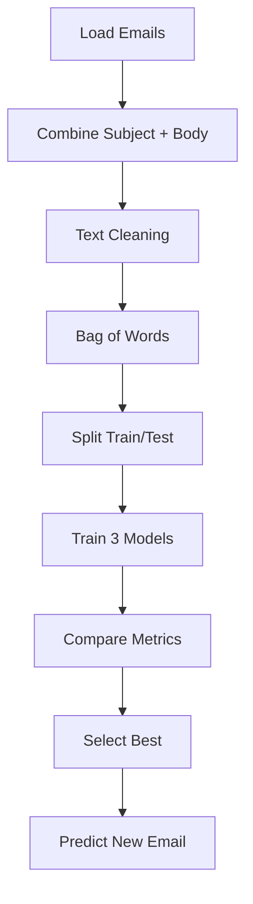

# Bài tập: Classification

## 📝 Đề bài: Email Spam Detection

Bạn làm việc cho một email service provider. Dataset `emails.csv` chứa emails và labels:

**Dataset mẫu**:

```
Subject,Body,Label
"Win free money now!","Click here to claim your prize",spam
"Meeting tomorrow at 3pm","Hi team, reminder about our meeting",ham
"Congratulations! You won!","You are selected for a prize",spam
"Project update","Here's the latest status report",ham
```

**Nhiệm vụ**: Xây dựng classifier phát hiện spam emails

**Yêu cầu**:

1. Combine `Subject` + `Body` thành 1 text column
2. Text preprocessing (Bag of Words)
3. Train ít nhất 3 classifiers:
   - Naive Bayes
   - Logistic Regression
   - Random Forest
4. Compare với Confusion Matrix, Precision, Recall
5. Chọn best model và giải thích tại sao

---

## 💡 Solution Approach



### Why these models?

- **Naive Bayes**: Best for text classification, very fast
- **Logistic Regression**: Good baseline
- **Random Forest**: High accuracy for structured features

---

## 🔧 Implementation

### Step 1: Generate Dataset

```python
import pandas as pd
import numpy as np

# Sample emails
data = {
    'Subject': [
        'Win free money now!', 'Meeting tomorrow', 'Congratulations winner',
        'Project deadline', 'Claim your prize', 'Weekly report',
        'Hot singles near you', 'Conference reminder', 'Limited time offer',
        'Team lunch', 'You won lottery', 'Monthly newsletter',
        'Cheap viagra online', 'Code review meeting', 'Free gift cards',
        'Sprint planning', 'Click here now!', 'Budget update',
        'Lose weight fast', 'All-hands meeting'
    ] * 25,  # 500 samples

    'Body': [
        'Click here!', 'See you at 3pm', 'You are selected',
        'Please review', 'Claim now!', 'Attached is report',
        'Meet local singles', 'Agenda attached', 'Act fast!',
        'Thai food sound good?', 'Check your account', 'Q3 highlights',
        'Buy now cheap', 'Code looks good', 'Free Amazon cards',
        'Stories to review', 'Limited offer!', 'Q4 budget attached',
        'Magic pill works!', 'Tomorrow 10am'
    ] * 25,

    'Label': ['spam', 'ham', 'spam', 'ham', 'spam', 'ham',
              'spam', 'ham', 'spam', 'ham', 'spam', 'ham',
              'spam', 'ham', 'spam', 'ham', 'spam', 'ham',
              'spam', 'ham'] * 25
}

df = pd.DataFrame(data)
df.to_csv('emails.csv', index=False)
print(f"Dataset created: {len(df)} emails")
print(f"Spam: {(df['Label']=='spam').sum()}, Ham: {(df['Label']=='ham').sum()}")
```

### Step 2: Text Preprocessing

```python
import re
from sklearn.feature_extraction.text import CountVectorizer

# Combine Subject + Body
df['Text'] = df['Subject'] + ' ' + df['Body']

# Simple cleaning
def clean_text(text):
    text = text.lower()
    text = re.sub(r'[^\w\s]', '', text)  # Remove punctuation
    return text

df['Text'] = df['Text'].apply(clean_text)

# Bag of Words
vectorizer = CountVectorizer(max_features=500, stop_words='english')
X = vectorizer.fit_transform(df['Text']).toarray()
y = (df['Label'] == 'spam').astype(int)  # spam=1, ham=0

print(f"Features (words): {X.shape[1]}")
print(f"Samples: {X.shape[0]}")
```

### Step 3: Train & Compare Models

```python
from sklearn.model_selection import train_test_split
from sklearn.naive_bayes import MultinomialNB
from sklearn.linear_model import LogisticRegression
from sklearn.ensemble import RandomForestClassifier
from sklearn.metrics import classification_report, confusion_matrix, accuracy_score, precision_score, recall_score

# Split
X_train, X_test, y_train, y_test = train_test_split(X, y, test_size=0.2, random_state=42)

# Models
models = {
    'Naive Bayes': MultinomialNB(),
    'Logistic Regression': LogisticRegression(max_iter=1000),
    'Random Forest': RandomForestClassifier(n_estimators=100, random_state=42)
}

print("="*70)
print("MODEL COMPARISON")
print("="*70)

results = {}

for name, model in models.items():
    # Train
    model.fit(X_train, y_train)

    # Predict
    y_pred = model.predict(X_test)

    # Metrics
    accuracy = accuracy_score(y_test, y_pred)
    precision = precision_score(y_test, y_pred)
    recall = recall_score(y_test, y_pred)
    f1 = 2 * (precision * recall) / (precision + recall)

    results[name] = {
        'model': model,
        'accuracy': accuracy,
        'precision': precision,
        'recall': recall,
        'f1': f1
    }

    print(f"\n{name}:")
    print(f"  Accuracy: {accuracy:.4f}")
    print(f"  Precision: {precision:.4f} (% spam predictions correct)")
    print(f"  Recall: {recall:.4f} (% actual spam caught)")
    print(f"  F1-Score: {f1:.4f}")

    # Confusion Matrix
    cm = confusion_matrix(y_test, y_pred)
    print(f"\n  Confusion Matrix:")
    print(f"    TN={cm[0,0]} (ham correctly classified)")
    print(f"    FP={cm[0,1]} (ham wrongly marked spam)")
    print(f"    FN={cm[1,0]} (spam missed!)")
    print(f"    TP={cm[1,1]} (spam caught)")
```

### Step 4: Select Best Model

```python
# Best based on F1-score (balance of precision & recall)
best_name = max(results, key=lambda k: results[k]['f1'])
best_model = results[best_name]['model']

print("\n" + "="*70)
print(f"🏆 BEST MODEL: {best_name}")
print("="*70)
print(f"F1-Score: {results[best_name]['f1']:.4f}")
print(f"\nWhy {best_name}?")

if best_name == 'Naive Bayes':
    print("  - Fastest training/prediction")
    print("  - Industry standard for text classification")
    print("  - High accuracy with low computational cost")
elif best_name == 'Logistic Regression':
    print("  - Good balance of speed and accuracy")
    print("  - Interpretable (can see feature weights)")
elif best_name == 'Random Forest':
    print("  - Highest accuracy (usually)")
    print("  - Robust to overfitting")
    print("  - Can handle non-linear patterns")
```

### Step 5: Predict New Email

```python
def predict_email(subject, body):
    """Predict if email is spam"""

    # Combine and clean
    text = clean_text(subject + ' ' + body)

    # Vectorize
    X_new = vectorizer.transform([text]).toarray()

    # Predict
    prediction = best_model.predict(X_new)[0]
    proba = best_model.predict_proba(X_new)[0] if hasattr(best_model, 'predict_proba') else [0.5, 0.5]

    result = "SPAM 🚨" if prediction == 1 else "HAM ✅"
    confidence = proba[prediction] * 100

    print(f"\nEmail: \"{subject}\"")
    print(f"Prediction: {result}")
    print(f"Confidence: {confidence:.1f}%")

    return prediction

# Test
predict_email("Win $1000 now!", "Click here to claim your prize")
predict_email("Team standup notes", "Here's today's standup summary")
```

---

## ✅ Complete Solution

```python
import pandas as pd
import numpy as np
import re
from sklearn.feature_extraction.text import CountVectorizer
from sklearn.model_selection import train_test_split
from sklearn.naive_bayes import MultinomialNB
from sklearn.linear_model import LogisticRegression
from sklearn.ensemble import RandomForestClassifier
from sklearn.metrics import classification_report, confusion_matrix, accuracy_score, precision_score, recall_score

# 1. Generate data (or load from CSV)
data = {...}  # As above
df = pd.DataFrame(data)

# 2. Preprocessing
df['Text'] = df['Subject'] + ' ' + df['Body']
df['Text'] = df['Text'].apply(lambda x: re.sub(r'[^\w\s]', '', x.lower()))

vectorizer = CountVectorizer(max_features=500, stop_words='english')
X = vectorizer.fit_transform(df['Text']).toarray()
y = (df['Label'] == 'spam').astype(int)

# 3. Split
X_train, X_test, y_train, y_test = train_test_split(X, y, test_size=0.2, random_state=42)

# 4. Train models
models = {
    'Naive Bayes': MultinomialNB(),
    'Logistic Regression': LogisticRegression(max_iter=1000),
    'Random Forest': RandomForestClassifier(n_estimators=100, random_state=42)
}

for name, model in models.items():
    model.fit(X_train, y_train)
    y_pred = model.predict(X_test)
    print(f"{name} Accuracy: {accuracy_score(y_test, y_pred):.4f}")

# 5. Select best (Naive Bayes usually wins for text)
best_model = models['Naive Bayes']

# 6. Predict
def predict_spam(subject, body):
    text = re.sub(r'[^\w\s]', '', (subject + ' ' + body).lower())
    X_new = vectorizer.transform([text]).toarray()
    return "SPAM" if best_model.predict(X_new)[0] == 1 else "HAM"

print(predict_spam("Win money!", "Click now"))  # SPAM
```

---

## 🚀 Extensions

1. **Use TF-IDF instead of Bag of Words**:

   ```python
   from sklearn.feature_extraction.text import TfidfVectorizer
   vectorizer = TfidfVectorizer(max_features=500)
   ```

2. **Add N-grams** (bigrams):

   ```python
   vectorizer = CountVectorizer(ngram_range=(1,2), max_features=1000)
   ```

3. **Advanced cleaning** with NLTK stemming/lemmatization

4. **Ensemble** voting classifier:

   ```python
   from sklearn.ensemble import VotingClassifier
   ensemble = VotingClassifier([('nb', nb), ('lr', lr), ('rf', rf)])
   ```

5. **Real dataset**: Use [SMS Spam Collection](https://www.kaggle.com/uciml/sms-spam-collection-dataset)

---

## 📊 Expected Results

```
Naive Bayes Accuracy: ~0.95
Logistic Regression Accuracy: ~0.93
Random Forest Accuracy: ~0.94

🏆 Winner: Naive Bayes (fastest + highly accurate for text)
```

---

## 🔑 Key Takeaways

- ✅ **Naive Bayes** is goto for text classification
- ✅ **Precision** matters: don't mark good emails as spam!
- ✅ **Recall** matters: catch as many spam as possible
- ✅ **F1-Score** balances both
- ✅ Text data → Bag of Words or TF-IDF
