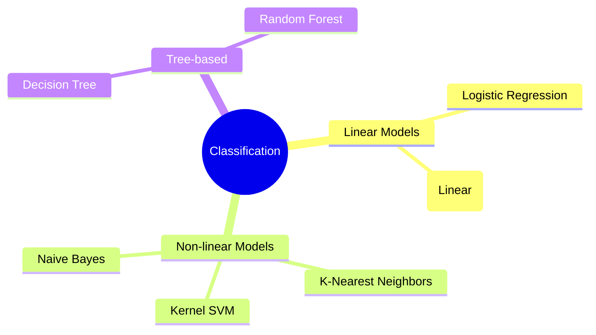
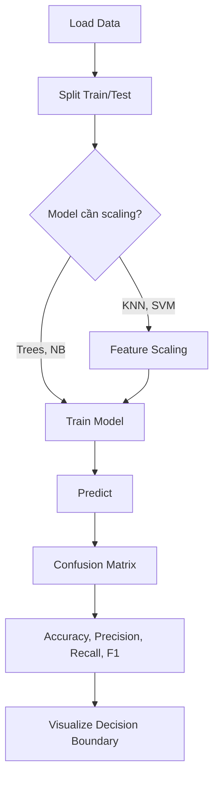

# Bài 2: Classification (Phân loại)

## Tổng quan
**Classification** dự đoán **category/class** (không phải số). Output là nhóm rời rạc.

**Ví dụ**:
- Email: Spam hay Not Spam
- Khách hàng: Mua hay Không mua
- Bệnh: Ác tính hay Lành tính
- Ảnh: Chó, Mèo, hay Chim



## Phân biệt Regression vs Classification

| Regression | Classification |
|------------|----------------|
| Output: **số liên tục** | Output: **category** |
| Ví dụ: giá nhà $200,000 | Ví dụ: Spam/Not Spam |
| Metrics: R², RMSE | Metrics: Accuracy, Confusion Matrix |

---

## 1. Logistic Regression

### Tổng quan
- **Tên gây nhầm lẫn**: là **Classification**, không phải Regression!
- Dự đoán **xác suất** thuộc class (0 hoặc 1)
- Công thức: $$P(y=1) = \frac{1}{1 + e^{-(b_0 + b_1x)}}$$ (Sigmoid function)

### Ví dụ: Dự đoán khách hàng có mua sản phẩm không
**Dataset**: `Social_Network_Ads.csv` (Age, Salary → Purchased 0/1)

```python
# 1. Import
import numpy as np
import pandas as pd
from sklearn.model_selection import train_test_split
from sklearn.preprocessing import StandardScaler
from sklearn.linear_model import LogisticRegression
from sklearn.metrics import confusion_matrix, accuracy_score

# 2. Load data
dataset = pd.read_csv('Social_Network_Ads.csv')
X = dataset.iloc[:, :-1].values  # Age, Salary
y = dataset.iloc[:, -1].values   # Purchased (0 or 1)

# 3. Split
X_train, X_test, y_train, y_test = train_test_split(
    X, y, test_size=0.25, random_state=0
)

# 4. Feature Scaling (khuyến nghị)
sc = StandardScaler()
X_train = sc.fit_transform(X_train)
X_test = sc.transform(X_test)

# 5. Train Logistic Regression
classifier = LogisticRegression(random_state=0)
classifier.fit(X_train, y_train)

# 6. Predict
y_pred = classifier.predict(X_test)

# 7. Evaluate
cm = confusion_matrix(y_test, y_pred)
print(cm)
accuracy = accuracy_score(y_test, y_pred)
print(f"Accuracy: {accuracy}")
```

### Chi tiết LogisticRegression
```python
from sklearn.linear_model import LogisticRegression
clf = LogisticRegression(
    penalty='l2',       # Regularization: 'l1', 'l2', 'elasticnet'
    C=1.0,             # Inverse of regularization strength
    solver='lbfgs',    # Optimization algorithm
    random_state=0
)
```
- **penalty**: regularization để tránh overfitting
- **C**: càng nhỏ, regularization càng mạnh
- **solver**: `'lbfgs'`, `'liblinear'`, `'saga'`

### Dự đoán xác suất
```python
# Dự đoán class (0 hoặc 1)
classifier.predict([[30, 87000]])  # Output: [0] hoặc [1]

# Dự đoán xác suất
classifier.predict_proba([[30, 87000]])
# Output: [[0.73, 0.27]] → 73% class 0, 27% class 1
```

---

## 2. K-Nearest Neighbors (KNN)

### Tổng quan
- **Non-parametric**: không học công thức, chỉ nhớ training data
- Dự đoán dựa trên **K láng giềng gần nhất**
- Voting: class nào nhiều nhất trong K neighbors


### Ví dụ
```python
from sklearn.neighbors import KNeighborsClassifier

# 1-4. Load, split, scale (giống Logistic Regression)
...

# 5. Train KNN
classifier = KNeighborsClassifier(n_neighbors=5, metric='minkowski', p=2)
classifier.fit(X_train, y_train)

# 6. Predict
y_pred = classifier.predict(X_test)

# 7. Evaluate
cm = confusion_matrix(y_test, y_pred)
print(cm)
accuracy = accuracy_score(y_test, y_pred)
```

### Chi tiết KNeighborsClassifier
```python
from sklearn.neighbors import KNeighborsClassifier
knn = KNeighborsClassifier(
    n_neighbors=5,      # Số neighbors (K)
    metric='minkowski', # Distance metric
    p=2                 # p=2: Euclidean, p=1: Manhattan
)
```
- **n_neighbors (K)**: số láng giềng
  - K nhỏ → sensitive, có thể overfit
  - K lớn → smooth, có thể underfit
  - Rule of thumb: K = √N (N = số training samples)
- **metric**: `'euclidean'`, `'manhattan'`, `'minkowski'`
- **p**:
  - p=2: Euclidean distance → $\sqrt{(x_2-x_1)^2 + (y_2-y_1)^2}$
  - p=1: Manhattan distance → $|x_2-x_1| + |y_2-y_1|$

### Lưu ý KNN
- ⚠️ **PHẢI Feature Scaling** (distance-based)
- Chậm với large dataset (phải tính khoảng cách đến tất cả points)

---

## 3. Support Vector Machine (SVM)

### Tổng quan
- Tìm **hyperplane** (đường phân chia) tốt nhất giữa các classes
- **Maximum margin**: tối đa hóa khoảng cách giữa hyperplane và điểm gần nhất

```python
from sklearn.svm import SVC

# 1-4. Load, split, scale
...

# 5. Train Linear SVM
classifier = SVC(kernel='linear', random_state=0)
classifier.fit(X_train, y_train)

# 6. Predict
y_pred = classifier.predict(X_test)
```

### Chi tiết SVC
```python
from sklearn.svm import SVC
svm = SVC(
    kernel='linear',    # 'linear', 'rbf', 'poly', 'sigmoid'
    C=1.0,             # Regularization parameter
    random_state=0
)
```
- **kernel='linear'**: SVM tuyến tính
- **C**: trade-off giữa margin và classification errors
  - C lớn: margin nhỏ, ít errors
  - C nhỏ: margin lớn, chấp nhận một số errors

---

## 4. Kernel SVM

### Tổng quan
- Dùng **kernel tricks** để xử lý **non-linear** boundaries
- Transforms data lên **higher dimension** để tuyến tính hóa

**Ví dụ**: Data không tuyến tính trong 2D → transform lên 3D → tuyến tính được

### Ví dụ: RBF (Radial Basis Function) Kernel
```python
from sklearn.svm import SVC

# Train với RBF kernel
classifier = SVC(kernel='rbf', random_state=0)
classifier.fit(X_train, y_train)
```

### Chi tiết Kernels
```python
# 1. Linear Kernel
SVC(kernel='linear')

# 2. RBF (Gaussian) Kernel - phổ biến nhất
SVC(kernel='rbf', gamma='scale')

# 3. Polynomial Kernel
SVC(kernel='poly', degree=3)

# 4. Sigmoid Kernel
SVC(kernel='sigmoid')
```
- **kernel='rbf'**: Radial Basis Function (Gaussian)
  - Tốt cho non-linear boundaries
  - **gamma**: càng lớn, decision boundary càng complex
- **kernel='poly'**: Polynomial kernel
  - **degree**: bậc đa thức (2, 3, 4...)

### Lưu ý Kernel SVM
- ⚠️ **PHẢI Feature Scaling**
- RBF kernel: tốt cho hầu hết các trường hợp non-linear
- Chậm với large dataset

---

## 5. Naive Bayes

### Tổng quan
- Dựa trên **Bayes' Theorem**
- **"Naive" assumption**: các features **độc lập** với nhau
- Rất nhanh, tốt cho **text classification** (spam filtering)

### Công thức Bayes
$$P(A|B) = \frac{P(B|A) \cdot P(A)}{P(B)}$$

### Ví dụ
```python
from sklearn.naive_bayes import GaussianNB

# 1-4. Load, split, scale
...

# 5. Train Naive Bayes
classifier = GaussianNB()
classifier.fit(X_train, y_train)

# 6. Predict
y_pred = classifier.predict(X_test)
```

### Chi tiết GaussianNB
```python
from sklearn.naive_bayes import GaussianNB
nb = GaussianNB()  # Ít parameters để tune
```
- **GaussianNB**: assume features có phân phối Gaussian (normal distribution)
- **Variants**:
  - `GaussianNB()`: continuous features
  - `MultinomialNB()`: count features (word counts)
  - `BernoulliNB()`: binary features

### Ưu điểm Naive Bayes
- ⚡ Cực nhanh
- Tốt với small dataset
- Tốt cho text classification (NLP)

---

## 6. Decision Tree Classification

### Tổng quan
- Chia data thành các **branches** dựa trên feature values
- Dễ interpret (có thể visualize tree)

### Ví dụ
```python
from sklearn.tree import DecisionTreeClassifier

# 1-4. Load, split, scale (scaling không bắt buộc)
...

# 5. Train
classifier = DecisionTreeClassifier(criterion='entropy', random_state=0)
classifier.fit(X_train, y_train)

# 6. Predict
y_pred = classifier.predict(X_test)
```

### Chi tiết DecisionTreeClassifier
```python
from sklearn.tree import DecisionTreeClassifier
dt = DecisionTreeClassifier(
    criterion='entropy',    # 'gini' hoặc 'entropy'
    max_depth=None,        # Độ sâu tối đa
    min_samples_split=2,   # Min samples để split
    random_state=0
)
```
- **criterion**:
  - `'gini'`: Gini impurity (default, nhanh hơn)
  - `'entropy'`: Information gain (chính xác hơn một chút)
- **max_depth**: giới hạn độ sâu để tránh overfitting
- **min_samples_split**: số samples tối thiểu để tiếp tục split

### Visualize Tree
```python
from sklearn import tree
import matplotlib.pyplot as plt

plt.figure(figsize=(20,10))
tree.plot_tree(classifier, filled=True, feature_names=['Age', 'Salary'])
plt.show()
```

---

## 7. Random Forest Classification

### Tổng quan
- **Ensemble** của nhiều Decision Trees
- Mỗi tree vote → majority wins
- **Giảm overfitting**, tăng accuracy

### Ví dụ
```python
from sklearn.ensemble import RandomForestClassifier

# 1-4. Load, split, scale
...

# 5. Train với 10 trees
classifier = RandomForestClassifier(
    n_estimators=10,
    criterion='entropy',
    random_state=0
)
classifier.fit(X_train, y_train)

# 6. Predict
y_pred = classifier.predict(X_test)
```

### Chi tiết RandomForestClassifier
```python
from sklearn.ensemble import RandomForestClassifier
rf = RandomForestClassifier(
    n_estimators=100,      # Số trees
    criterion='gini',      # 'gini' hoặc 'entropy'
    max_depth=None,
    min_samples_split=2,
    random_state=0
)
```
- **n_estimators**: số lượng trees (càng nhiều càng tốt, nhưng chậm hơn)
  - Thường dùng: 100, 500, 1000
- Các param khác giống DecisionTree

---

## Confusion Matrix (Ma trận nhầm lẫn)

```python
from sklearn.metrics import confusion_matrix, accuracy_score

cm = confusion_matrix(y_test, y_pred)
print(cm)
# Output:
# [[65  3]   ← TN=65, FP=3
#  [ 8 24]]  ← FN=8,  TP=24
```

### Giải thích
```
                Predicted
                0       1
Actual  0      TN      FP
        1      FN      TP
```
- **TN (True Negative)**: dự đoán 0, thực tế 0 ✅
- **FP (False Positive)**: dự đoán 1, thực tế 0 ❌ (Type I error)
- **FN (False Negative)**: dự đoán 0, thực tế 1 ❌ (Type II error)
- **TP (True Positive)**: dự đoán 1, thực tế 1 ✅

### Metrics
```python
accuracy = accuracy_score(y_test, y_pred)
# Accuracy = (TP + TN) / Total

from sklearn.metrics import precision_score, recall_score, f1_score
precision = precision_score(y_test, y_pred)  # TP / (TP + FP)
recall = recall_score(y_test, y_pred)        # TP / (TP + FN) - Sensitivity
f1 = f1_score(y_test, y_pred)                # 2 * (Precision * Recall) / (P + R)
```

| Metric | Công thức | Khi nào dùng |
|--------|-----------|--------------|
| **Accuracy** | (TP+TN)/Total | Balanced classes |
| **Precision** | TP/(TP+FP) | Minimize False Positives (spam detection) |
| **Recall** | TP/(TP+FN) | Minimize False Negatives (cancer detection) |
| **F1 Score** | 2·P·R/(P+R) | Balance Precision & Recall |

---

## So sánh các Classification Models

| Model | Linear? | Scaling? | Speed | Use Case |
|-------|---------|----------|-------|----------|
| Logistic Regression | Yes | Recommended | ⚡⚡⚡ | Binary, linear separable |
| KNN | No | **YES!** | ⚡ | Small dataset, non-linear |
| SVM (Linear) | Yes | **YES!** | ⚡⚡ | High-dimensional, linear |
| Kernel SVM | No | **YES!** | ⚡ | Non-linear boundaries |
| Naive Bayes | Yes | No | ⚡⚡⚡ | Text classification, fast |
| Decision Tree | No | No | ⚡⚡ | Interpretable, non-linear |
| Random Forest | No | No | ⚡ | High accuracy, robust |

---

## Visualize Decision Boundary

```python
from matplotlib.colors import ListedColormap
import numpy as np

X_set, y_set = sc.inverse_transform(X_test), y_test
X1, X2 = np.meshgrid(
    np.arange(start=X_set[:, 0].min()-10, stop=X_set[:, 0].max()+10, step=0.25),
    np.arange(start=X_set[:, 1].min()-1000, stop=X_set[:, 1].max()+1000, step=0.25)
)
plt.contourf(
    X1, X2,
    classifier.predict(sc.transform(np.array([X1.ravel(), X2.ravel()]).T)).reshape(X1.shape),
    alpha=0.75,
    cmap=ListedColormap(('red', 'green'))
)
plt.scatter(X_set[:, 0], X_set[:, 1], c=y_set, cmap=ListedColormap(('red', 'green')))
plt.title('Classifier (Test set)')
plt.xlabel('Age')
plt.ylabel('Estimated Salary')
plt.show()
```

---

## Workflow chung cho Classification



---

## Bài tập thực hành
1. Chạy [logistic_regression.py](1-logistic-regressions/logistic_regression.py) → quan sát Confusion Matrix
2. Chạy [k_nearest_neighbors.py](2-knear-neighbors-knn/k_nearest_neighbors.py) → thử n_neighbors=3, 5, 7
3. Chạy [kernel_svm.py](4-kernel-svm/kernel_svm.py) → thử kernel='rbf', 'poly'
4. Chạy [random_forest_classification.py](7-random-forest-classification/random_forest_classification.py) → thử n_estimators=10, 50, 100
5. So sánh accuracy của tất cả models

---

## Lưu ý cho .NET developers
- Save model: `joblib.dump(classifier, 'model.pkl')`
- Load model: `classifier = joblib.load('model.pkl')`
- **Quan trọng**: Lưu cả `StandardScaler` nếu đã dùng scaling!
  ```python
  joblib.dump(sc, 'scaler.pkl')  # Lưu scaler
  ```
- Trong .NET/Python service, phải scale input trước khi predict

---

## Tài liệu tham khảo
- [Sklearn Classification](https://scikit-learn.org/stable/supervised_learning.html#supervised-learning)
- [Confusion Matrix](https://scikit-learn.org/stable/modules/model_evaluation.html#confusion-matrix)
- [Metrics](https://scikit-learn.org/stable/modules/model_evaluation.html#classification-metrics)
