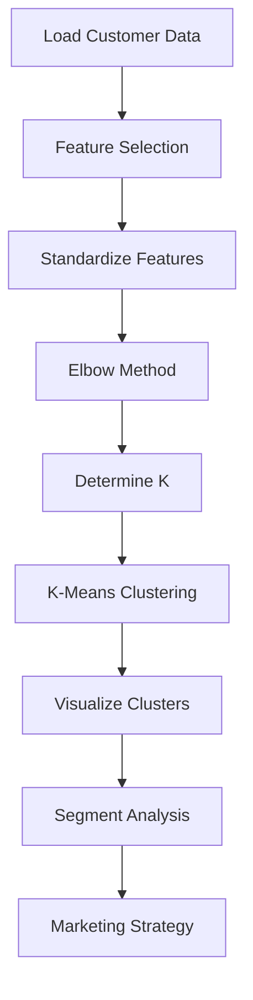

# Bài tập: Clustering

## 📝 Đề bài: Customer Segmentation for Marketing Campaign

Một công ty e-commerce muốn phân khách hàng thành các nhóm để chạy marketing campaigns targeted.

**Dataset**: Customer data với features:

- `Age`: Tuổi
- `Annual_Income`: Thu nhập hàng năm (K USD)
- `Spending_Score`: Điểm chi tiêu (1-100)

**Nhiệm vụ**:

1. Tìm số clusters tối ưu bằng Elbow Method
2. Apply K-Means clustering
3. Visualize clusters
4. Đặt tên và giải thích từng segment
5. Đề xuất marketing strategy cho mỗi segment

---

## 💡 Solution Approach



---

## 🔧 Implementation

### Step 1: Generate Customer Dataset

```python
import numpy as np
import pandas as pd
import matplotlib.pyplot as plt
from sklearn.cluster import KMeans
from sklearn.preprocessing import StandardScaler

# Generate synthetic customer data
np.random.seed(42)

# Create 5 clear segments
segments = {
    'Young Low Income Low Spend': {'age': (18, 30), 'income': (15, 40), 'spend': (1, 40)},
    'Young High Income High Spend': {'age': (18, 35), 'income': (60, 120), 'spend': (60, 100)},
    'Middle-aged Medium': {'age': (30, 50), 'income': (40, 70), 'spend': (40, 65)},
    'Senior High Income Low Spend': {'age': (50, 70), 'income': (70, 120), 'spend': (1, 40)},
    'Senior High Income High Spend': {'age': (45, 65), 'income': (80, 130), 'spend': (60, 100)}
}

data = []
for segment_name, ranges in segments.items():
    n_samples = 40
    ages = np.random.randint(ranges['age'][0], ranges['age'][1], n_samples)
    incomes = np.random.randint(ranges['income'][0], ranges['income'][1], n_samples)
    spends = np.random.randint(ranges['spend'][0], ranges['spend'][1], n_samples)

    for i in range(n_samples):
        data.append([ages[i], incomes[i], spends[i]])

df = pd.DataFrame(data, columns=['Age', 'Annual_Income', 'Spending_Score'])
df.to_csv('customers.csv', index=False)

print(f"Dataset created: {len(df)} customers")
print(df.describe())
```

### Step 2: Elbow Method - Tìm số Clusters tối ưu

```python
# Features to cluster
X = df[['Annual_Income', 'Spending_Score']].values

# Standardize (quan trọng cho K-Means!)
scaler = StandardScaler()
X_scaled = scaler.fit_transform(X)

# Elbow Method
wcss = []  # Within-Cluster Sum of Squares
K_range = range(1, 11)

for k in K_range:
    kmeans = KMeans(n_clusters=k, init='k-means++', random_state=42)
    kmeans.fit(X_scaled)
    wcss.append(kmeans.inertia_)

# Plot Elbow
plt.figure(figsize=(10, 6))
plt.plot(K_range, wcss, 'bo-', linewidth=2, markersize=8)
plt.xlabel('Number of Clusters (K)', fontsize=12)
plt.ylabel('WCSS (Within-Cluster Sum of Squares)', fontsize=12)
plt.title('Elbow Method - Finding Optimal K', fontsize=14, fontweight='bold')
plt.grid(True, alpha=0.3)

# Annotate the elbow point
plt.axvline(x=5, color='r', linestyle='--', label='Elbow at K=5')
plt.legend()
plt.savefig('elbow_method.png', dpi=300, bbox_inches='tight')
plt.show()

print("WCSS values:")
for k, value in zip(K_range, wcss):
    print(f"  K={k}: {value:.2f}")
print("\n👉 Elbow appears at K=5")
```

### Step 3: Apply K-Means

```python
# Optimal K
optimal_k = 5

# K-Means
kmeans = KMeans(n_clusters=optimal_k, init='k-means++', random_state=42)
clusters = kmeans.fit_predict(X_scaled)

# Add to dataframe
df['Cluster'] = clusters

print(f"\nClusters created: {optimal_k}")
print(f"\nCluster sizes:")
print(df['Cluster'].value_counts().sort_index())
```

### Step 4: Visualize Clusters

```python
plt.figure(figsize=(12, 8))

# Scatter plot
colors = ['red', 'blue', 'green', 'orange', 'purple']
for i in range(optimal_k):
    cluster_data = df[df['Cluster'] == i]
    plt.scatter(
        cluster_data['Annual_Income'],
        cluster_data['Spending_Score'],
        c=colors[i],
        label=f'Cluster {i}',
        s=100,
        alpha=0.6,
        edgecolors='black'
    )

# Centroids
centroids_original = scaler.inverse_transform(kmeans.cluster_centers_)
plt.scatter(
    centroids_original[:, 0],
    centroids_original[:, 1],
    c='black',
    s=300,
    marker='X',
    label='Centroids',
    edgecolors='yellow',
    linewidths=2
)

plt.xlabel('Annual Income (K USD)', fontsize=12)
plt.ylabel('Spending Score (1-100)', fontsize=12)
plt.title('Customer Segments', fontsize=14, fontweight='bold')
plt.legend()
plt.grid(True, alpha=0.3)
plt.savefig('customer_segments.png', dpi=300, bbox_inches='tight')
plt.show()
```

### Step 5: Analyze & Name Segments

```python
print("\n" + "="*80)
print("SEGMENT ANALYSIS")
print("="*80)

segment_names = {}

for i in range(optimal_k):
    cluster_data = df[df['Cluster'] == i]

    avg_age = cluster_data['Age'].mean()
    avg_income = cluster_data['Annual_Income'].mean()
    avg_spend = cluster_data['Spending_Score'].mean()
    size = len(cluster_data)

    # Name segment based on characteristics
    if avg_income < 40:
        income_level = "Low Income"
    elif avg_income < 70:
        income_level = "Medium Income"
    else:
        income_level = "High Income"

    if avg_spend < 40:
        spend_level = "Low Spenders"
    elif avg_spend < 65:
        spend_level = "Medium Spenders"
    else:
        spend_level = "High Spenders"

    segment_name = f"{income_level} {spend_level}"
    segment_names[i] = segment_name

    print(f"\nCluster {i}: {segment_name}")
    print(f"  Size: {size} customers ({size/len(df)*100:.1f}%)")
    print(f"  Avg Age: {avg_age:.1f} years")
    print(f"  Avg Income: ${avg_income:.1f}K")
    print(f"  Avg Spending Score: {avg_spend:.1f}/100")

# Add segment names to dataframe
df['Segment_Name'] = df['Cluster'].map(segment_names)
```

### Step 6: Marketing Strategy

```python
print("\n" + "="*80)
print("MARKETING STRATEGIES")
print("="*80)

strategies = {
    "High Income High Spenders": {
        "strategy": "💎 Premium Loyalty Program",
        "tactics": [
            "Exclusive VIP events and early access",
            "Personalized luxury product recommendations",
            "Premium customer service (dedicated account manager)",
            "High-value reward points program"
        ]
    },
    "High Income Low Spenders": {
        "strategy": "🎯 Engagement & Activation",
        "tactics": [
            "Educational content about products",
            "Limited-time premium offers",
            "Incentivize first/repeat purchases",
            "Showcase product value and quality"
        ]
    },
    "Medium Income Medium Spenders": {
        "strategy": "📈 Upsell & Cross-sell",
        "tactics": [
            "Bundle deals and packages",
            "Seasonal promotions",
            "Referral incentives",
            "Email marketing with targeted offers"
        ]
    },
    "Low Income High Spenders": {
        "strategy": "💚 Retention & Appreciation",
        "tactics": [
            "Thank-you rewards and recognition",
            "Budget-friendly product lines",
            "Installment payment options",
            "Community building programs"
        ]
    },
    "Low Income Low Spenders": {
        "strategy": "🌱 Awareness & Conversion",
        "tactics": [
            "Entry-level product promotions",
            "Free shipping on first order",
            "Discount coupons",
            "Value-focused messaging"
        ]
    }
}

for cluster_id, segment_name in segment_names.items():
    # Find matching strategy
    matched_strategy = None
    for key in strategies.keys():
        if key.lower() in segment_name.lower():
            matched_strategy = strategies[key]
            break

    if not matched_strategy:
        # Default strategy
        matched_strategy = {
            "strategy": "📊 Data-Driven Personalization",
            "tactics": [
                "Analyze behavior patterns",
                "A/B test different offers",
                "Personalized email campaigns"
            ]
        }

    print(f"\n{segment_name}:")
    print(f"  {matched_strategy['strategy']}")
    for tactic in matched_strategy['tactics']:
        print(f"    • {tactic}")
```

---

## ✅ Complete Solution

```python
import numpy as np
import pandas as pd
import matplotlib.pyplot as plt
from sklearn.cluster import KMeans
from sklearn.preprocessing import StandardScaler

# 1. Load or generate data
df = pd.read_csv('customers.csv')  # Or generate as shown above

# 2. Prepare features
X = df[['Annual_Income', 'Spending_Score']].values
scaler = StandardScaler()
X_scaled = scaler.fit_transform(X)

# 3. Elbow method
wcss = []
for k in range(1, 11):
    kmeans = KMeans(n_clusters=k, init='k-means++', random_state=42)
    kmeans.fit(X_scaled)
    wcss.append(kmeans.inertia_)

plt.plot(range(1, 11), wcss, 'bo-')
plt.xlabel('K')
plt.ylabel('WCSS')
plt.title('Elbow Method')
plt.show()

# 4. K-Means with optimal K
optimal_k = 5
kmeans = KMeans(n_clusters=optimal_k, init='k-means++', random_state=42)
df['Cluster'] = kmeans.fit_predict(X_scaled)

# 5. Visualize
for i in range(optimal_k):
    cluster_data = df[df['Cluster'] == i]
    plt.scatter(cluster_data['Annual_Income'], cluster_data['Spending_Score'], label=f'Cluster {i}')

centroids = scaler.inverse_transform(kmeans.cluster_centers_)
plt.scatter(centroids[:, 0], centroids[:, 1], c='black', s=300, marker='X', label='Centroids')
plt.xlabel('Annual Income')
plt.ylabel('Spending Score')
plt.legend()
plt.show()

# 6. Analyze segments
for i in range(optimal_k):
    cluster_data = df[df['Cluster'] == i]
    print(f"Cluster {i}: Income={cluster_data['Annual_Income'].mean():.1f}, Spend={cluster_data['Spending_Score'].mean():.1f}")
```

---

## 🚀 Extensions

1. **Add more features**: Age, Gender, purchase frequency

   ```python
   X = df[['Age', 'Annual_Income', 'Spending_Score']].values
   # 3D visualization
   from mpl_toolkits.mplot3d import Axes3D
   ```

2. **Try Hierarchical Clustering**:

   ```python
   from sklearn.cluster import AgglomerativeClustering
   import scipy.cluster.hierarchy as sch
   dendrogram = sch.dendrogram(sch.linkage(X_scaled, method='ward'))
   ```

3. **Silhouette Score** (alternative to Elbow):

   ```python
   from sklearn.metrics import silhouette_score
   for k in range(2, 11):
       kmeans = KMeans(n_clusters=k)
       labels = kmeans.fit_predict(X_scaled)
       score = silhouette_score(X_scaled, labels)
       print(f"K={k}: Silhouette={score:.3f}")
   ```

4. **DBSCAN** for noise/outlier detection:
   ```python
   from sklearn.cluster import DBSCAN
   dbscan = DBSCAN(eps=0.5, min_samples=5)
   clusters = dbscan.fit_predict(X_scaled)
   ```

---

## 📊 Expected Clusters

```
Cluster 0: Low Income Low Spenders (Budget Conscious)
Cluster 1: High Income Low Spenders (Careful Wealthy)
Cluster 2: Medium Income Medium Spenders (General Market)
Cluster 3: Low Income High Spenders (Aspirational Spenders)
Cluster 4: High Income High Spenders (Premium Customers)
```

---

## 🔑 Key Takeaways

- ✅ **Standardize features** before K-Means (important!)
- ✅ **Elbow Method** to find optimal K
- ✅ **k-means++** initialization for better convergence
- ✅ **Interpret clusters** with business context
- ✅ Clustering is **unsupervised** - no labels needed!
- ✅ Different segments need **different strategies**
