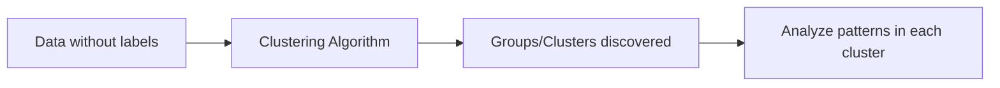
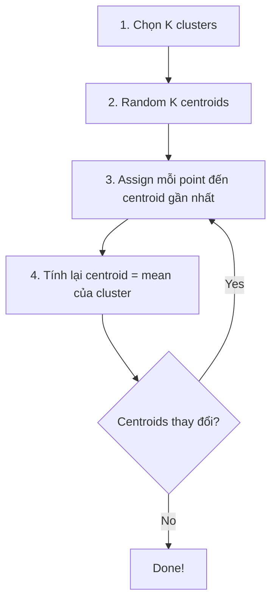
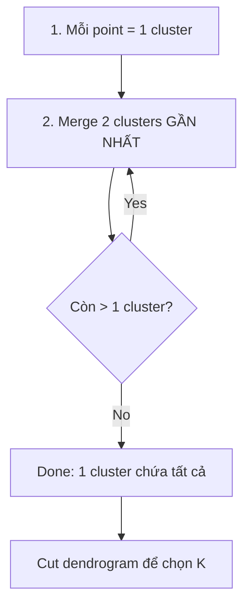
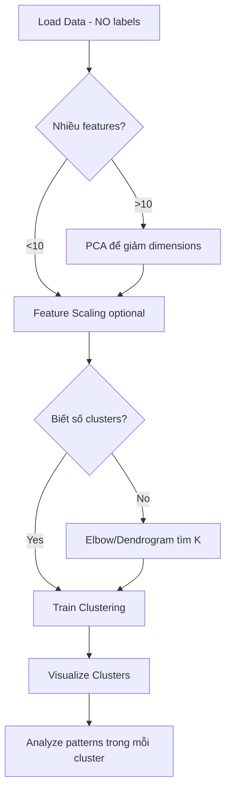

# Bài 3: Clustering (Phân cụm)

## Tổng quan
**Clustering** là **Unsupervised Learning** - học KHÔNG cần nhãn (labels).
- Mục đích: Tìm các **nhóm tự nhiên** trong data
- Khác Classification: **KHÔNG có y** (target variable)



**Use cases**:
- Customer segmentation (phân nhóm khách hàng)
- Image compression
- Anomaly detection
- Document clustering

---

## 1. K-Means Clustering

### Tổng quan
- Thuật toán phổ biến nhất
- Chia data thành **K clusters** (K là số nhóm định trước)
- Mỗi cluster có **centroid** (tâm)

### Thuật toán K-Means



### Ví dụ: Phân nhóm khách hàng Mall
**Dataset**: `Mall_Customers.csv` (Annual Income, Spending Score)

```python
# 1. Import
import numpy as np
import pandas as pd
import matplotlib.pyplot as plt
from sklearn.cluster import KMeans

# 2. Load data
dataset = pd.read_csv('Mall_Customers.csv')
X = dataset.iloc[:, [3, 4]].values  # Cột 3, 4: Income, Spending Score
# Chú ý: KHÔNG có y, vì unsupervised!

# 3. Elbow Method - tìm số clusters tối ưu
wcss = []  # Within-Cluster Sum of Squares
for i in range(1, 11):
    kmeans = KMeans(n_clusters=i, init='k-means++', random_state=42)
    kmeans.fit(X)
    wcss.append(kmeans.inertia_)

# Vẽ Elbow graph
plt.plot(range(1, 11), wcss)
plt.title('The Elbow Method')
plt.xlabel('Number of clusters')
plt.ylabel('WCSS')
plt.show()
# → Chọn K ở "khuỷu tay" (elbow) của đường cong

# 4. Train K-Means với K=5
kmeans = KMeans(n_clusters=5, init='k-means++', random_state=42)
y_kmeans = kmeans.fit_predict(X)  # fit_predict: fit và return cluster labels

# 5. Visualize clusters
plt.scatter(X[y_kmeans == 0, 0], X[y_kmeans == 0, 1], s=100, c='red', label='Cluster 1')
plt.scatter(X[y_kmeans == 1, 0], X[y_kmeans == 1, 1], s=100, c='blue', label='Cluster 2')
plt.scatter(X[y_kmeans == 2, 0], X[y_kmeans == 2, 1], s=100, c='green', label='Cluster 3')
plt.scatter(X[y_kmeans == 3, 0], X[y_kmeans == 3, 1], s=100, c='cyan', label='Cluster 4')
plt.scatter(X[y_kmeans == 4, 0], X[y_kmeans == 4, 1], s=100, c='magenta', label='Cluster 5')
plt.scatter(kmeans.cluster_centers_[:, 0], kmeans.cluster_centers_[:, 1],
            s=300, c='yellow', label='Centroids', edgecolors='black')
plt.title('Clusters of customers')
plt.xlabel('Annual Income (k$)')
plt.ylabel('Spending Score (1-100)')
plt.legend()
plt.show()
```

### Chi tiết KMeans
```python
from sklearn.cluster import KMeans
kmeans = KMeans(
    n_clusters=5,           # Số clusters (K)
    init='k-means++',       # Thuật toán khởi tạo centroids
    max_iter=300,           # Số iterations tối đa
    n_init=10,              # Số lần chạy với centroid seeds khác nhau
    random_state=42         # Seed
)
```

#### Parameters quan trọng
- **n_clusters (K)**: số nhóm muốn chia
  - Dùng **Elbow Method** để tìm K tối ưu
- **init='k-means++'**: smart initialization (tốt hơn random)
  - `'k-means++'`: chọn centroids ban đầu thông minh
  - `'random'`: random centroids
- **max_iter**: số vòng lặp tối đa
- **n_init**: chạy K-Means n_init lần, chọn kết quả tốt nhất

#### Attributes quan trọng
```python
kmeans.cluster_centers_  # Tọa độ các centroids
kmeans.labels_           # Cluster label của mỗi point
kmeans.inertia_          # WCSS (Within-Cluster Sum of Squares)
```

### Elbow Method - Tìm K tối ưu

**WCSS (Within-Cluster Sum of Squares)**:
$$WCSS = \sum_{i=1}^{K} \sum_{x \in C_i} distance(x, centroid_i)^2$$

- WCSS đo "độ compact" của clusters
- K tăng → WCSS giảm
- Chọn K ở điểm **elbow** (khuỷu tay)

```python
wcss = []
for i in range(1, 11):
    kmeans = KMeans(n_clusters=i, init='k-means++', random_state=42)
    kmeans.fit(X)
    wcss.append(kmeans.inertia_)  # inertia_ = WCSS

plt.plot(range(1, 11), wcss)
plt.xlabel('Number of clusters')
plt.ylabel('WCSS')
plt.show()
```

**Cách đọc Elbow graph**:
- K=1: WCSS cao nhất (tất cả points trong 1 cluster)
- K tăng: WCSS giảm
- **Chọn K** ở điểm đường cong "bẻ cong" (elbow) → balance giữa số clusters và WCSS

---

## 2. Hierarchical Clustering

### Tổng quan
- Không cần chọn K trước
- Build **dendrogram** (cây phân cấp)
- 2 approaches:
  - **Agglomerative** (bottom-up): merge nhỏ thành lớn ⭐ (phổ biến)
  - **Divisive** (top-down): split lớn thành nhỏ

### Thuật toán Agglomerative Clustering



### Ví dụ
```python
# 1. Import
import numpy as np
import pandas as pd
import matplotlib.pyplot as plt
import scipy.cluster.hierarchy as sch
from sklearn.cluster import AgglomerativeClustering

# 2. Load data
dataset = pd.read_csv('Mall_Customers.csv')
X = dataset.iloc[:, [3, 4]].values

# 3. Vẽ Dendrogram để tìm số clusters
dendrogram = sch.dendrogram(sch.linkage(X, method='ward'))
plt.title('Dendrogram')
plt.xlabel('Customers')
plt.ylabel('Euclidean distances')
plt.show()
# → Nhìn dendrogram, chọn số clusters (cắt ngang ở chiều cao phù hợp)

# 4. Train Hierarchical Clustering
hc = AgglomerativeClustering(n_clusters=5, affinity='euclidean', linkage='ward')
y_hc = hc.fit_predict(X)

# 5. Visualize
plt.scatter(X[y_hc == 0, 0], X[y_hc == 0, 1], s=100, c='red', label='Cluster 1')
plt.scatter(X[y_hc == 1, 0], X[y_hc == 1, 1], s=100, c='blue', label='Cluster 2')
plt.scatter(X[y_hc == 2, 0], X[y_hc == 2, 1], s=100, c='green', label='Cluster 3')
plt.scatter(X[y_hc == 3, 0], X[y_hc == 3, 1], s=100, c='cyan', label='Cluster 4')
plt.scatter(X[y_hc == 4, 0], X[y_hc == 4, 1], s=100, c='magenta', label='Cluster 5')
plt.title('Clusters of customers')
plt.xlabel('Annual Income (k$)')
plt.ylabel('Spending Score (1-100)')
plt.legend()
plt.show()
```

### Chi tiết AgglomerativeClustering
```python
from sklearn.cluster import AgglomerativeClustering
hc = AgglomerativeClustering(
    n_clusters=5,           # Số clusters cuối cùng
    affinity='euclidean',   # Distance metric
    linkage='ward'          # Linkage criterion
)
```

#### Parameters quan trọng
- **n_clusters**: số clusters muốn (tìm từ dendrogram)
- **affinity**: distance metric
  - `'euclidean'`: Euclidean distance (phổ biến)
  - `'manhattan'`, `'cosine'`, `'precomputed'`
- **linkage**: cách tính khoảng cách giữa clusters
  - `'ward'`: minimize variance (phổ biến nhất) ⭐
  - `'complete'`: max distance giữa 2 clusters
  - `'average'`: average distance
  - `'single'`: min distance

### Dendrogram

```python
import scipy.cluster.hierarchy as sch
dendrogram = sch.dendrogram(sch.linkage(X, method='ward'))
plt.show()
```

**Cách đọc Dendrogram**:
- Trục Y: khoảng cách (distance)
- Cắt ngang ở chiều cao → số clusters
- Ví dụ: cắt ở chiều cao 200 → 5 clusters

```
        |
    200-|----+----+
        |    |    |
    100-|  +-+ +-+|
        | +-+ |   |
      0-|_|_|_|___|
         A B C D E
```
Cắt ở 200 → 2 clusters: {A,B,C,D}, {E}
Cắt ở 100 → 4 clusters: {A,B}, {C,D}, {E}

---

## So sánh K-Means vs Hierarchical

| Tiêu chí | K-Means | Hierarchical |
|----------|---------|--------------|
| **Chọn K trước** | ✅ Yes (dùng Elbow) | ❌ No (dùng Dendrogram) |
| **Speed** | ⚡⚡⚡ Fast | ⚡ Slow (O(n³)) |
| **Large dataset** | ✅ Tốt | ❌ Chậm |
| **Cluster shape** | Spherical (hình tròn) | Flexible (linh hoạt) |
| **Dendrogram** | ❌ No | ✅ Yes |
| **Use case** | Large data, simple clusters | Small data, hierarchical structure |

---

## Khi nào dùng Clustering?

### Use Case 1: Customer Segmentation
**Ví dụ**: Mall phân nhóm khách hàng
```python
# Features: Annual Income, Spending Score
# → Phát hiện 5 nhóm:
# 1. High Income, High Spending → Target marketing
# 2. High Income, Low Spending → Retention campaigns
# 3. Low Income, High Spending → Credit offers
# 4. Low Income, Low Spending → Budget products
# 5. Average → Standard marketing
```

### Use Case 2: Image Compression
```python
from sklearn.cluster import KMeans
# Ảnh có 1 triệu màu → cluster thành 16 màu
# → Giảm dung lượng file
```

### Use Case 3: Anomaly Detection
```python
# Points xa tất cả clusters → outliers/anomalies
# Dùng cho fraud detection, network security
```

---

## Đánh giá Clustering (không có labels)

### 1. Elbow Method (K-Means)
- Xem WCSS vs K
- Chọn K ở elbow

### 2. Silhouette Score
```python
from sklearn.metrics import silhouette_score
score = silhouette_score(X, y_kmeans)
print(f"Silhouette Score: {score}")  # -1 đến 1, càng gần 1 càng tốt
```
- **Silhouette Score**: đo "độ tách biệt" giữa clusters
- Giá trị: -1 đến 1
  - > 0.7: Strong clusters
  - 0.5-0.7: Reasonable
  - < 0.25: Weak/overlapping clusters

### 3. Dendrogram (Hierarchical)
- Visual inspection

---

## Lưu ý quan trọng

### 1. Feature Scaling
```python
from sklearn.preprocessing import StandardScaler
sc = StandardScaler()
X = sc.fit_transform(X)
```
⚠️ **Khuyến nghị scale** nếu features có đơn vị khác nhau (Income: 0-200k, Age: 18-70)

### 2. Curse of Dimensionality
- K-Means, Hierarchical hoạt động tốt với **low dimensions** (2-10 features)
- Nếu quá nhiều features → dùng **PCA** để giảm dimensions trước

### 3. Số Clusters
- **K-Means**: dùng Elbow Method
- **Hierarchical**: dùng Dendrogram
- **Domain knowledge**: biết business logic (ví dụ: phân 3 nhóm khách hàng: Low, Medium, High)

---

## Workflow chung cho Clustering



---

## Bài tập thực hành
1. Chạy [k_means_clustering.py](1-k-means-clustering/k_means_clustering.py)
   - Quan sát Elbow graph → chọn K
   - Thử K=3, 4, 5, 6 → so sánh kết quả
2. Chạy [hierarchical_clustering.py](2-hierachical-clustering/hierarchical_clustering.py)
   - Nhìn Dendrogram
   - Thử cắt ở các chiều cao khác nhau
3. So sánh kết quả K-Means vs Hierarchical với cùng K=5
4. Tính Silhouette Score cho cả 2 methods

---

## Code snippet: Predict cluster cho new customer

```python
# 1. Train K-Means
kmeans = KMeans(n_clusters=5, init='k-means++', random_state=42)
kmeans.fit(X)

# 2. Predict cluster cho customer mới
new_customer = [[70, 40]]  # Income=70k, Spending=40
cluster = kmeans.predict(new_customer)
print(f"Customer thuộc Cluster {cluster[0]}")

# 3. Lấy centroid của cluster đó
centroid = kmeans.cluster_centers_[cluster[0]]
print(f"Centroid: {centroid}")
```

---

## Lưu ý cho .NET developers
- Save model: `joblib.dump(kmeans, 'kmeans_model.pkl')`
- Trong production, có thể:
  1. Train offline → lưu clusters labels cho mỗi customer vào DB
  2. Hoặc call Python API để predict cluster real-time
- **Quan trọng**: Nếu đã scale data khi train, phải scale input mới trước khi predict

---

## Tài liệu tham khảo
- [Sklearn Clustering](https://scikit-learn.org/stable/modules/clustering.html)
- [K-Means](https://scikit-learn.org/stable/modules/generated/sklearn.cluster.KMeans.html)
- [Agglomerative Clustering](https://scikit-learn.org/stable/modules/generated/sklearn.cluster.AgglomerativeClustering.html)
- [Silhouette Score](https://scikit-learn.org/stable/modules/generated/sklearn.metrics.silhouette_score.html)
