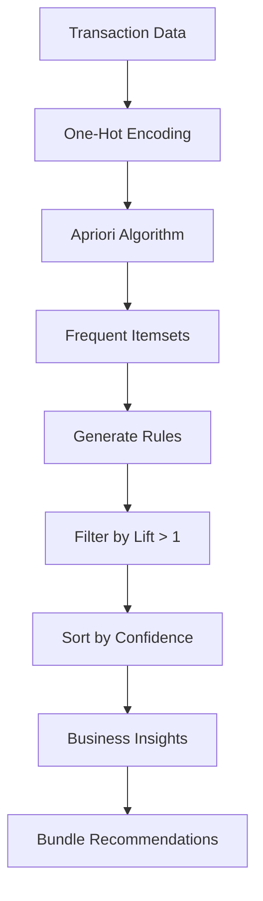

# Bài tập: Association Rule Learning

## 📝 Đề bài: Market Basket Analysis for Retail Store

Bạn là data analyst cho siêu thị. Cần phân tích shopping baskets để:

1. Tìm products thường được mua cùng nhau
2. Tạo bundle deals
3. Optimize product placement
4. Generate personalized recommendations

**Dataset**: Transaction records

- Mỗi row = 1 transaction (basket)
- Columns = Products purchased (Bread, Milk, Eggs, etc.)

**Example**:

```
Transaction 1: Bread, Milk, Eggs
Transaction 2: Bread, Butter, Jam
Transaction 3: Milk, Eggs, Cheese
```

**Nhiệm vụ**:

1. Apply **Apriori Algorithm** để find frequent itemsets
2. Generate **association rules** với lift > 1.0
3. Interpret rules (Support, Confidence, Lift)
4. Recommend product bundles và placement strategies

---

## 💡 Solution Approach



**Key Metrics**:

- **Support**: How often itemset appears (popularity)
- **Confidence**: How likely B is bought when A is bought
- **Lift**: Strength of association (>1 = positive correlation)

---

## 🔧 Implementation

### Step 1: Generate Transaction Data

```python
import pandas as pd
import numpy as np

# Common grocery items
items = [
    'Bread', 'Milk', 'Eggs', 'Butter', 'Cheese',
    'Yogurt', 'Coffee', 'Tea', 'Sugar', 'Flour',
    'Pasta', 'Tomato_Sauce', 'Olive_Oil', 'Chicken',
    'Beef', 'Fish', 'Rice', 'Beans', 'Onions', 'Garlic'
]

# Generate realistic shopping patterns
np.random.seed(42)

transactions = []

# Pattern 1: Breakfast items (30% of transactions)
for _ in range(150):
    basket = np.random.choice(
        ['Bread', 'Milk', 'Eggs', 'Butter', 'Coffee', 'Yogurt'],
        size=np.random.randint(2, 5),
        replace=False
    ).tolist()
    transactions.append(basket)

# Pattern 2: Pasta dinner (20% of transactions)
for _ in range(100):
    basket = np.random.choice(
        ['Pasta', 'Tomato_Sauce', 'Olive_Oil', 'Garlic', 'Onions', 'Cheese'],
        size=np.random.randint(3, 6),
        replace=False
    ).tolist()
    transactions.append(basket)

# Pattern 3: Baking (15% of transactions)
for _ in range(75):
    basket = np.random.choice(
        ['Flour', 'Sugar', 'Butter', 'Eggs', 'Milk'],
        size=np.random.randint(3, 5),
        replace=False
    ).tolist()
    transactions.append(basket)

# Pattern 4: Random/mixed (35% of transactions)
for _ in range(175):
    basket = np.random.choice(
        items,
        size=np.random.randint(3, 7),
        replace=False
    ).tolist()
    transactions.append(basket)

# Convert to DataFrame (one-hot encoded)
transactions_df = pd.DataFrame(
    [[1 if item in basket else 0 for item in items] for basket in transactions],
    columns=items
)

print(f"Dataset created: {len(transactions_df)} transactions")
print(f"Average items per basket: {transactions_df.sum(axis=1).mean():.1f}")
print("\nSample transactions:")
for i in range(5):
    purchased = [item for item, val in zip(items, transactions_df.iloc[i]) if val == 1]
    print(f"  Transaction {i+1}: {', '.join(purchased)}")

# Save
transactions_df.to_csv('market_basket.csv', index=False)
```

### Step 2: Apply Apriori Algorithm

```python
from mlxtend.frequent_patterns import apriori, association_rules
from mlxtend.preprocessing import TransactionEncoder

# Note: Install mlxtend if needed
# pip install mlxtend

# Apply Apriori (find frequent itemsets)
min_support = 0.05  # Items appearing in at least 5% of transactions

frequent_itemsets = apriori(transactions_df, min_support=min_support, use_colnames=True)

print("\n" + "="*80)
print("FREQUENT ITEMSETS")
print("="*80)
print(f"\nFound {len(frequent_itemsets)} frequent itemsets")
print("\nTop 20 by support:")
print(frequent_itemsets.sort_values('support', ascending=False).head(20))

# Visualize support distribution
import matplotlib.pyplot as plt

plt.figure(figsize=(12, 5))

# Support distribution
plt.subplot(1, 2, 1)
plt.hist(frequent_itemsets['support'], bins=30, color='steelblue', alpha=0.7, edgecolor='black')
plt.xlabel('Support', fontsize=12)
plt.ylabel('Frequency', fontsize=12)
plt.title('Distribution of Support Values', fontsize=13, fontweight='bold')
plt.grid(True, alpha=0.3)

# Itemset size distribution
plt.subplot(1, 2, 2)
itemset_lengths = frequent_itemsets['itemsets'].apply(len)
plt.hist(itemset_lengths, bins=range(1, itemset_lengths.max()+2), color='coral', alpha=0.7, edgecolor='black')
plt.xlabel('Itemset Size', fontsize=12)
plt.ylabel('Frequency', fontsize=12)
plt.title('Distribution of Itemset Sizes', fontsize=13, fontweight='bold')
plt.xticks(range(1, itemset_lengths.max()+1))
plt.grid(True, alpha=0.3, axis='y')

plt.tight_layout()
plt.savefig('apriori_analysis.png', dpi=300, bbox_inches='tight')
plt.show()
```

### Step 3: Generate Association Rules

```python
# Generate rules
rules = association_rules(frequent_itemsets, metric="lift", min_threshold=1.0)

# Sort by confidence (how reliable the rule is)
rules = rules.sort_values('confidence', ascending=False)

print("\n" + "="*80)
print("ASSOCIATION RULES")
print("="*80)
print(f"\nFound {len(rules)} rules with lift > 1.0")

print("\nMetric Explanations:")
print("  • Support: % of transactions containing the itemset")
print("  • Confidence: P(consequent|antecedent) - reliability of the rule")
print("  • Lift: Confidence / P(consequent) - strength above random chance")
print("    - Lift > 1: Positive correlation (items bought together)")
print("    - Lift = 1: No correlation")
print("    - Lift < 1: Negative correlation (rarely bought together)")

print("\n" + "-"*80)
print("TOP 15 RULES (by Confidence)")
print("-"*80)

for idx, row in rules.head(15).iterrows():
    antecedents = ', '.join(list(row['antecedents']))
    consequents = ', '.join(list(row['consequents']))

    print(f"\nRule {idx+1}:")
    print(f"  If customer buys: {antecedents}")
    print(f"  Then also buys: {consequents}")
    print(f"  Support: {row['support']:.3f} ({row['support']*100:.1f}% of transactions)")
    print(f"  Confidence: {row['confidence']:.3f} ({row['confidence']*100:.1f}% of the time)")
    print(f"  Lift: {row['lift']:.2f} (×{row['lift']:.2f} more likely than random)")
```

### Step 4: Business Insights & Recommendations

```python
print("\n" + "="*80)
print("BUSINESS INSIGHTS & RECOMMENDATIONS")
print("="*80)

# Filter for high-confidence, high-lift rules
strong_rules = rules[(rules['confidence'] >= 0.6) & (rules['lift'] >= 1.5)]

print(f"\n🎯 STRONG ASSOCIATION RULES ({len(strong_rules)} rules)")
print("   (Confidence ≥ 60%, Lift ≥ 1.5)")

# 1. Product Bundles
print("\n1️⃣ RECOMMENDED PRODUCT BUNDLES:")
print("-" * 50)

for idx, row in strong_rules.head(5).iterrows():
    antecedents = ', '.join(list(row['antecedents']))
    consequents = ', '.join(list(row['consequents']))

    print(f"\n  Bundle: {antecedents} + {consequents}")
    print(f"    Discount strategy: Buy {antecedents}, get {row['confidence']*100:.0f}% likely to need {consequents}")
    print(f"    Expected uptake: {row['lift']:.1f}× normal rate")

# 2. Store Layout
print("\n\n2️⃣ STORE LAYOUT OPTIMIZATION:")
print("-" * 50)

print("\n  Place nearby on shelves:")
for idx, row in strong_rules.head(5).iterrows():
    antecedents = ', '.join(list(row['antecedents']))
    consequents = ', '.join(list(row['consequents']))
    print(f"    • {antecedents} ↔️ {consequents}")

# 3. Personalized Recommendations
print("\n\n3️⃣ RECOMMENDATION ENGINE RULES:")
print("-" * 50)

def recommend_products(current_basket, top_n=3):
    """Recommend products based on current basket"""

    recommendations = []

    for _, rule in rules.iterrows():
        # Check if all antecedents are in basket
        if rule['antecedents'].issubset(set(current_basket)):
            # Recommend consequents
            for item in rule['consequents']:
                if item not in current_basket:
                    recommendations.append({
                        'item': item,
                        'confidence': rule['confidence'],
                        'lift': rule['lift']
                    })

    # Remove duplicates and sort by confidence
    seen = set()
    unique_recs = []
    for rec in sorted(recommendations, key=lambda x: x['confidence'], reverse=True):
        if rec['item'] not in seen:
            seen.add(rec['item'])
            unique_recs.append(rec)

    return unique_recs[:top_n]

# Test recommendations
test_baskets = [
    ['Bread', 'Milk'],
    ['Pasta', 'Tomato_Sauce'],
    ['Flour', 'Sugar', 'Eggs']
]

print("\n  Example recommendations:")
for basket in test_baskets:
    recs = recommend_products(basket)
    print(f"\n    Basket: {', '.join(basket)}")
    if recs:
        print(f"    Recommendations:")
        for rec in recs:
            print(f"      • {rec['item']} (confidence: {rec['confidence']:.1%}, lift: {rec['lift']:.2f})")
    else:
        print(f"    No strong recommendations found")

# 4. Cross-selling opportunities
print("\n\n4️⃣ CROSS-SELLING OPPORTUNITIES:")
print("-" * 50)

high_lift_rules = rules[rules['lift'] >= 2.0].sort_values('lift', ascending=False).head(5)

for idx, row in high_lift_rules.iterrows():
    antecedents = ', '.join(list(row['antecedents']))
    consequents = ', '.join(list(row['consequents']))

    print(f"\n  When customer has {antecedents} in cart:")
    print(f"    → Suggest {consequents}")
    print(f"    → {(row['lift']-1)*100:.0f}% more likely to buy than average customer")
```

### Step 5: Visualization - Network Graph

```python
import networkx as nx
import matplotlib.pyplot as plt

# Create network graph of association rules
G = nx.DiGraph()

# Add edges for top rules
top_rules = rules.nlargest(15, 'lift')

for _, row in top_rules.iterrows():
    antecedents = ', '.join(list(row['antecedents']))
    consequents = ', '.join(list(row['consequents']))

    # Add edge with lift as weight
    G.add_edge(
        antecedents,
        consequents,
        weight=row['lift'],
        confidence=row['confidence']
    )

# Draw network
plt.figure(figsize=(16, 12))
pos = nx.spring_layout(G, k=2, iterations=50)

# Draw nodes
nx.draw_networkx_nodes(G, pos, node_size=3000, node_color='lightblue', alpha=0.9)

# Draw edges (width based on lift)
edges = G.edges()
weights = [G[u][v]['weight'] for u, v in edges]
nx.draw_networkx_edges(G, pos, width=[w*2 for w in weights], alpha=0.6, edge_color='gray', arrows=True, arrowsize=20)

# Draw labels
nx.draw_networkx_labels(G, pos, font_size=10, font_weight='bold')

# Edge labels (show lift)
edge_labels = {(u, v): f"{d['weight']:.2f}" for u, v, d in G.edges(data=True)}
nx.draw_networkx_edge_labels(G, pos, edge_labels, font_size=8)

plt.title('Association Rules Network (Top 15 by Lift)', fontsize=16, fontweight='bold')
plt.axis('off')
plt.tight_layout()
plt.savefig('association_network.png', dpi=300, bbox_inches='tight')
plt.show()
```

---

## ✅ Complete Solution

```python
import pandas as pd
import numpy as np
from mlxtend.frequent_patterns import apriori, association_rules

# 1. Load data (one-hot encoded transactions)
df = pd.read_csv('market_basket.csv')

# 2. Apply Apriori
frequent_itemsets = apriori(df, min_support=0.05, use_colnames=True)
print(f"Frequent itemsets: {len(frequent_itemsets)}")

# 3. Generate rules
rules = association_rules(frequent_itemsets, metric="lift", min_threshold=1.0)
rules = rules.sort_values('confidence', ascending=False)
print(f"Association rules: {len(rules)}")

# 4. Top rules
print("\nTop 5 rules:")
for idx, row in rules.head(5).iterrows():
    ant = ', '.join(list(row['antecedents']))
    con = ', '.join(list(row['consequents']))
    print(f"{ant} → {con}")
    print(f"  Support: {row['support']:.3f}, Confidence: {row['confidence']:.3f}, Lift: {row['lift']:.2f}\n")

# 5. Recommend function
def recommend(basket):
    """Recommend products based on basket"""
    recs = []
    for _, rule in rules.iterrows():
        if rule['antecedents'].issubset(set(basket)):
            recs.extend([item for item in rule['consequents'] if item not in basket])
    return list(set(recs))[:3]

print(recommend(['Bread', 'Milk']))  # Example
```

---

## 🚀 Extensions

1. **ECLAT Algorithm** (faster than Apriori):

   ```python
   # ECLAT uses vertical data format (more efficient)
   # Implementation available in mlxtend or pyfpgrowth
   ```

2. **FP-Growth** (even faster):

   ```python
   from mlxtend.frequent_patterns import fpgrowth
   frequent_itemsets = fpgrowth(df, min_support=0.05, use_colnames=True)
   ```

3. **Multi-level association** (category → item):

   ```python
   # Add hierarchy: Dairy → Milk, Cheese, Yogurt
   ```

4. **Temporal patterns** (sequential rules):

   ```python
   # Time-ordered transactions to find "what's bought next"
   ```

5. **Connect to recommendation system**:
   ```python
   # Real-time recommendations during checkout
   ```

---

## 📊 Expected Results

```
Frequent Itemsets: ~50-100 itemsets
Association Rules: ~30-50 rules with lift > 1.0

Strong Rules Examples:
  Bread, Butter → Eggs (Confidence: 75%, Lift: 2.3)
  Pasta, Tomato_Sauce → Garlic (Confidence: 68%, Lift: 2.1)
  Flour, Sugar → Eggs, Butter (Confidence: 82%, Lift: 2.8)
```

---

## 🔑 Key Takeaways

- ✅ **Apriori** finds items frequently bought together
- ✅ **Support** = popularity, **Confidence** = reliability, **Lift** = strength
- ✅ **Lift > 1** indicates positive association
- ✅ Use for: product bundles, store layout, recommendations, cross-selling
- ✅ **min_support** too low → too many rules (noise)
- ✅ **min_support** too high → miss rare but valuable patterns
- ✅ Real stores analyze millions of transactions!
