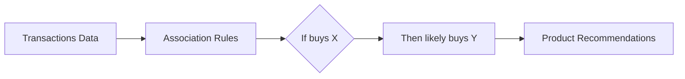
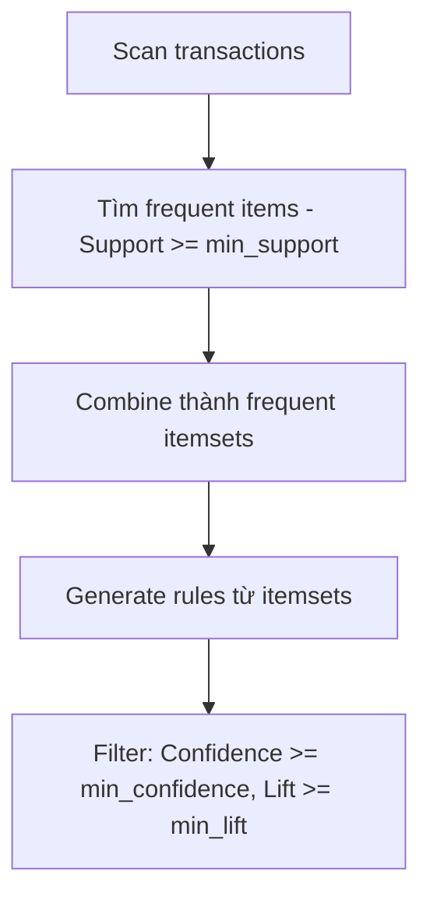
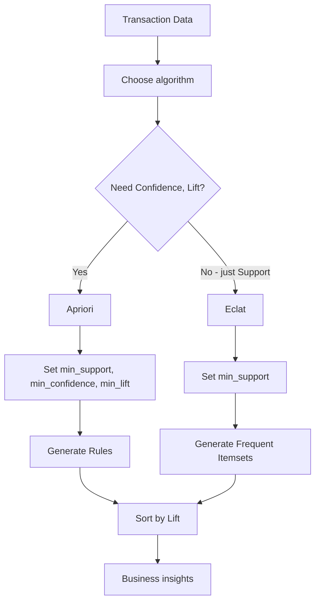

# Bài 4: Association Rule Learning (Học luật kết hợp)

## Tổng quan
**Association Rule Learning** tìm **mối quan hệ** giữa các items trong transactions.

**Use case chính**: **Market Basket Analysis** (phân tích giỏ hàng)
- Ví dụ: Khách mua Bread → thường mua Butter
- Ứng dụng: Recommend products, xếp sản phẩm trong siêu thị



---

## Khái niệm cơ bản

### Ví dụ Transaction
```
Transaction 1: {Bread, Milk, Butter}
Transaction 2: {Bread, Butter}
Transaction 3: {Milk, Butter, Cheese}
Transaction 4: {Bread, Milk, Butter, Cheese}
```

### Association Rule
**Format**: `{X} → {Y}`
- Ví dụ: `{Bread, Milk} → {Butter}`
- Đọc: "Nếu mua Bread VÀ Milk, thì có khả năng cao mua Butter"

---

## 3 Metrics quan trọng

### 1. Support
$$Support(X) = \frac{\text{Transactions chứa X}}{\text{Tổng transactions}}$$

**Ví dụ**:
- 100 transactions, 20 transactions chứa {Bread, Milk}
- Support({Bread, Milk}) = 20/100 = 0.2 (20%)

**Ý nghĩa**: Độ phổ biến của itemset

### 2. Confidence
$$Confidence(X \to Y) = \frac{Support(X \cup Y)}{Support(X)}$$

**Ví dụ**:
- Support({Bread, Milk, Butter}) = 0.15
- Support({Bread, Milk}) = 0.2
- Confidence({Bread, Milk} → {Butter}) = 0.15/0.2 = 0.75 (75%)

**Ý nghĩa**: Xác suất mua Y khi đã mua X

### 3. Lift
$$Lift(X \to Y) = \frac{Confidence(X \to Y)}{Support(Y)}$$

**Ví dụ**:
- Confidence({Bread, Milk} → {Butter}) = 0.75
- Support({Butter}) = 0.4
- Lift = 0.75/0.4 = 1.875

**Ý nghĩa**:
- Lift = 1: X và Y độc lập (không liên quan)
- Lift > 1: X và Y có mối quan hệ dương (mua X → tăng khả năng mua Y) ⭐
- Lift < 1: X và Y có mối quan hệ âm (mua X → giảm khả năng mua Y)

---

## 1. Apriori Algorithm

### Tổng quan
- Thuật toán kinh điển, phổ biến nhất
- Tìm **frequent itemsets** rồi generate rules

### Cách hoạt động


### Ví dụ: Market Basket Optimization
**Dataset**: `Market_Basket_Optimisation.csv` - 7501 transactions, mỗi row là các sản phẩm khách mua

```python
# 1. Import
import numpy as np
import pandas as pd

# 2. Load data
dataset = pd.read_csv('Market_Basket_Optimisation.csv', header=None)

# 3. Transform vào list of transactions
transactions = []
for i in range(0, 7501):
    transactions.append([str(dataset.values[i,j]) for j in range(0, 20)])
# Format: [['bread', 'milk', 'butter'], ['bread', 'butter'], ...]

# 4. Install apyori: pip install apyori
from apyori import apriori

# 5. Train Apriori
rules = apriori(
    transactions=transactions,
    min_support=0.003,      # Item phải xuất hiện ít nhất 0.3% transactions
    min_confidence=0.2,     # Rule phải có confidence >= 20%
    min_lift=3,             # Lift >= 3 (quan hệ mạnh)
    min_length=2,           # Rule có ít nhất 2 items
    max_length=2            # Rule có tối đa 2 items
)

# 6. Lấy kết quả
results = list(rules)

# 7. Organize kết quả vào DataFrame
def inspect(results):
    lhs         = [tuple(result[2][0][0])[0] for result in results]  # Left Hand Side
    rhs         = [tuple(result[2][0][1])[0] for result in results]  # Right Hand Side
    supports    = [result[1] for result in results]
    confidences = [result[2][0][2] for result in results]
    lifts       = [result[2][0][3] for result in results]
    return list(zip(lhs, rhs, supports, confidences, lifts))

resultsinDataFrame = pd.DataFrame(
    inspect(results),
    columns=['Left Hand Side', 'Right Hand Side', 'Support', 'Confidence', 'Lift']
)

# 8. Top 10 rules theo Lift
print(resultsinDataFrame.nlargest(n=10, columns='Lift'))
```

### Chi tiết Apriori Parameters
```python
from apyori import apriori
rules = apriori(
    transactions,
    min_support=0.003,     # 0.3% = 22.5/7501 transactions
    min_confidence=0.2,    # 20%
    min_lift=3,           # Lift >= 3
    min_length=2,         # Tối thiểu 2 items
    max_length=2          # Tối đa 2 items (có thể để None)
)
```

#### Cách chọn parameters
- **min_support**:
  - Quá cao → bỏ lỡ rare items
  - Quá thấp → quá nhiều rules, chậm
  - Rule of thumb: 3-5 lần/ngày trong 1 tuần = 3*7/7501 ≈ 0.003

- **min_confidence**:
  - 0.2-0.3: reasonable
  - Quá cao → quá ít rules

- **min_lift**:
  - >= 3: quan hệ mạnh (khuyến nghị)
  - >= 1: có quan hệ dương

- **min_length, max_length**:
  - 2: rules 1-item → 1-item (ví dụ: bread → butter)
  - 3: rules 2-items → 1-item hoặc 1-item → 2-items

### Kết quả mẫu
```
Left Hand Side    Right Hand Side    Support    Confidence    Lift
light cream       chicken            0.0045     0.29         4.84
pasta             escalope           0.0059     0.37         4.70
fromage blanc     honey              0.0033     0.25         5.16
```

**Giải thích rule đầu tiên**:
- `light cream → chicken`
- Support: 0.45% transactions có cả 2
- Confidence: 29% khách mua light cream cũng mua chicken
- Lift: 4.84 → mua light cream tăng gần 5 lần khả năng mua chicken!

---

## 2. Eclat Algorithm

### Tổng quan
- Đơn giản hơn Apriori
- **Chỉ tính Support** (không tính Confidence, Lift)
- Nhanh hơn Apriori

### Cách hoạt động
- Dùng **depth-first search** thay vì breadth-first (như Apriori)
- Tìm frequent itemsets dựa trên Support

### Ví dụ
```python
# 1. Import
import numpy as np
import pandas as pd

# 2. Load data
dataset = pd.read_csv('Market_Basket_Optimisation.csv', header=None)
transactions = []
for i in range(0, 7501):
    transactions.append([str(dataset.values[i,j]) for j in range(0, 20)])

# 3. Install pyECLAT: pip install pyECLAT
from pyECLAT import ECLAT

# 4. Train Eclat
eclat = ECLAT(data=transactions, verbose=True)
rule_indices, rule_supports = eclat.fit(
    min_support=0.003,
    min_combination=2,      # Tối thiểu 2 items
    max_combination=2,      # Tối đa 2 items
    separator=' & '
)

# 5. Kết quả
# rule_indices: các itemsets
# rule_supports: support của mỗi itemset
```

### Chi tiết ECLAT
```python
from pyECLAT import ECLAT
eclat = ECLAT(data=transactions, verbose=True)
rule_indices, rule_supports = eclat.fit(
    min_support=0.003,       # Support tối thiểu
    min_combination=1,       # Min items trong itemset
    max_combination=3,       # Max items trong itemset
    separator=' & '          # Delimiter khi hiển thị
)
```

---

## So sánh Apriori vs Eclat

| Tiêu chí | Apriori | Eclat |
|----------|---------|-------|
| **Metrics** | Support, Confidence, Lift | Chỉ Support |
| **Speed** | ⚡⚡ Slower | ⚡⚡⚡ Faster |
| **Memory** | More | Less |
| **Output** | Rules (X → Y) | Frequent itemsets |
| **Use case** | Full analysis, recommendations | Quick frequent pattern mining |
| **Complexity** | Higher | Lower |

---

## Ứng dụng thực tế

### 1. Product Recommendations
```python
# Rule: {bread, milk} → {butter}
# → Khi khách thêm bread + milk vào cart
#   → Suggest: "Customers also bought butter"
```

### 2. Store Layout
```python
# Rule: {beer} → {diapers} (famous case!)
# → Đặt beer gần diapers để tăng sales
```

### 3. Cross-selling
```python
# Rule: {laptop} → {mouse, laptop bag}
# → Bundle pricing: Laptop + Mouse + Bag
```

### 4. Promotional Campaigns
```python
# Rule: {coffee} → {cookies} (Lift = 4.5)
# → Discount cookies khi mua coffee
```

---

## Workflow chung



---

## Cách đọc kết quả

### Ví dụ kết quả Apriori:
```
{fromage blanc} → {honey}
Support: 0.0033
Confidence: 0.25
Lift: 5.16
```

**Insights**:
1. **Support 0.33%**: Ít giao dịch (có thể bỏ qua nếu muốn rules phổ biến hơn)
2. **Confidence 25%**: 1/4 khách mua fromage blanc cũng mua honey
3. **Lift 5.16**: ⭐ Mạnh! Mua fromage blanc tăng >5 lần khả năng mua honey
   → **Action**: Đặt honey gần fromage blanc, hoặc bundle offer

### Prioritize rules theo:
1. **Lift cao** (>3): quan hệ mạnh
2. **Support vừa phải** (>0.003): không quá hiếm
3. **Confidence cao** (>0.2): tin cậy

---

## Bài tập thực hành
1. Chạy [apriori.py](1-apriori/apriori.py)
   - Quan sát top 10 rules theo Lift
   - Thử thay đổi `min_support=0.002, 0.005`
   - Thử thay đổi `min_lift=2, 4, 5`
2. Chạy [eclat.py](2-eclat/eclat.py)
   - So sánh speed với Apriori
3. Tìm 3 rules có Lift cao nhất → viết business insights

---

## Tips cho .NET developers

### Lưu rules vào DB
```python
# Sau khi có resultsinDataFrame
resultsinDataFrame.to_csv('rules.csv', index=False)

# Hoặc insert vào SQL Server
import pyodbc
conn = pyodbc.connect('DRIVER={SQL Server};SERVER=localhost;DATABASE=retail;UID=user;PWD=pass')
resultsinDataFrame.to_sql('association_rules', conn, if_exists='replace', index=False)
```

### Real-time recommendations trong .NET
```csharp
// 1. Load rules từ DB khi app start
var rules = db.AssociationRules.Where(r => r.Lift > 3).ToList();

// 2. Khi user thêm item vào cart
var cartItems = new[] { "bread", "milk" };
var recommendations = rules
    .Where(r => cartItems.Contains(r.LeftHandSide))
    .OrderByDescending(r => r.Lift)
    .Select(r => r.RightHandSide)
    .Take(3); // Top 3 suggestions
```

---

## Lưu ý quan trọng

### 1. Data format
- Mỗi row = 1 transaction
- Mỗi cột = 1 item (hoặc list items)
- **KHÔNG có labels** (unsupervised)

### 2. Computational cost
- Apriori: O(2^n) với n items → chậm với nhiều items
- Giảm bằng cách tăng min_support

### 3. Spurious correlations
- Lift cao không có nghĩa là **causation**
- Ví dụ: {umbrella} → {rain} → Lift cao, nhưng mua umbrella không gây mưa!
- Cần domain knowledge để interpret

---

## Tài liệu tham khảo
- [Apyori Documentation](https://pypi.org/project/apyori/)
- [pyECLAT Documentation](https://pypi.org/project/pyECLAT/)
- [Association Rule Learning - Wiki](https://en.wikipedia.org/wiki/Association_rule_learning)
- [Market Basket Analysis Guide](https://www.kaggle.com/learn/market-basket-analysis)
