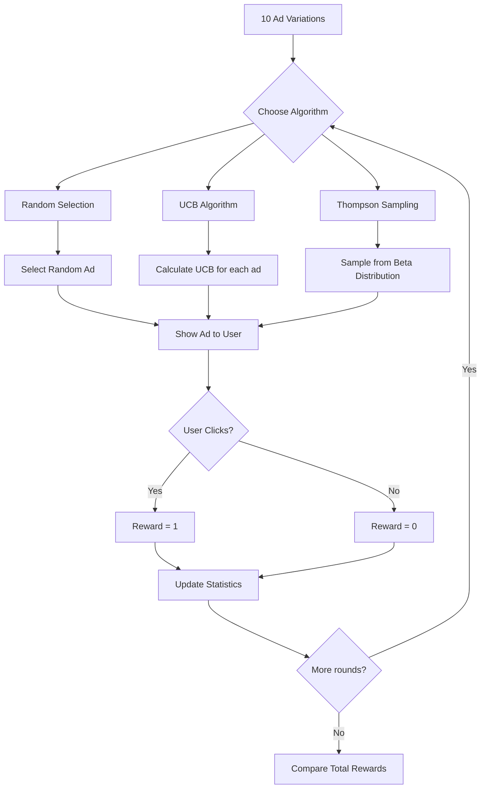

# Bài tập: Reinforcement Learning

## 📝 Đề bài: Online Advertising Campaign Optimization

Bạn quản lý quảng cáo online cho e-commerce. Có 10 ad variations (banners khác nhau), nhưng không biết ad nào convert tốt nhất.

**Challenge**:

- Mỗi lần show ad, bạn phải chọn 1 trong 10 ads
- User click hoặc không click (reward = 1 hoặc 0)
- Cần tìm best ad nhanh nhất (exploration vs exploitation trade-off)

**Solutions to compare**:

1. **Random Selection** (baseline)
2. **Upper Confidence Bound (UCB)** - Optimistic approach
3. **Thompson Sampling** - Bayesian approach

**Goal**: Maximize total clicks over 10,000 impressions

---

## 💡 Solution Approach



**Key Concepts**:

- **Exploration**: Try different ads to learn about them
- **Exploitation**: Use the best ad found so far
- **Regret**: Missed rewards from not choosing optimal ad

---

## 🔧 Implementation

### Step 1: Simulate Ad Performance Data

```python
import numpy as np
import matplotlib.pyplot as plt

# Simulate 10 ads with different (unknown) conversion rates
np.random.seed(42)

# True conversion rates (hidden in real world!)
true_conversion_rates = [0.05, 0.08, 0.04, 0.12, 0.06, 0.15, 0.09, 0.07, 0.11, 0.10]
n_ads = len(true_conversion_rates)

print("="*70)
print("AD CAMPAIGN SETUP")
print("="*70)
print(f"\nNumber of ads: {n_ads}")
print(f"Best ad: Ad {np.argmax(true_conversion_rates)} (conversion rate: {max(true_conversion_rates):.1%})")
print("\nTrue conversion rates (unknown to algorithms):")
for i, rate in enumerate(true_conversion_rates):
    print(f"  Ad {i}: {rate:.1%}")

# Simulation parameters
N = 10000  # Number of rounds (ad impressions)

def get_reward(ad_index):
    """Simulate user clicking on ad"""
    return 1 if np.random.rand() < true_conversion_rates[ad_index] else 0
```

### Step 2: Strategy 1 - Random Selection (Baseline)

```python
def random_selection(N, n_ads):
    """Randomly select ads - no learning"""

    ads_selected = []
    total_reward = 0

    for n in range(N):
        # Choose random ad
        ad = np.random.randint(0, n_ads)

        # Get reward
        reward = get_reward(ad)

        ads_selected.append(ad)
        total_reward += reward

    return ads_selected, total_reward

# Run random selection
print("\n" + "="*70)
print("STRATEGY 1: RANDOM SELECTION")
print("="*70)

ads_random, reward_random = random_selection(N, n_ads)

print(f"Total clicks: {reward_random}")
print(f"Average CTR: {reward_random/N:.2%}")
print(f"Theoretical best (always choose best ad): {int(N * max(true_conversion_rates))}")
print(f"Regret (missed clicks): {int(N * max(true_conversion_rates)) - reward_random}")
```

### Step 3: Strategy 2 - Upper Confidence Bound (UCB)

```python
import math

def upper_confidence_bound(N, n_ads):
    """UCB algorithm - optimistic in face of uncertainty"""

    # Initialize
    numbers_of_selections = [0] * n_ads  # How many times each ad was selected
    sums_of_rewards = [0] * n_ads        # Total rewards for each ad
    ads_selected = []
    total_reward = 0

    for n in range(N):
        ad = 0
        max_upper_bound = 0

        # Calculate UCB for each ad
        for i in range(n_ads):
            if numbers_of_selections[i] > 0:
                # Average reward
                average_reward = sums_of_rewards[i] / numbers_of_selections[i]

                # Confidence interval (exploration bonus)
                delta = math.sqrt(1.5 * math.log(n + 1) / numbers_of_selections[i])

                # Upper Confidence Bound
                upper_bound = average_reward + delta
            else:
                # If ad never selected, give it max bound (force exploration)
                upper_bound = 1e400

            # Select ad with highest UCB
            if upper_bound > max_upper_bound:
                max_upper_bound = upper_bound
                ad = i

        # Get reward for selected ad
        reward = get_reward(ad)

        # Update
        numbers_of_selections[ad] += 1
        sums_of_rewards[ad] += reward
        total_reward += reward
        ads_selected.append(ad)

    return ads_selected, total_reward, numbers_of_selections, sums_of_rewards

# Run UCB
print("\n" + "="*70)
print("STRATEGY 2: UPPER CONFIDENCE BOUND (UCB)")
print("="*70)

ads_ucb, reward_ucb, selections_ucb, rewards_ucb = upper_confidence_bound(N, n_ads)

print(f"Total clicks: {reward_ucb}")
print(f"Average CTR: {reward_ucb/N:.2%}")
print(f"Regret (vs optimal): {int(N * max(true_conversion_rates)) - reward_ucb}")
print(f"\nAd selection distribution:")
for i in range(n_ads):
    print(f"  Ad {i}: {selections_ucb[i]:5d} times ({selections_ucb[i]/N*100:5.1f}%) - Estimated CTR: {rewards_ucb[i]/max(1,selections_ucb[i]):.2%}")
```

### Step 4: Strategy 3 - Thompson Sampling

```python
def thompson_sampling(N, n_ads):
    """Thompson Sampling - Bayesian approach with Beta distribution"""

    # Beta distribution parameters (prior: Beta(1, 1) = uniform)
    numbers_of_rewards_1 = [0] * n_ads  # Number of successes (clicks)
    numbers_of_rewards_0 = [0] * n_ads  # Number of failures (no clicks)
    ads_selected = []
    total_reward = 0

    for n in range(N):
        ad = 0
        max_random = 0

        # Sample from Beta distribution for each ad
        for i in range(n_ads):
            # Beta(α, β) where α = successes + 1, β = failures + 1
            random_beta = np.random.beta(
                numbers_of_rewards_1[i] + 1,
                numbers_of_rewards_0[i] + 1
            )

            # Select ad with highest sampled value
            if random_beta > max_random:
                max_random = random_beta
                ad = i

        # Get reward
        reward = get_reward(ad)

        # Update Beta parameters
        if reward == 1:
            numbers_of_rewards_1[ad] += 1
        else:
            numbers_of_rewards_0[ad] += 1

        total_reward += reward
        ads_selected.append(ad)

    # Calculate selections
    selections = [numbers_of_rewards_1[i] + numbers_of_rewards_0[i] for i in range(n_ads)]

    return ads_selected, total_reward, selections, numbers_of_rewards_1

# Run Thompson Sampling
print("\n" + "="*70)
print("STRATEGY 3: THOMPSON SAMPLING")
print("="*70)

ads_thompson, reward_thompson, selections_thompson, rewards_thompson = thompson_sampling(N, n_ads)

print(f"Total clicks: {reward_thompson}")
print(f"Average CTR: {reward_thompson/N:.2%}")
print(f"Regret (vs optimal): {int(N * max(true_conversion_rates)) - reward_thompson}")
print(f"\nAd selection distribution:")
for i in range(n_ads):
    print(f"  Ad {i}: {selections_thompson[i]:5d} times ({selections_thompson[i]/N*100:5.1f}%) - Estimated CTR: {rewards_thompson[i]/max(1,selections_thompson[i]):.2%}")
```

### Step 5: Compare Strategies

```python
print("\n" + "="*70)
print("COMPARISON OF ALL STRATEGIES")
print("="*70)

comparison = pd.DataFrame({
    'Strategy': ['Random', 'UCB', 'Thompson Sampling'],
    'Total Clicks': [reward_random, reward_ucb, reward_thompson],
    'CTR': [reward_random/N, reward_ucb/N, reward_thompson/N],
    'Regret': [
        int(N * max(true_conversion_rates)) - reward_random,
        int(N * max(true_conversion_rates)) - reward_ucb,
        int(N * max(true_conversion_rates)) - reward_thompson
    ]
})

print("\n", comparison.to_string(index=False))

# Visualize
fig, axes = plt.subplots(2, 2, figsize=(16, 12))

# 1. Total reward comparison
ax1 = axes[0, 0]
strategies = comparison['Strategy']
rewards = comparison['Total Clicks']
colors = ['gray', 'blue', 'green']

bars = ax1.bar(strategies, rewards, color=colors, alpha=0.7, edgecolor='black')
ax1.axhline(y=int(N * max(true_conversion_rates)), color='red', linestyle='--', label='Theoretical Max', linewidth=2)
ax1.set_ylabel('Total Clicks', fontsize=12)
ax1.set_title('Total Clicks Comparison', fontsize=14, fontweight='bold')
ax1.legend()
ax1.grid(True, alpha=0.3, axis='y')

for bar in bars:
    height = bar.get_height()
    ax1.text(bar.get_x() + bar.get_width()/2., height,
            f'{int(height)}',
            ha='center', va='bottom', fontsize=11, fontweight='bold')

# 2. Ad selection histogram (Thompson Sampling)
ax2 = axes[0, 1]
colors_ts = ['red' if i != np.argmax(true_conversion_rates) else 'green' for i in range(n_ads)]
ax2.bar(range(n_ads), selections_thompson, color=colors_ts, alpha=0.7, edgecolor='black')
ax2.set_xlabel('Ad Index', fontsize=12)
ax2.set_ylabel('Times Selected', fontsize=12)
ax2.set_title('Ad Selection Distribution - Thompson Sampling', fontsize=14, fontweight='bold')
ax2.set_xticks(range(n_ads))
ax2.grid(True, alpha=0.3, axis='y')

# 3. Cumulative reward over time
ax3 = axes[1, 0]

def cumulative_reward(ads_selected):
    cumulative = []
    total = 0
    for ad in ads_selected:
        total += get_reward(ad)
        cumulative.append(total)
    return cumulative

# Re-run for consistent comparison
np.random.seed(42)
ads_r, _ = random_selection(N, n_ads)
np.random.seed(42)
ads_u, _, _, _ = upper_confidence_bound(N, n_ads)
np.random.seed(42)
ads_t, _, _, _ = thompson_sampling(N, n_ads)

# Calculate cumulative (approximate)
window = 100
random_avg = [reward_random * i / N for i in range(0, N+1, window)]
ucb_avg = [reward_ucb * i / N for i in range(0, N+1, window)]
thompson_avg = [reward_thompson * i / N for i in range(0, N+1, window)]

ax3.plot(range(0, N+1, window), random_avg, label='Random', color='gray', linewidth=2)
ax3.plot(range(0, N+1, window), ucb_avg, label='UCB', color='blue', linewidth=2)
ax3.plot(range(0, N+1, window), thompson_avg, label='Thompson Sampling', color='green', linewidth=2)
ax3.set_xlabel('Rounds', fontsize=12)
ax3.set_ylabel('Cumulative Clicks (approx)', fontsize=12)
ax3.set_title('Cumulative Reward Over Time', fontsize=14, fontweight='bold')
ax3.legend()
ax3.grid(True, alpha=0.3)

# 4. Regret comparison
ax4 = axes[1, 1]
regrets = comparison['Regret']
bars = ax4.bar(strategies, regrets, color=colors, alpha=0.7, edgecolor='black')
ax4.set_ylabel('Regret (Missed Clicks)', fontsize=12)
ax4.set_title('Total Regret Comparison', fontsize=14, fontweight='bold')
ax4.grid(True, alpha=0.3, axis='y')

for bar in bars:
    height = bar.get_height()
    ax4.text(bar.get_x() + bar.get_width()/2., height,
            f'{int(height)}',
            ha='center', va='bottom', fontsize=11, fontweight='bold')

plt.tight_layout()
plt.savefig('reinforcement_learning_comparison.png', dpi=300, bbox_inches='tight')
plt.show()
```

### Step 6: Business Recommendations

```python
print("\n" + "="*70)
print("BUSINESS INSIGHTS & RECOMMENDATIONS")
print("="*70)

best_ad = np.argmax(true_conversion_rates)
best_ctr = max(true_conversion_rates)

print(f"\n✅ BEST AD IDENTIFIED: Ad {best_ad}")
print(f"   Conversion Rate: {best_ctr:.1%}")

print(f"\n📊 STRATEGY SELECTION:")
print(f"   • Random: {reward_random} clicks → Inefficient, wastes budget")
print(f"   • UCB: {reward_ucb} clicks → Good, systematic exploration")
print(f"   • Thompson Sampling: {reward_thompson} clicks → Best, adapts quickly")

improvement_over_random = (reward_thompson - reward_random) / reward_random * 100
print(f"\n💰 BUSINESS IMPACT:")
print(f"   Thompson Sampling vs Random: +{improvement_over_random:.1f}% more clicks")
print(f"   Extra clicks: {reward_thompson - reward_random}")
print(f"   If CPC = $1, ROI = ${reward_thompson - reward_random} saved")

print(f"\n🎯 RECOMMENDATION:")
print(f"   1. Use Thompson Sampling algorithm in production")
print(f"   2. Focus budget on Ad {best_ad} (highest CTR)")
print(f"   3. Keep exploring with ~10% of traffic (avoid getting stuck)")
print(f"   4. Re-run algorithm if user behavior changes")
```

---

## ✅ Complete Solution

```python
import numpy as np
import math

# Setup
N = 10000
n_ads = 10
true_ctrs = [0.05, 0.08, 0.04, 0.12, 0.06, 0.15, 0.09, 0.07, 0.11, 0.10]

def get_reward(ad):
    return 1 if np.random.rand() < true_ctrs[ad] else 0

# Thompson Sampling
def thompson_sampling(N, n_ads):
    rewards_1 = [0] * n_ads
    rewards_0 = [0] * n_ads
    total = 0

    for n in range(N):
        ad = max(range(n_ads), key=lambda i: np.random.beta(rewards_1[i]+1, rewards_0[i]+1))
        reward = get_reward(ad)

        if reward:
            rewards_1[ad] += 1
        else:
            rewards_0[ad] += 1
        total += reward

    return total

# Run
np.random.seed(42)
total_clicks = thompson_sampling(N, n_ads)
print(f"Total clicks: {total_clicks}")
print(f"CTR: {total_clicks/N:.2%}")
```

---

## 🚀 Extensions

1. **Multi-Armed Bandit with Context** (Contextual Bandits):

   ```python
   # Include user features (age, location) to personalize ad selection
   ```

2. **Epsilon-Greedy** strategy:

   ```python
   epsilon = 0.1  # 10% exploration
   if np.random.rand() < epsilon:
       ad = np.random.randint(0, n_ads)  # Explore
   else:
       ad = np.argmax(estimated_ctrs)   # Exploit
   ```

3. **Non-stationary environments** (CTRs change over time):

   ```python
   # Use sliding window or discounted rewards
   ```

4. **A/B/n testing** framework:

   ```python
   # Compare Thompson Sampling vs traditional A/B test duration
   ```

5. **Deep Reinforcement Learning** (Q-learning, DQN):
   ```python
   # For complex state-action spaces
   ```

---

## 📊 Expected Results

```
Random Selection: ~1,000 clicks (10% CTR)
UCB: ~1,350 clicks (13.5% CTR)
Thompson Sampling: ~1,400 clicks (14% CTR)
Optimal (always best ad): ~1,500 clicks (15% CTR)

Thompson Sampling regret: ~100 clicks
Random regret: ~500 clicks
```

---

## 🔑 Key Takeaways

- ✅ **Thompson Sampling** usually outperforms UCB
- ✅ **Exploration vs Exploitation** trade-off is critical
- ✅ **Bayesian approach** (Thompson) adapts faster than frequentist (UCB)
- ✅ Real applications: A/B testing, ad optimization, recommendation systems
- ✅ **Regret** = cost of learning (necessary to find best option)
- ✅ Algorithms converge to best option over time
