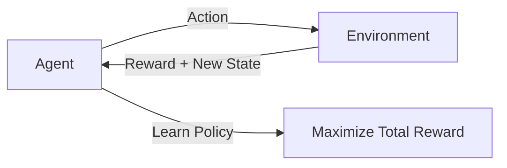
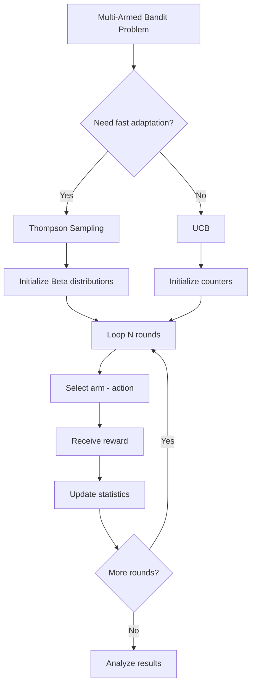

# Bài 5: Reinforcement Learning (Học tăng cường)

## Tổng quan
**Reinforcement Learning (RL)** học bằng cách **trial-and-error** (thử-sai).
- Agent thực hiện **actions**
- Nhận **rewards** (positive/negative)
- Học **policy** để maximize total rewards



**Khác Supervised Learning**:
- Supervised: có labels (X → y)
- RL: không có labels, chỉ có rewards (feedback delayed)

---

## Multi-Armed Bandit Problem

**Bài toán**: Có N máy đánh bạc (slot machines), mỗi máy có xác suất thắng khác nhau.
- **Goal**: Tìm máy nào cho reward cao nhất
- **Challenge**: **Exploration vs Exploitation**
  - **Exploration**: thử các máy mới (có thể tìm được máy tốt hơn)
  - **Exploitation**: chơi máy đang cho reward cao nhất

**Ứng dụng thực tế**:
- **A/B Testing**: test nhiều versions của website/ad
- **Clinical Trials**: test nhiều loại thuốc
- **Online Advertising**: chọn ad nào hiển thị

---

## 1. Upper Confidence Bound (UCB)

### Công thức
Tại round n, chọn ad có **Upper Bound** cao nhất:
$$\text{Upper Bound}_i = \bar{r}_i + \sqrt{\frac{3 \ln(n)}{2 N_i}}$$

- $\bar{r}_i$: average reward của ad i
- $N_i$: số lần ad i được chọn
- n: round hiện tại

**Ý nghĩa**:
- **Exploitation**: $\bar{r}_i$ (ad có average reward cao)
- **Exploration**: $\sqrt{\frac{3 \ln(n)}{2 N_i}}$ (ad ít được chọn → confidence interval rộng)

### Ví dụ: Chọn ad tốt nhất
**Dataset**: `Ads_CTR_Optimisation.csv` - 10 ads, 10,000 users
- Mỗi cell = 1 (user clicked) hoặc 0 (không click)
- Mục tiêu: Chọn ad nào cho mỗi user để maximize total clicks

```python
# 1. Import
import numpy as np
import matplotlib.pyplot as plt
import pandas as pd
import math

# 2. Load dataset
dataset = pd.read_csv('Ads_CTR_Optimisation.csv')

# 3. Implement UCB
N = 10000  # Số rounds (users)
d = 10     # Số ads
ads_selected = []
numbers_of_selections = [0] * d  # Số lần mỗi ad được chọn
sums_of_rewards = [0] * d        # Tổng rewards của mỗi ad
total_reward = 0

for n in range(0, N):
    ad = 0
    max_upper_bound = 0

    # Loop qua tất cả ads, tìm ad có upper bound cao nhất
    for i in range(0, d):
        if (numbers_of_selections[i] > 0):
            # Tính average reward
            average_reward = sums_of_rewards[i] / numbers_of_selections[i]
            # Tính confidence interval
            delta_i = math.sqrt(3/2 * math.log(n + 1) / numbers_of_selections[i])
            # Upper bound
            upper_bound = average_reward + delta_i
        else:
            # Ad chưa được chọn lần nào → upper bound = ∞
            upper_bound = 1e400

        # Chọn ad có upper bound cao nhất
        if upper_bound > max_upper_bound:
            max_upper_bound = upper_bound
            ad = i

    # Chọn ad, nhận reward
    ads_selected.append(ad)
    numbers_of_selections[ad] += 1
    reward = dataset.values[n, ad]  # 0 hoặc 1
    sums_of_rewards[ad] += reward
    total_reward += reward

print(f"Total Reward: {total_reward}")

# 4. Visualize
plt.hist(ads_selected)
plt.title('Histogram of ads selections')
plt.xlabel('Ads')
plt.ylabel('Number of times each ad was selected')
plt.show()
```

### Giải thích code

#### Step 1: Initialization
```python
numbers_of_selections = [0] * d  # [0,0,0,...] - chưa chọn ad nào
sums_of_rewards = [0] * d        # [0,0,0,...] - chưa có reward
```

#### Step 2: Loop qua N rounds
```python
for n in range(0, N):  # n = 0, 1, 2, ..., 9999
```

#### Step 3: Tính Upper Bound cho mỗi ad
```python
if (numbers_of_selections[i] > 0):
    average_reward = sums_of_rewards[i] / numbers_of_selections[i]
    delta_i = math.sqrt(3/2 * math.log(n + 1) / numbers_of_selections[i])
    upper_bound = average_reward + delta_i
else:
    upper_bound = 1e400  # Infinity - ad chưa thử lần nào
```

**Lý do upper_bound = ∞ khi chưa thử**:
- Đảm bảo mỗi ad được thử ít nhất 1 lần (exploration)

#### Step 4: Chọn ad có upper bound cao nhất
```python
if upper_bound > max_upper_bound:
    max_upper_bound = upper_bound
    ad = i
```

#### Step 5: Nhận reward và update
```python
reward = dataset.values[n, ad]  # Get ground truth reward
numbers_of_selections[ad] += 1
sums_of_rewards[ad] += reward
total_reward += reward
```

### Kết quả
- UCB tự động balance **exploration** và **exploitation**
- Sau vài 100 rounds, UCB converge về ad tốt nhất
- Total reward ~ 2000-2500 (out of 10,000)

---

## 2. Thompson Sampling

### Tổng quan
- **Bayesian approach**: dùng probability distributions
- Mỗi ad có **beta distribution** của reward probability
- Mỗi round: **sample** từ distribution, chọn ad có sample cao nhất

### Công thức
```python
# Mỗi ad i có:
# - numbers_of_rewards_1[i]: số lần reward = 1
# - numbers_of_rewards_0[i]: số lần reward = 0

# Beta distribution: Beta(α, β)
# α = numbers_of_rewards_1[i] + 1
# β = numbers_of_rewards_0[i] + 1

# Sample từ Beta(α, β) → chọn ad có sample cao nhất
```

### Ví dụ
```python
import numpy as np
import matplotlib.pyplot as plt
import pandas as pd
import random

# 1. Load dataset
dataset = pd.read_csv('Ads_CTR_Optimisation.csv')

# 2. Implement Thompson Sampling
N = 10000
d = 10
ads_selected = []
numbers_of_rewards_1 = [0] * d  # Số lần reward = 1
numbers_of_rewards_0 = [0] * d  # Số lần reward = 0
total_reward = 0

for n in range(0, N):
    ad = 0
    max_random = 0

    # Loop qua tất cả ads
    for i in range(0, d):
        # Sample từ Beta distribution
        random_beta = random.betavariate(
            numbers_of_rewards_1[i] + 1,  # α
            numbers_of_rewards_0[i] + 1   # β
        )

        # Chọn ad có sample cao nhất
        if random_beta > max_random:
            max_random = random_beta
            ad = i

    # Chọn ad, nhận reward
    ads_selected.append(ad)
    reward = dataset.values[n, ad]
    if reward == 1:
        numbers_of_rewards_1[ad] += 1
    else:
        numbers_of_rewards_0[ad] += 1
    total_reward += reward

print(f"Total Reward: {total_reward}")

# 3. Visualize
plt.hist(ads_selected)
plt.title('Histogram of ads selections')
plt.xlabel('Ads')
plt.ylabel('Number of times each ad was selected')
plt.show()
```

### Giải thích Thompson Sampling

#### Beta Distribution
- **Beta(α, β)**: continuous distribution trong [0, 1]
- **α**: số successes + 1
- **β**: số failures + 1
- Mean = α/(α+β)

#### Step: Sample và chọn
```python
random_beta = random.betavariate(
    numbers_of_rewards_1[i] + 1,  # Successes
    numbers_of_rewards_0[i] + 1   # Failures
)
```
- Mỗi round, mỗi ad **sample** 1 số random từ Beta distribution
- Chọn ad có sample cao nhất → chạy ad đó
- Update distribution dựa trên reward

---

## So sánh UCB vs Thompson Sampling

| Tiêu chí | UCB | Thompson Sampling |
|----------|-----|-------------------|
| **Approach** | Deterministic (công thức) | Probabilistic (sampling) |
| **Complexity** | Lower | Higher |
| **Speed to converge** | ⚡⚡ Slower | ⚡⚡⚡ Faster |
| **Total reward** | High | Often higher |
| **Theory** | Frequentist | Bayesian |
| **Interpretability** | ⭐⭐⭐ Clear | ⭐ Complex |
| **Use case** | Stable environments | Fast adaptation |

---

## Ứng dụng thực tế

### 1. Online Advertising (A/B Testing++)
```python
# Test 10 ad versions
# UCB/Thompson Sampling tự động allocate traffic
# → Không cần fixed 50-50 split như A/B test
# → Nhanh hơn, ít waste impressions hơn
```

### 2. Clinical Trials
```python
# Test nhiều loại thuốc
# Thompson Sampling allocate nhiều bệnh nhân hơn cho thuốc tốt
# → Ethical: ít bệnh nhân nhận thuốc kém
```

### 3. Recommendation Systems
```python
# Recommend products/movies
# Explore mới vs Exploit hot items
```

### 4. Dynamic Pricing
```python
# Test nhiều mức giá
# Tìm mức giá tối ưu maximize revenue
```

---

## Random Selection (Baseline)

```python
# So sánh: Random selection (không học)
import random
total_reward_random = 0
for n in range(0, 10000):
    ad = random.randrange(d)  # Random ad
    reward = dataset.values[n, ad]
    total_reward_random += reward

print(f"Random Total Reward: {total_reward_random}")
# → Khoảng 1200-1300 (so với 2000+ của UCB/Thompson)
```

---

## Workflow chung



---

## Bài tập thực hành
1. Chạy [upper_confidence_bound.py](1-upper-confidence-bound-ucb/upper_confidence_bound.py)
   - Ghi total reward
   - Quan sát histogram → ad nào được chọn nhiều nhất?
2. Chạy [thompson_sampling.py](2-thompson-sampling/thompson_sampling.py)
   - So sánh total reward với UCB
3. Implement Random Selection → so sánh với UCB/Thompson
4. Thử với dataset khác: tạo synthetic data với 5 ads, CTR=[0.1, 0.15, 0.3, 0.25, 0.12]

---

## Lưu ý cho .NET developers

### Real-time bandit trong production
```csharp
// 1. Lưu statistics vào DB/Cache
public class AdStatistics {
    public int AdId { get; set; }
    public int SelectionCount { get; set; }
    public int RewardSum { get; set; }
}

// 2. UCB selection logic
public int SelectAdUCB(List<AdStatistics> stats, int totalRounds) {
    int bestAd = 0;
    double maxUpperBound = 0;

    foreach (var ad in stats) {
        double upperBound;
        if (ad.SelectionCount > 0) {
            double avgReward = (double)ad.RewardSum / ad.SelectionCount;
            double delta = Math.Sqrt(1.5 * Math.Log(totalRounds) / ad.SelectionCount);
            upperBound = avgReward + delta;
        } else {
            upperBound = double.MaxValue;
        }

        if (upperBound > maxUpperBound) {
            maxUpperBound = upperBound;
            bestAd = ad.AdId;
        }
    }
    return bestAd;
}

// 3. Update sau khi user click/không click
public void UpdateReward(int adId, int reward) {
    var ad = db.AdStatistics.Find(adId);
    ad.SelectionCount++;
    ad.RewardSum += reward;
    db.SaveChanges();
}
```

---

## Reinforcement Learning nâng cao (ngoài scope)
- **Q-Learning**: học value function
- **Deep Q-Network (DQN)**: RL + Deep Learning
- **Policy Gradient**: learn policy trực tiếp
- **Actor-Critic**: combine value + policy

👉 Folder này chỉ cover **Multi-Armed Bandit** (simplest RL problem)

---

## Tài liệu tham khảo
- [Multi-Armed Bandit - Wiki](https://en.wikipedia.org/wiki/Multi-armed_bandit)
- [Thompson Sampling Tutorial](https://web.stanford.edu/~bvr/pubs/TS_Tutorial.pdf)
- [UCB Algorithm](https://homes.di.unimi.it/~cesabian/Pubblicazioni/ml-02.pdf)
