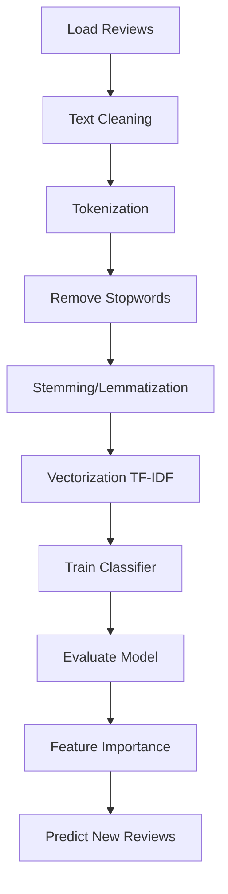

# Bài tập: Natural Language Processing (NLP)

## 📝 Đề bài: Social Media Sentiment Analysis

Bạn làm việc cho marketing team cần analyze customer feedback trên social media.

**Dataset**: Customer reviews/tweets về sản phẩm

- `Text`: Review text
- `Sentiment`: Positive (1) hoặc Negative (0)

**Nhiệm vụ**:

1. Text preprocessing (cleaning, stemming/lemmatization)
2. Feature extraction (Bag of Words hoặc TF-IDF)
3. Train classifier (Naive Bayes recommended for NLP)
4. Predict sentiment cho new reviews
5. Extract most important words cho mỗi sentiment

**Example reviews**:

- "Love this product! Amazing quality and fast shipping!" → Positive
- "Terrible experience. Product broke after 2 days." → Negative

---

## 💡 Solution Approach



---

## 🔧 Implementation

### Step 1: Generate Dataset

```python
import pandas as pd
import numpy as np

# Sample reviews (realistic social media feedback)
reviews = {
    'Text': [
        # Positive reviews
        "Love this product! Amazing quality and fast shipping!",
        "Best purchase ever! Highly recommend to everyone!",
        "Excellent customer service, very satisfied with my order",
        "Great value for money, will definitely buy again",
        "Outstanding quality, exceeded my expectations!",
        "Fantastic product, works perfectly as described",
        "Super happy with this purchase, worth every penny",
        "Incredible quality, shipping was fast and secure",
        "Absolutely love it! Five stars from me!",
        "Amazing! Better than I expected. Great seller!",
        "Perfect! Exactly what I needed. Thank you!",
        "Awesome product, good price, fast delivery",
        "Very pleased with quality and service",
        "Wonderful experience, product is excellent",
        "Brilliant! Works great, very happy customer",

        # Negative reviews
        "Terrible experience. Product broke after 2 days.",
        "Worst purchase I've ever made. Total waste of money.",
        "Poor quality, not as advertised. Very disappointed.",
        "Horrible customer service, never buying again",
        "Cheap materials, broke immediately. Do not buy!",
        "Awful product, complete rip-off. Save your money.",
        "Disappointing quality, not worth the price at all",
        "Rubbish! Stopped working after one week.",
        "Very bad experience. Product is useless.",
        "Disgusting quality. Waste of time and money.",
        "Terrible! Nothing like the description. Scam!",
        "Poor packaging, item arrived damaged and broken",
        "Horrible! Product failed on first use.",
        "Not recommended. Low quality and overpriced.",
        "Bad service, defective product, very unhappy"
    ] * 20,  # Repeat to get ~600 samples

    'Sentiment': ([1]*15 + [0]*15) * 20  # 1=Positive, 0=Negative
}

df = pd.DataFrame(reviews)

# Shuffle
df = df.sample(frac=1, random_state=42).reset_index(drop=True)

df.to_csv('reviews.csv', index=False)
print(f"Dataset created: {len(df)} reviews")
print(f"Positive: {df['Sentiment'].sum()}, Negative: {len(df) - df['Sentiment'].sum()}")
```

### Step 2: Text Preprocessing

```python
import re
import nltk
from nltk.corpus import stopwords
from nltk.stem import PorterStemmer
from nltk.stem import WordNetLemmatizer

# Download NLTK data (run once)
nltk.download('stopwords')
nltk.download('wordnet')
nltk.download('omw-1.4')

# Initialize
ps = PorterStemmer()
lemmatizer = WordNetLemmatizer()
stop_words = set(stopwords.words('english'))

def preprocess_text(text):
    """Clean and preprocess text"""

    # 1. Lowercase
    text = text.lower()

    # 2. Remove special characters (keep only letters)
    text = re.sub(r'[^a-zA-Z\s]', '', text)

    # 3. Tokenize (split into words)
    words = text.split()

    # 4. Remove stopwords
    words = [word for word in words if word not in stop_words]

    # 5. Stemming (or Lemmatization - choose one)
    # Stemming (faster, rougher)
    words = [ps.stem(word) for word in words]

    # OR Lemmatization (slower, more accurate)
    # words = [lemmatizer.lemmatize(word) for word in words]

    # 6. Join back
    return ' '.join(words)

# Apply preprocessing
df['Cleaned_Text'] = df['Text'].apply(preprocess_text)

print("\nOriginal vs Cleaned:")
for i in range(3):
    print(f"\nOriginal: {df['Text'].iloc[i]}")
    print(f"Cleaned:  {df['Cleaned_Text'].iloc[i]}")
```

### Step 3: Feature Extraction - TF-IDF

```python
from sklearn.feature_extraction.text import TfidfVectorizer

# TF-IDF (better than Bag of Words for NLP)
vectorizer = TfidfVectorizer(max_features=500)
X = vectorizer.fit_transform(df['Cleaned_Text']).toarray()
y = df['Sentiment'].values

print(f"\nFeatures (words): {X.shape[1]}")
print(f"Samples: {X.shape[0]}")

# See what words were extracted
feature_names = vectorizer.get_feature_names_out()
print(f"\nSample features: {list(feature_names[:20])}")
```

### Step 4: Train Classifier

```python
from sklearn.model_selection import train_test_split
from sklearn.naive_bayes import MultinomialNB
from sklearn.metrics import classification_report, confusion_matrix, accuracy_score

# Split
X_train, X_test, y_train, y_test = train_test_split(X, y, test_size=0.2, random_state=42)

# Naive Bayes (best for text classification)
classifier = MultinomialNB()
classifier.fit(X_train, y_train)

# Predict
y_pred = classifier.predict(X_test)

# Evaluate
print("\n" + "="*70)
print("MODEL EVALUATION")
print("="*70)
print(f"\nAccuracy: {accuracy_score(y_test, y_pred):.4f}")
print("\nClassification Report:")
print(classification_report(y_test, y_pred, target_names=['Negative', 'Positive']))

# Confusion Matrix
cm = confusion_matrix(y_test, y_pred)
print("\nConfusion Matrix:")
print(f"  True Negatives: {cm[0,0]}")
print(f"  False Positives: {cm[0,1]} (negative predicted as positive)")
print(f"  False Negatives: {cm[1,0]} (positive predicted as negative)")
print(f"  True Positives: {cm[1,1]}")
```

### Step 5: Most Important Words

```python
import matplotlib.pyplot as plt

# Get feature importance (log probabilities from Naive Bayes)
feature_log_prob = classifier.feature_log_prob_

# Top words for POSITIVE sentiment
positive_idx = 1
top_positive_indices = feature_log_prob[positive_idx].argsort()[-15:][::-1]
top_positive_words = [feature_names[i] for i in top_positive_indices]
top_positive_scores = [feature_log_prob[positive_idx][i] for i in top_positive_indices]

# Top words for NEGATIVE sentiment
negative_idx = 0
top_negative_indices = feature_log_prob[negative_idx].argsort()[-15:][::-1]
top_negative_words = [feature_names[i] for i in top_negative_indices]
top_negative_scores = [feature_log_prob[negative_idx][i] for i in top_negative_indices]

# Visualize
fig, (ax1, ax2) = plt.subplots(1, 2, figsize=(16, 6))

# Positive words
ax1.barh(top_positive_words, top_positive_scores, color='green', alpha=0.7)
ax1.set_xlabel('Log Probability')
ax1.set_title('Top 15 Words in POSITIVE Reviews', fontweight='bold')
ax1.invert_yaxis()

# Negative words
ax2.barh(top_negative_words, top_negative_scores, color='red', alpha=0.7)
ax2.set_xlabel('Log Probability')
ax2.set_title('Top 15 Words in NEGATIVE Reviews', fontweight='bold')
ax2.invert_yaxis()

plt.tight_layout()
plt.savefig('important_words.png', dpi=300, bbox_inches='tight')
plt.show()

print("\n" + "="*70)
print("IMPORTANT WORDS")
print("="*70)
print(f"\nPositive sentiment keywords: {', '.join(top_positive_words[:10])}")
print(f"Negative sentiment keywords: {', '.join(top_negative_words[:10])}")
```

### Step 6: Predict New Reviews

```python
def predict_sentiment(review_text):
    """Predict sentiment of new review"""

    # Preprocess
    cleaned = preprocess_text(review_text)

    # Vectorize
    X_new = vectorizer.transform([cleaned]).toarray()

    # Predict
    prediction = classifier.predict(X_new)[0]
    proba = classifier.predict_proba(X_new)[0]

    sentiment = "POSITIVE 😊" if prediction == 1 else "NEGATIVE 😞"
    confidence = proba[prediction] * 100

    print(f"\nReview: \"{review_text}\"")
    print(f"Prediction: {sentiment}")
    print(f"Confidence: {confidence:.1f}%")
    print(f"Probabilities: Negative={proba[0]:.2%}, Positive={proba[1]:.2%}")

    return prediction

# Test predictions
print("\n" + "="*70)
print("TESTING NEW REVIEWS")
print("="*70)

test_reviews = [
    "This is absolutely amazing! Best product ever!",
    "Terrible quality. Completely disappointed.",
    "Pretty good, but could be better.",
    "Waste of money. Don't buy this garbage!",
    "Decent product for the price, satisfied overall."
]

for review in test_reviews:
    predict_sentiment(review)
```

---

## ✅ Complete Solution

```python
import pandas as pd
import re
import nltk
from nltk.corpus import stopwords
from nltk.stem import PorterStemmer
from sklearn.feature_extraction.text import TfidfVectorizer
from sklearn.model_selection import train_test_split
from sklearn.naive_bayes import MultinomialNB
from sklearn.metrics import accuracy_score, classification_report

# Download NLTK data
nltk.download('stopwords', quiet=True)

# Load data
df = pd.read_csv('reviews.csv')

# Preprocessing function
ps = PorterStemmer()
stop_words = set(stopwords.words('english'))

def clean_text(text):
    text = re.sub(r'[^a-zA-Z\s]', '', text.lower())
    words = [ps.stem(w) for w in text.split() if w not in stop_words]
    return ' '.join(words)

df['Cleaned'] = df['Text'].apply(clean_text)

# TF-IDF
vectorizer = TfidfVectorizer(max_features=500)
X = vectorizer.fit_transform(df['Cleaned']).toarray()
y = df['Sentiment'].values

# Train
X_train, X_test, y_train, y_test = train_test_split(X, y, test_size=0.2, random_state=42)
classifier = MultinomialNB()
classifier.fit(X_train, y_train)

# Evaluate
y_pred = classifier.predict(X_test)
print(f"Accuracy: {accuracy_score(y_test, y_pred):.4f}")

# Predict function
def predict(text):
    cleaned = clean_text(text)
    X_new = vectorizer.transform([cleaned]).toarray()
    return "POSITIVE" if classifier.predict(X_new)[0] == 1 else "NEGATIVE"

print(predict("Love this product!"))  # POSITIVE
print(predict("Terrible quality"))     # NEGATIVE
```

---

## 🚀 Extensions

1. **Advanced cleaning with spaCy**:

   ```python
   import spacy
   nlp = spacy.load('en_core_web_sm')
   doc = nlp(text)
   lemmas = [token.lemma_ for token in doc if not token.is_stop]
   ```

2. **Word Cloud visualization**:

   ```python
   from wordcloud import WordCloud
   positive_text = ' '.join(df[df['Sentiment']==1]['Cleaned_Text'])
   wordcloud = WordCloud(width=800, height=400).generate(positive_text)
   plt.imshow(wordcloud)
   plt.show()
   ```

3. **N-grams** (bigrams, trigrams):

   ```python
   vectorizer = TfidfVectorizer(ngram_range=(1, 2), max_features=1000)
   ```

4. **Deep Learning** with Word Embeddings:

   ```python
   from tensorflow.keras.preprocessing.text import Tokenizer
   from tensorflow.keras.models import Sequential
   from tensorflow.keras.layers import Embedding, LSTM, Dense
   ```

5. **Multi-class sentiment** (Positive/Neutral/Negative):
   ```python
   # Add Neutral class
   df['Sentiment'] = [0, 1, 2]  # 0=Negative, 1=Neutral, 2=Positive
   ```

---

## 📊 Expected Results

```
Accuracy: ~0.95-0.98

Top Positive Words: love, amaz, best, great, excel, fantast, perfect, recommend
Top Negative Words: terribl, worst, poor, bad, disappoint, awfu, horribl, useless

Classification Report:
              precision    recall  f1-score
Negative         0.97      0.96      0.97
Positive         0.96      0.97      0.97
```

---

## 🔑 Key Takeaways

- ✅ **Text cleaning** is crucial: lowercase, remove special chars, stopwords
- ✅ **Stemming** vs **Lemmatization**: Stemming faster, Lemmatization more accurate
- ✅ **TF-IDF** better than Bag of Words (weights important words)
- ✅ **Naive Bayes** is goto classifier for text
- ✅ **Feature importance** reveals key sentiment indicators
- ✅ Real-world NLP needs larger datasets (thousands/millions of samples)
