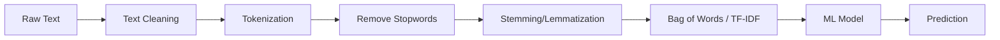
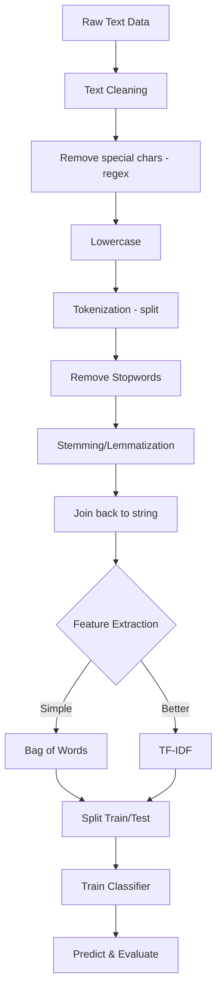

# Bài 6: Natural Language Processing (NLP)

## Tổng quan
**NLP** xử lý text/language data để máy "hiểu" được ngôn ngữ con người.



**Ứng dụng**:
- **Sentiment Analysis**: phân tích cảm xúc (positive/negative reviews)
- **Spam Detection**: email spam hay không
- **Chatbots**: trả lời tự động
- **Machine Translation**: dịch ngôn ngữ
- **Text Classification**: phân loại văn bản

---

## Ví dụ: Sentiment Analysis - Restaurant Reviews

**Dataset**: `Restaurant_Reviews.tsv` - 1000 reviews, mỗi review có label 0 (negative) hoặc 1 (positive)

```
Review                                              Liked
"Wow... Loved this place."                          1
"Crust is not good."                                0
"Not tasty and the texture was just nasty."         0
"Stopped by during the late May bank holiday..."    1
```

**Mục tiêu**: Dự đoán review positive hay negative

---

## Các bước xử lý Text

### Bước 1: Import & Load
```python
import numpy as np
import pandas as pd
import matplotlib.pyplot as plt

# Load dataset (TSV = Tab-Separated Values)
dataset = pd.read_csv('Restaurant_Reviews.tsv', delimiter='\t', quoting=3)
# quoting=3: QUOTE_NONE - không bỏ qua quotes
```

### Bước 2: Text Cleaning (Tiền xử lý text)
```python
import re
import nltk
nltk.download('stopwords')
from nltk.corpus import stopwords
from nltk.stem.porter import PorterStemmer

corpus = []  # List chứa cleaned reviews

for i in range(0, 1000):
    # 2.1. Loại bỏ ký tự đặc biệt, giữ chữ cái
    review = re.sub('[^a-zA-Z]', ' ', dataset['Review'][i])
    # "Wow... Loved this place." → "Wow    Loved this place "

    # 2.2. Chuyển về lowercase
    review = review.lower()
    # "Wow    Loved this place " → "wow    loved this place "

    # 2.3. Tokenization (tách thành words)
    review = review.split()
    # "wow    loved this place " → ['wow', 'loved', 'this', 'place']

    # 2.4. Stemming (rút gọn từ về gốc)
    ps = PorterStemmer()
    # loved → love, running → run, better → better

    # 2.5. Loại bỏ stopwords (từ vô nghĩa)
    all_stopwords = stopwords.words('english')
    # ['i', 'me', 'my', 'myself', 'we', 'our', 'the', 'a', 'an', ...]

    all_stopwords.remove('not')  # Giữ 'not' vì quan trọng cho sentiment

    # List comprehension: stem + remove stopwords
    review = [ps.stem(word) for word in review if not word in set(all_stopwords)]
    # ['wow', 'loved', 'this', 'place'] → ['wow', 'love', 'place']

    # 2.6. Join lại thành string
    review = ' '.join(review)
    # ['wow', 'love', 'place'] → "wow love place"

    corpus.append(review)

print(corpus)
# Output: ['wow love place', 'crust not good', 'not tasti textur nasti', ...]
```

### Chi tiết Text Cleaning

#### 2.1. Regular Expression (regex)
```python
import re
review = re.sub('[^a-zA-Z]', ' ', text)
```
- **Pattern**: `'[^a-zA-Z]'` - tất cả KO phải chữ cái
- **Replacement**: `' '` (space)
- **Ví dụ**: `"Wow... Loved!"` → `"Wow    Loved "`

#### 2.2. Lowercase
```python
review = review.lower()
```
- "Loved" và "loved" là 2 từ khác nhau → lowercase để chuẩn hóa

#### 2.3. Tokenization
```python
review = review.split()
```
- Tách string thành list of words (tokens)

#### 2.4. Stemming
```python
from nltk.stem.porter import PorterStemmer
ps = PorterStemmer()
word_stemmed = ps.stem(word)
```
**Ví dụ**:
- `ps.stem('loved')` → `'love'`
- `ps.stem('loving')` → `'love'`
- `ps.stem('running')` → `'run'`
- `ps.stem('better')` → `'better'`

**Tại sao**: Giảm số từ vựng, "loved" và "loving" có cùng ý nghĩa → cùng feature

**Alternative**: **Lemmatization** (chính xác hơn nhưng chậm hơn)
```python
from nltk.stem import WordNetLemmatizer
lemmatizer = WordNetLemmatizer()
lemmatizer.lemmatize('better', pos='a')  # → 'good'
```

#### 2.5. Stopwords Removal
```python
from nltk.corpus import stopwords
all_stopwords = stopwords.words('english')
# ['i', 'me', 'my', 'the', 'is', 'are', 'was', 'were', ...]
```
- **Stopwords**: từ phổ biến, ít mang ý nghĩa (the, a, an, is, are...)
- Loại bỏ để giảm features

**Custom stopwords**:
```python
all_stopwords.remove('not')  # Giữ 'not' - quan trọng cho sentiment
all_stopwords.append('restaurant')  # Thêm từ muốn loại
```

---

### Bước 3: Bag of Words (BoW)

**Bag of Words**: Chuyển text → vector số

```python
from sklearn.feature_extraction.text import CountVectorizer

cv = CountVectorizer(max_features=1500)
X = cv.fit_transform(corpus).toarray()
y = dataset.iloc[:, -1].values  # Liked column (0 or 1)
```

#### Cách hoạt động
```python
corpus = [
    "wow love place",
    "crust not good",
    "not tasti textur nasti"
]

# CountVectorizer tạo vocabulary
# {'wow': 0, 'love': 1, 'place': 2, 'crust': 3, 'not': 4, 'good': 5, ...}

# Mỗi review → vector đếm số lần xuất hiện mỗi từ
# "wow love place" → [1, 1, 1, 0, 0, 0, ...]
# "crust not good" → [0, 0, 0, 1, 1, 1, ...]
```

#### Chi tiết CountVectorizer
```python
from sklearn.feature_extraction.text import CountVectorizer
cv = CountVectorizer(
    max_features=1500,      # Chỉ giữ 1500 từ phổ biến nhất
    stop_words='english',   # Tự động loại stopwords (optional)
    ngram_range=(1, 2),     # Unigrams + Bigrams (optional)
    min_df=2,              # Từ phải xuất hiện ít nhất 2 documents (optional)
    max_df=0.8             # Từ xuất hiện >80% docs bị loại (optional)
)
X = cv.fit_transform(corpus).toarray()
```

**Parameters**:
- **max_features**: giới hạn số features (từ vựng)
  - 1500: reasonable cho small dataset
  - Quá ít → mất thông tin, quá nhiều → overfitting
- **ngram_range=(1, 1)**: unigrams (single words)
  - `(1, 2)`: unigrams + bigrams ("not good")
  - `(2, 2)`: chỉ bigrams
- **min_df**: minimum document frequency
- **max_df**: maximum document frequency

#### Get feature names
```python
print(cv.get_feature_names_out())
# ['abandon', 'absolut', 'accept', ..., 'wow', 'wrong', 'year']
```

#### Sparse Matrix → Dense Array
```python
X = cv.fit_transform(corpus).toarray()
# Sparse: lưu chỉ non-zero values (tiết kiệm memory)
# Dense: full matrix
```

---

### Bước 4: Split Train/Test
```python
from sklearn.model_selection import train_test_split
X_train, X_test, y_train, y_test = train_test_split(
    X, y, test_size=0.20, random_state=0
)
```

---

### Bước 5: Train Model (Naive Bayes)
```python
from sklearn.naive_bayes import GaussianNB
classifier = GaussianNB()
classifier.fit(X_train, y_train)
```

**Tại sao Naive Bayes**:
- ⚡ Rất nhanh
- Tốt cho **text classification**
- Hoạt động tốt với high-dimensional sparse data (BoW)

**Alternatives**:
```python
# Logistic Regression
from sklearn.linear_model import LogisticRegression
classifier = LogisticRegression()

# Random Forest
from sklearn.ensemble import RandomForestClassifier
classifier = RandomForestClassifier(n_estimators=100)
```

---

### Bước 6: Predict & Evaluate
```python
# Predict
y_pred = classifier.predict(X_test)

# Confusion Matrix
from sklearn.metrics import confusion_matrix, accuracy_score
cm = confusion_matrix(y_test, y_pred)
print(cm)
# [[55 42]
#  [12 91]]

accuracy = accuracy_score(y_test, y_pred)
print(f"Accuracy: {accuracy}")  # 0.73 (73%)
```

---

## TF-IDF (Alternative to BoW)

**TF-IDF** = Term Frequency - Inverse Document Frequency
- Cân nhắc **tầm quan trọng** của từ, không chỉ đếm

### Công thức
$$TF\text{-}IDF(t, d) = TF(t, d) \times IDF(t)$$

- **TF (Term Frequency)**: số lần từ xuất hiện trong document
- **IDF (Inverse Document Frequency)**: $\log(\frac{\text{Total docs}}{\text{Docs chứa từ}})$
  - Từ hiếm → IDF cao
  - Từ phổ biến → IDF thấp

### Ví dụ
```python
from sklearn.feature_extraction.text import TfidfVectorizer

tfidf = TfidfVectorizer(max_features=1500)
X = tfidf.fit_transform(corpus).toarray()
y = dataset.iloc[:, -1].values

# Tiếp tục train như BoW
```

### So sánh BoW vs TF-IDF

| Tiêu chí | BoW (CountVectorizer) | TF-IDF |
|----------|----------------------|--------|
| **Representation** | Đếm số lần xuất hiện | Weighted by importance |
| **Common words** | High values | Lower values (IDF penalizes) |
| **Rare significant words** | Low counts | Higher scores |
| **Use case** | Simple, fast | Better for large corpus |
| **Accuracy** | ⭐⭐ Good | ⭐⭐⭐ Better (usually) |

---

## N-grams

**N-gram**: chuỗi N từ liên tiếp
- **Unigram** (1-gram): "not", "good"
- **Bigram** (2-gram): "not good", "very tasty"
- **Trigram** (3-gram): "not very good"

### Ví dụ với Bigrams
```python
cv = CountVectorizer(max_features=1500, ngram_range=(1, 2))
X = cv.fit_transform(corpus).toarray()
```
- `ngram_range=(1, 1)`: chỉ unigrams
- `ngram_range=(1, 2)`: unigrams + bigrams
- `ngram_range=(2, 2)`: chỉ bigrams

**Lưu ý**: Bigrams tăng features → tăng accuracy nhưng có thể overfit

---

## Workflow đầy đủ cho NLP Classification



---

## Bài tập thực hành
1. Chạy [natural_language_processing.py](natural_language_processing.py)
   - Quan sát `corpus` sau cleaning
   - Check accuracy
2. Thử thay `GaussianNB()` bằng `LogisticRegression()` → so sánh accuracy
3. Thử `TfidfVectorizer` thay vì `CountVectorizer`
4. Thử `ngram_range=(1, 2)` → quan sát accuracy
5. Thử `max_features=500, 1000, 2000` → tìm optimal value

---

## Predict review mới

```python
# 1. Cleaning function
def clean_review(text):
    review = re.sub('[^a-zA-Z]', ' ', text)
    review = review.lower()
    review = review.split()
    ps = PorterStemmer()
    all_stopwords = stopwords.words('english')
    all_stopwords.remove('not')
    review = [ps.stem(word) for word in review if not word in set(all_stopwords)]
    review = ' '.join(review)
    return review

# 2. Predict
new_review = "The food was terrible and service was bad"
cleaned = clean_review(new_review)
X_new = cv.transform([cleaned]).toarray()
prediction = classifier.predict(X_new)
print(f"Prediction: {'Positive' if prediction[0] == 1 else 'Negative'}")
# Output: Negative
```

---

## Lưu ý cho .NET developers

### Save model và vectorizer
```python
import joblib

# Save
joblib.dump(classifier, 'sentiment_model.pkl')
joblib.dump(cv, 'count_vectorizer.pkl')  # QUAN TRỌNG!

# Load
classifier = joblib.load('sentiment_model.pkl')
cv = joblib.load('count_vectorizer.pkl')
```

⚠️ **PHẢI lưu** cả `CountVectorizer`! Vì nó chứa vocabulary mapping.

### API trong .NET calling Python service
```csharp
// ASP.NET minimal API
public class SentimentRequest {
    public string Review { get; set; }
}

app.MapPost("/predict", async (SentimentRequest req) => {
    // Call Python microservice
    var response = await httpClient.PostAsJsonAsync(
        "http://python-service:5000/predict",
        new { text = req.Review }
    );
    var result = await response.Content.ReadFromJsonAsync<SentimentResponse>();
    return result;
});
```

### Python Flask service
```python
from flask import Flask, request, jsonify
import joblib

app = Flask(__name__)
classifier = joblib.load('sentiment_model.pkl')
cv = joblib.load('count_vectorizer.pkl')

@app.route('/predict', methods=['POST'])
def predict():
    text = request.json['text']
    cleaned = clean_review(text)
    X = cv.transform([cleaned]).toarray()
    prediction = classifier.predict(X)[0]
    return jsonify({'sentiment': 'positive' if prediction == 1 else 'negative'})

if __name__ == '__main__':
    app.run(port=5000)
```

---

## NLP nâng cao (ngoài scope)
- **Word Embeddings**: Word2Vec, GloVe, FastText
- **Deep Learning**: LSTM, GRU, Transformers
- **Pre-trained Models**: BERT, GPT, RoBERTa
- **Named Entity Recognition (NER)**
- **Machine Translation**: Seq2Seq, Attention

👉 Folder này chỉ cover **basic NLP + Bag of Words**

---

## Tài liệu tham khảo
- [NLTK Documentation](https://www.nltk.org/)
- [Sklearn Text Feature Extraction](https://scikit-learn.org/stable/modules/feature_extraction.html#text-feature-extraction)
- [CountVectorizer](https://scikit-learn.org/stable/modules/generated/sklearn.feature_extraction.text.CountVectorizer.html)
- [TfidfVectorizer](https://scikit-learn.org/stable/modules/generated/sklearn.feature_extraction.text.TfidfVectorizer.html)
