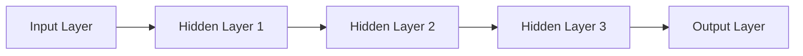
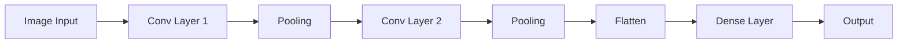

# Bài 7: Deep Learning - Neural Networks

## Tổng quan
**Deep Learning** là subset của Machine Learning, dùng **Neural Networks** với nhiều layers (deep).



**Khi nào dùng Deep Learning**:
- Large dataset (>10,000 samples)
- Complex patterns (images, audio, text)
- High-dimensional data

**Framework phổ biến**:
- **TensorFlow/Keras** (phổ biến nhất) ⭐
- PyTorch
- JAX

---

## 1. Artificial Neural Network (ANN)

### Tổng quan
**ANN** = Fully Connected Neural Network
- Mỗi neuron kết nối đến tất cả neurons ở layer kế tiếp
- Tốt cho **tabular data** (structured data)

### Kiến trúc

```
Input Layer (features) → Hidden Layers → Output Layer (prediction)
```

**Ví dụ**:
- Input: 10 features
- Hidden Layer 1: 6 neurons
- Hidden Layer 2: 6 neurons
- Output: 1 neuron (binary classification)

---

## Ví dụ: Customer Churn Prediction

**Dataset**: `Churn_Modelling.csv` - dự đoán khách hàng có rời khỏi ngân hàng không
- Features: Geography, Credit Score, Gender, Age, Tenure, Balance, ...
- Target: Exited (0 = stay, 1 = leave)

### Bước 1: Data Preprocessing
```python
# 1. Import
import numpy as np
import pandas as pd
import tensorflow as tf

# 2. Load data
dataset = pd.read_csv('Churn_Modelling.csv')
X = dataset.iloc[:, 3:-1].values  # Bỏ 3 cột đầu (RowNumber, CustomerId, Surname)
y = dataset.iloc[:, -1].values    # Exited

# 3. Encode categorical data
from sklearn.preprocessing import LabelEncoder
le = LabelEncoder()
X[:, 2] = le.fit_transform(X[:, 2])  # Gender: Male=1, Female=0

from sklearn.compose import ColumnTransformer
from sklearn.preprocessing import OneHotEncoder
ct = ColumnTransformer(transformers=[('encoder', OneHotEncoder(), [1])], remainder='passthrough')
X = np.array(ct.fit_transform(X))  # Geography: One-Hot Encoding

# 4. Split
from sklearn.model_selection import train_test_split
X_train, X_test, y_train, y_test = train_test_split(X, y, test_size=0.2, random_state=0)

# 5. Feature Scaling (BẮT BUỘC cho ANN!)
from sklearn.preprocessing import StandardScaler
sc = StandardScaler()
X_train = sc.fit_transform(X_train)
X_test = sc.transform(X_test)
```

### Bước 2: Build ANN với Keras
```python
# 1. Initialize ANN
ann = tf.keras.models.Sequential()

# 2. Add Input Layer + Hidden Layer 1
ann.add(tf.keras.layers.Dense(units=6, activation='relu'))

# 3. Add Hidden Layer 2
ann.add(tf.keras.layers.Dense(units=6, activation='relu'))

# 4. Add Output Layer
ann.add(tf.keras.layers.Dense(units=1, activation='sigmoid'))
```

#### Chi tiết layers

##### Dense Layer (Fully Connected)
```python
tf.keras.layers.Dense(
    units=6,              # Số neurons
    activation='relu',    # Activation function
    input_shape=(10,)     # Optional: shape of input (chỉ cho layer đầu)
)
```

**Activation Functions**:
- **ReLU** (Rectified Linear Unit): `activation='relu'`
  - $f(x) = max(0, x)$
  - ⭐ Dùng cho **hidden layers**
  - Tránh vanishing gradient

- **Sigmoid**: `activation='sigmoid'`
  - $f(x) = \frac{1}{1 + e^{-x}}$ → [0, 1]
  - Dùng cho **binary classification output**

- **Softmax**: `activation='softmax'`
  - Dùng cho **multi-class classification output**
  - Output: probabilities sum to 1

- **Linear**: `activation='linear'` (default)
  - Dùng cho **regression output**

### Bước 3: Compile ANN
```python
ann.compile(
    optimizer='adam',              # Optimization algorithm
    loss='binary_crossentropy',    # Loss function
    metrics=['accuracy']           # Metrics to track
)
```

#### Chi tiết compile parameters

##### optimizer
- **'adam'**: Adaptive Moment Estimation (phổ biến nhất) ⭐
  - Tự động điều chỉnh learning rate
  - Tốt cho hầu hết trường hợp
- **'sgd'**: Stochastic Gradient Descent
- **'rmsprop'**: Root Mean Square Propagation

##### loss
- **Binary classification**: `'binary_crossentropy'`
- **Multi-class classification**: `'categorical_crossentropy'` hoặc `'sparse_categorical_crossentropy'`
- **Regression**: `'mean_squared_error'`, `'mean_absolute_error'`

##### metrics
- Classification: `['accuracy']`
- Regression: `['mae']`, `['mse']`

### Bước 4: Train ANN
```python
ann.fit(
    X_train, y_train,
    batch_size=32,     # Số samples mỗi batch
    epochs=100         # Số lần train qua toàn bộ dataset
)
```

#### Chi tiết fit parameters
- **batch_size**:
  - 32: standard (default)
  - Nhỏ (16): chậm, nhiều updates
  - Lớn (128): nhanh, ít updates

- **epochs**:
  - Số lần train qua toàn bộ training set
  - Quá ít → underfit
  - Quá nhiều → overfit
  - Dùng **validation** để tìm optimal epochs

- **validation_split** (optional):
  ```python
  ann.fit(X_train, y_train, batch_size=32, epochs=100, validation_split=0.2)
  # 20% train data dùng làm validation
  ```

### Bước 5: Predict
```python
# Predict single observation
single_prediction = ann.predict(sc.transform([[1, 0, 0, 600, 1, 40, 3, 60000, 2, 1, 1, 50000]]))
print(single_prediction > 0.5)  # Convert probability to binary
# Output: [[False]] → Customer sẽ ở lại

# Predict test set
y_pred = ann.predict(X_test)
y_pred = (y_pred > 0.5)  # Convert probabilities to 0/1

# Confusion Matrix
from sklearn.metrics import confusion_matrix, accuracy_score
cm = confusion_matrix(y_test, y_pred)
print(cm)
accuracy = accuracy_score(y_test, y_pred)
print(f"Accuracy: {accuracy:.2f}")  # ~86%
```

---

## Model Architecture Best Practices

### Số Hidden Layers
- **1-2 layers**: simple problems
- **3-5 layers**: complex problems
- **>5 layers**: very complex (có thể overfit nếu data ít)

### Số Neurons mỗi layer
- Rule of thumb: giữa số input và output
  - Input: 10 features → Hidden: 6 neurons → Output: 1
- Pyramid structure: giảm dần
  - 64 → 32 → 16 → 1
- Trial and error + validation

### Activation Functions
- Hidden layers: **ReLU** (phổ biến nhất)
- Output layer:
  - Binary classification: **Sigmoid**
  - Multi-class: **Softmax**
  - Regression: **Linear** (no activation)

---

## Overfitting và Solutions

### Dropout Layer (regularization)
```python
ann = tf.keras.models.Sequential([
    tf.keras.layers.Dense(64, activation='relu'),
    tf.keras.layers.Dropout(0.5),  # Drop 50% neurons randomly
    tf.keras.layers.Dense(32, activation='relu'),
    tf.keras.layers.Dropout(0.3),  # Drop 30%
    tf.keras.layers.Dense(1, activation='sigmoid')
])
```
- **Dropout(0.5)**: mỗi epoch, random tắt 50% neurons
- Giảm overfitting

### Early Stopping
```python
from tensorflow.keras.callbacks import EarlyStopping

early_stop = EarlyStopping(
    monitor='val_loss',     # Theo dõi validation loss
    patience=10,           # Stop nếu không cải thiện sau 10 epochs
    restore_best_weights=True
)

ann.fit(X_train, y_train,
        batch_size=32,
        epochs=200,
        validation_split=0.2,
        callbacks=[early_stop])
```

---

## Save & Load Model

```python
# Save entire model
ann.save('my_model.h5')  # HDF5 format
ann.save('my_model')     # SavedModel format (recommended)

# Load model
from tensorflow import keras
loaded_model = keras.models.load_model('my_model')

# Predict với loaded model
prediction = loaded_model.predict(X_new)
```

---

## 2. Convolutional Neural Network (CNN)

### Tổng quan
**CNN** chuyên cho **image data**.
- **Convolutional layers**: detect features (edges, shapes, ...)
- **Pooling layers**: reduce dimensions
- **Fully connected layers**: classification



**Use case**: Image classification, object detection, face recognition

### Ví dụ đơn giản
```python
import tensorflow as tf

# Build CNN
cnn = tf.keras.models.Sequential([
    # Convolutional Layer 1
    tf.keras.layers.Conv2D(32, (3, 3), activation='relu', input_shape=(64, 64, 3)),
    tf.keras.layers.MaxPooling2D(pool_size=(2, 2)),

    # Convolutional Layer 2
    tf.keras.layers.Conv2D(64, (3, 3), activation='relu'),
    tf.keras.layers.MaxPooling2D(pool_size=(2, 2)),

    # Flatten
    tf.keras.layers.Flatten(),

    # Fully Connected Layer
    tf.keras.layers.Dense(128, activation='relu'),
    tf.keras.layers.Dense(1, activation='sigmoid')
])

# Compile
cnn.compile(optimizer='adam', loss='binary_crossentropy', metrics=['accuracy'])

# Train (cần ImageDataGenerator để load images)
# cnn.fit(train_generator, epochs=25, validation_data=test_generator)
```

**Chi tiết CNN** nằm trong folder `2-convolutional-neural-networks/`.

---

## ANN vs Traditional ML

| Tiêu chí | ANN (Deep Learning) | Traditional ML (SVM, RF, XGBoost) |
|----------|---------------------|-------------------------------------|
| **Data size** | Large (>10k samples) ⭐ | Small-Medium |
| **Features** | Auto feature extraction | Manual feature engineering |
| **Interpretability** | ⭐ Black box | ⭐⭐⭐ Interpretable |
| **Training time** | ⚡ Slow | ⚡⚡⚡ Fast |
| **Accuracy** | ⭐⭐⭐ (với large data) | ⭐⭐⭐ (với small data) |
| **Use case** | Images, audio, text, large tabular | Small-medium tabular data |

**Rule of thumb**:
- Small tabular data (< 10k rows) → XGBoost, Random Forest
- Large tabular data → ANN hoặc XGBoost
- Images/Audio/Text → CNN/RNN (Deep Learning)

---

## Bài tập thực hành
1. Chạy [artificial_neural_network.py](1-artificial-neural-networks/artificial_neural_network.py)
   - Quan sát training progress (loss giảm, accuracy tăng)
   - Thử predict với customer data khác
2. Thử thay đổi architecture:
   - 3 hidden layers: units=[64, 32, 16]
   - 1 hidden layer: units=[12]
3. Thử thay đổi epochs=50, 100, 200
4. Thêm Dropout layers → quan sát accuracy
5. Dùng validation_split=0.2 → quan sát val_loss vs loss

---

## Lưu ý cho .NET developers

### Deploy ANN model

#### Option 1: Python microservice (recommended)
```python
from flask import Flask, request, jsonify
import tensorflow as tf
import numpy as np
import joblib

app = Flask(__name__)
model = tf.keras.models.load_model('ann_model')
scaler = joblib.load('scaler.pkl')

@app.route('/predict', methods=['POST'])
def predict():
    data = request.json['features']
    scaled = scaler.transform([data])
    prediction = model.predict(scaled)[0][0]

    return jsonify({
        'churn_probability': float(prediction),
        'will_churn': bool(prediction > 0.5)
    })

if __name__ == '__main__':
    app.run(port=5000)
```

#### Option 2: ONNX (cross-platform)
```python
# Convert Keras to ONNX
import tf2onnx
import onnx

spec = (tf.TensorSpec((None, 10), tf.float32, name="input"),)
model_proto, _ = tf2onnx.convert.from_keras(ann, input_signature=spec)
onnx.save(model_proto, "model.onnx")
```

```csharp
// Load ONNX trong .NET
using Microsoft.ML.OnnxRuntime;

var session = new InferenceSession("model.onnx");
var inputMeta = session.InputMetadata;
var container = new List<NamedOnnxValue>();

var tensor = new DenseTensor<float>(inputArray, new[] { 1, 10 });
container.Add(NamedOnnxValue.CreateFromTensor("input", tensor));

var results = session.Run(container);
var prediction = results.First().AsTensor<float>().ToArray();
```

---

## Deep Learning nâng cao (ngoài scope)
- **RNN/LSTM/GRU**: sequence data (time series, text)
- **Transformers**: state-of-the-art NLP (BERT, GPT)
- **GANs**: generate synthetic data
- **Transfer Learning**: use pre-trained models (ResNet, VGG, BERT)
- **Hyperparameter tuning**: learning rate, batch size, architecture search

---

## Install TensorFlow

```bash
# CPU version
pip install tensorflow

# GPU version (cần CUDA)
pip install tensorflow-gpu

# Check installation
python -c "import tensorflow as tf; print(tf.__version__)"
```

---

## Tài liệu tham khảo
- [TensorFlow/Keras Documentation](https://www.tensorflow.org/guide/keras)
- [Keras Sequential API](https://keras.io/guides/sequential_model/)
- [Deep Learning Book](https://www.deeplearningbook.org/)
- [Fast.ai Course](https://www.fast.ai/)
