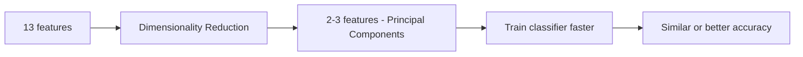
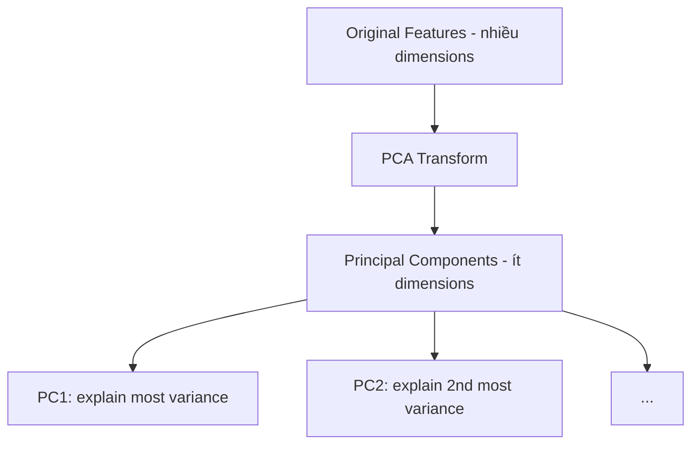
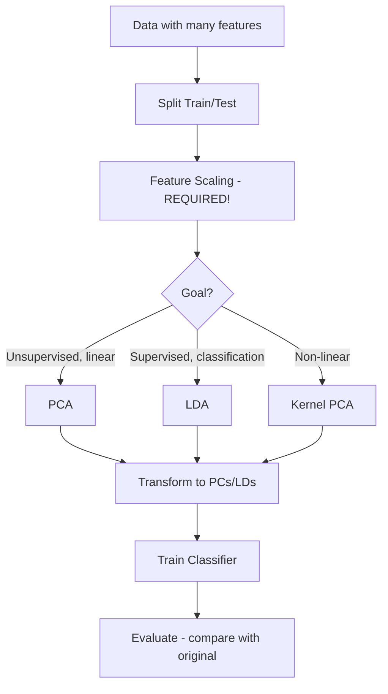

# Bài 8: Dimensionality Reduction (Giảm chiều dữ liệu)

## Tổng quan
**Dimensionality Reduction** giảm số features (dimensions) nhưng **giữ nguyên** hầu hết thông tin.

**Tại sao cần**:
- Quá nhiều features → **Curse of Dimensionality** → model chậm, overfit
- Visualization: giảm xuống 2D/3D để vẽ biểu đồ
- Remove noise/redundant features
- Tăng tốc training



**2 loại**:
1. **Feature Selection**: chọn subset features quan trọng
2. **Feature Extraction**: tạo features mới từ features cũ (PCA, LDA, Kernel PCA)

---

## 1. Principal Component Analysis (PCA)

### Tổng quan
- **Unsupervised**: KHÔNG dùng labels (y)
- Tìm **Principal Components** (PC): directions có variance cao nhất
- PC1: direction có variance lớn nhất
- PC2: direction có variance lớn thứ 2 (orthogonal với PC1)
- ...



### Ví dụ: Wine Classification
**Dataset**: `Wine.csv` - 13 features (alcohol, acidity, ...) → 3 wine classes

```python
# 1. Import
import numpy as np
import pandas as pd
import matplotlib.pyplot as plt

# 2. Load data
dataset = pd.read_csv('Wine.csv')
X = dataset.iloc[:, :-1].values  # 13 features
y = dataset.iloc[:, -1].values   # 3 classes (1, 2, 3)

# 3. Split
from sklearn.model_selection import train_test_split
X_train, X_test, y_train, y_test = train_test_split(X, y, test_size=0.2, random_state=0)

# 4. Feature Scaling (BẮT BUỘC cho PCA!)
from sklearn.preprocessing import StandardScaler
sc = StandardScaler()
X_train = sc.fit_transform(X_train)
X_test = sc.transform(X_test)

# 5. Applying PCA
from sklearn.decomposition import PCA
pca = PCA(n_components=2)  # Giảm từ 13 features → 2 PCs
X_train = pca.fit_transform(X_train)
X_test = pca.transform(X_test)
# X_train shape: (142, 13) → (142, 2)

# 6. Train classifier (trên 2 PCs thay vì 13 features)
from sklearn.linear_model import LogisticRegression
classifier = LogisticRegression(random_state=0)
classifier.fit(X_train, y_train)

# 7. Predict & Evaluate
from sklearn.metrics import confusion_matrix, accuracy_score
y_pred = classifier.predict(X_test)
cm = confusion_matrix(y_test, y_pred)
print(cm)
accuracy = accuracy_score(y_test, y_pred)
print(f"Accuracy: {accuracy}")  # ~97% (tương đương 13 features!)
```

### Chi tiết PCA
```python
from sklearn.decomposition import PCA
pca = PCA(n_components=2)  # Hoặc None, hoặc 0.95
X_train = pca.fit_transform(X_train)
X_test = pca.transform(X_test)
```

#### Parameters
- **n_components**:
  - **Integer** (2, 3, ...): số PCs cụ thể
  - **Float** (0.95): giữ 95% variance
  - **None**: giữ tất cả PCs

#### Explained Variance
```python
print(pca.explained_variance_ratio_)
# Output: [0.36, 0.19] → PC1 giải thích 36%, PC2 giải thích 19%
# Total: 55% variance với 2 PCs (từ 13 features!)
```

#### Chọn số PCs
```python
pca = PCA(n_components=None)
pca.fit(X_train)
explained_variance = pca.explained_variance_ratio_
cumsum = np.cumsum(explained_variance)

# Vẽ biểu đồ
plt.plot(range(1, len(cumsum)+1), cumsum)
plt.xlabel('Number of Components')
plt.ylabel('Cumulative Explained Variance')
plt.axhline(y=0.95, color='r', linestyle='--')  # 95% threshold
plt.show()
# Chọn số PCs để cumsum >= 0.95
```

### Lưu ý PCA
- ⚠️ **PHẢI Feature Scaling** trước PCA
- **Unsupervised**: không dùng y
- **Linear transformation**: PCA = linear combinations của original features
- **PC không có tên**: khó interpret (PC1 = ?, PC2 = ?)

---

## 2. Linear Discriminant Analysis (LDA)

### Tổng quan
- **Supervised**: DÙng labels (y)
- Tìm directions **maximize class separation**
- Output: ≤ (n_classes - 1) components
  - 2 classes → max 1 LD
  - 3 classes → max 2 LDs
  - 10 classes → max 9 LDs

### Công thức
LDA maximize:
$$\frac{\text{Between-class variance}}{\text{Within-class variance}}$$

### Ví dụ: Wine Classification với LDA
```python
# 1-4. Load, split, scale (giống PCA)
...

# 5. Applying LDA
from sklearn.discriminant_analysis import LinearDiscriminantAnalysis as LDA
lda = LDA(n_components=2)  # Max 2 vì 3 classes
X_train = lda.fit_transform(X_train, y_train)  # ⚠️ Cần y_train!
X_test = lda.transform(X_test)

# 6. Train classifier
classifier = LogisticRegression(random_state=0)
classifier.fit(X_train, y_train)

# 7. Evaluate
y_pred = classifier.predict(X_test)
accuracy = accuracy_score(y_test, y_pred)
print(f"Accuracy: {accuracy}")  # ~100% (tốt hơn PCA!)
```

### Chi tiết LDA
```python
from sklearn.discriminant_analysis import LinearDiscriminantAnalysis as LDA
lda = LDA(n_components=2)
X_train = lda.fit_transform(X_train, y_train)  # Supervised!
```

#### Parameters
- **n_components**: max = n_classes - 1
  - 3 classes → max n_components=2

#### Explained Variance
```python
print(lda.explained_variance_ratio_)
# Output: [0.687, 0.313] → LD1: 68.7%, LD2: 31.3%
# Total: 100% với 2 LDs!
```

---

## 3. Kernel PCA

### Tổng quan
- **Non-linear** PCA
- Dùng **kernel trick** (giống Kernel SVM)
- Tốt khi data có **non-linear relationships**

### Ví dụ
```python
# 1-4. Load, split, scale
...

# 5. Applying Kernel PCA
from sklearn.decomposition import KernelPCA
kpca = KernelPCA(n_components=2, kernel='rbf')
X_train = kpca.fit_transform(X_train)
X_test = kpca.transform(X_test)

# 6. Train classifier
from sklearn.linear_model import LogisticRegression
classifier = LogisticRegression(random_state=0)
classifier.fit(X_train, y_train)

# 7. Evaluate
y_pred = classifier.predict(X_test)
accuracy = accuracy_score(y_test, y_pred)
print(f"Accuracy: {accuracy}")
```

### Chi tiết Kernel PCA
```python
from sklearn.decomposition import KernelPCA
kpca = KernelPCA(
    n_components=2,
    kernel='rbf',      # 'linear', 'poly', 'rbf', 'sigmoid'
    gamma=None         # Kernel coefficient (auto)
)
```

#### Kernels
- **'linear'**: PCA chuẩn
- **'rbf'**: Gaussian kernel (phổ biến nhất)
- **'poly'**: Polynomial kernel
- **'sigmoid'**: Sigmoid kernel

---

## So sánh PCA vs LDA vs Kernel PCA

| Tiêu chí | PCA | LDA | Kernel PCA |
|----------|-----|-----|------------|
| **Supervised?** | ❌ No | ✅ Yes | ❌ No |
| **Linear?** | ✅ Yes | ✅ Yes | ❌ No |
| **Max components** | n_features | n_classes - 1 | n_features |
| **Goal** | Maximize variance | Maximize class separation | Non-linear variance |
| **Use case** | General reduction | Classification prep | Non-linear data |
| **Accuracy** | ⭐⭐ | ⭐⭐⭐ | ⭐⭐ (depends) |
| **Speed** | ⚡⚡⚡ | ⚡⚡⚡ | ⚡⚡ Slower |

---

## Khi nào dùng Dimensionality Reduction?

### Use Case 1: Quá nhiều features
```python
# Dataset: 1000 features, 500 samples
# → Overfitting risk cao
# → PCA giảm xuống 50 PCs
```

### Use Case 2: Visualization
```python
# 13 features → không vẽ được
# → PCA/LDA xuống 2D → scatter plot
```

### Use Case 3: Tăng tốc training
```python
# Random Forest với 100 features: chậm
# → PCA xuống 20 PCs → train nhanh hơn nhiều
```

### Use Case 4: Remove noise
```python
# Features cuối có variance thấp → có thể là noise
# → PCA giữ top PCs (variance cao)
```

---

## Workflow chung



---

## Visualize trong 2D

```python
# Sau khi PCA/LDA xuống 2 components
from matplotlib.colors import ListedColormap
X_set, y_set = X_test, y_test  # Hoặc X_train, y_train
plt.scatter(X_set[y_set == 1, 0], X_set[y_set == 1, 1], c='red', label='Class 1')
plt.scatter(X_set[y_set == 2, 0], X_set[y_set == 2, 1], c='green', label='Class 2')
plt.scatter(X_set[y_set == 3, 0], X_set[y_set == 3, 1], c='blue', label='Class 3')
plt.title('Wine Classification (PCA)')
plt.xlabel('PC1')
plt.ylabel('PC2')
plt.legend()
plt.show()
```

---

## Bài tập thực hành
1. Chạy [principal_component_analysis.py](1-principle-component-analysis-pca/principal_component_analysis.py)
   - Quan sát explained variance
   - So sánh accuracy với 13 features gốc (chạy LogReg trước PCA)
2. Chạy [linear_discriminant_analysis.py](2-linear-discriminant-analysis-lda/linear_discriminant_analysis.py)
   - So sánh accuracy PCA vs LDA
3. Chạy [kernel_pca.py](3-kernel-pca/kernel_pca.py)
   - Thử kernel='linear', 'rbf', 'poly'
4. Thử n_components=3, 5, 10 → quan sát trade-off accuracy vs số features

---

## Lưu ý cho .NET developers

### Save PCA/LDA transformer
```python
import joblib

# Save
joblib.dump(pca, 'pca_transformer.pkl')
joblib.dump(sc, 'scaler.pkl')  # Cũng phải lưu scaler!
joblib.dump(classifier, 'classifier.pkl')

# Load trong production
pca = joblib.load('pca_transformer.pkl')
sc = joblib.load('scaler.pkl')
classifier = joblib.load('classifier.pkl')

# Predict
new_data = [[...]]  # 13 features
new_data = sc.transform(new_data)
new_data = pca.transform(new_data)  # 13 → 2 PCs
prediction = classifier.predict(new_data)
```

⚠️ **Quan trọng**: Pipeline phải giống hệt training:
1. Scale
2. PCA transform
3. Predict

---

## Tài liệu tham khảo
- [Sklearn Decomposition](https://scikit-learn.org/stable/modules/decomposition.html)
- [PCA](https://scikit-learn.org/stable/modules/generated/sklearn.decomposition.PCA.html)
- [LDA](https://scikit-learn.org/stable/modules/generated/sklearn.discriminant_analysis.LinearDiscriminantAnalysis.html)
- [Kernel PCA](https://scikit-learn.org/stable/modules/generated/sklearn.decomposition.KernelPCA.html)
