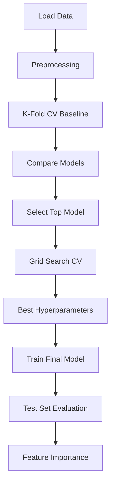

# Bài tập: Model Selection & Boosting

## 📝 Đề bài: Optimize ML Model Performance

Bạn có một classification task nhưng không biết model nào tốt nhất và hyperparameters nào tối ưu.

**Dataset**: Credit Card Fraud Detection

- Features: Transaction amount, time, merchant, location, etc.
- Target: `Fraud` (0 = legitimate, 1 = fraud)

**Nhiệm vụ**:

1. Apply **K-Fold Cross Validation** để evaluate models reliably
2. Compare multiple models (Logistic Regression, Random Forest, XGBoost)
3. Use **Grid Search** để tune hyperparameters
4. Select best model và analyze feature importance
5. Final evaluation on test set

---

## 💡 Solution Approach



---

## 🔧 Implementation

### Step 1: Generate Fraud Detection Dataset

```python
import pandas as pd
import numpy as np
from sklearn.datasets import make_classification

# Generate synthetic fraud data
np.random.seed(42)

# Imbalanced dataset (fraud is rare)
X, y = make_classification(
    n_samples=2000,
    n_features=20,
    n_informative=15,
    n_redundant=5,
    n_classes=2,
    weights=[0.95, 0.05],  # 5% fraud rate (realistic)
    flip_y=0.01,
    random_state=42
)

# Create feature names
feature_names = [
    'transaction_amount', 'transaction_hour', 'merchant_category',
    'distance_from_home', 'distance_from_last_transaction',
    'ratio_to_median_purchase', 'repeat_retailer', 'used_chip',
    'used_pin_number', 'online_order', 'transaction_day',
    'customer_age', 'customer_tenure', 'transactions_last_month',
    'avg_transaction_amount', 'num_declined_last_month',
    'account_age_days', 'credit_limit', 'current_balance',
    'payment_history_score'
]

df = pd.DataFrame(X, columns=feature_names)
df['Fraud'] = y

# Scale transaction amounts realistically
df['transaction_amount'] = np.abs(df['transaction_amount'] * 100 + 200)

df.to_csv('fraud_detection.csv', index=False)

print(f"Dataset created: {len(df)} transactions")
print(f"Fraud cases: {y.sum()} ({y.sum()/len(y)*100:.1f}%)")
print(f"Legitimate: {len(y) - y.sum()} ({(len(y)-y.sum())/len(y)*100:.1f}%)")
```

### Step 2: K-Fold Cross Validation Baseline

```python
from sklearn.model_selection import cross_val_score, StratifiedKFold
from sklearn.linear_model import LogisticRegression
from sklearn.ensemble import RandomForestClassifier
from xgboost import XGBClassifier
from sklearn.preprocessing import StandardScaler
from sklearn.model_selection import train_test_split

# Prepare data
X = df.drop('Fraud', axis=1).values
y = df['Fraud'].values

# Standardize features
scaler = StandardScaler()
X_scaled = scaler.fit_transform(X)

# Split (hold out test set)
X_train, X_test, y_train, y_test = train_test_split(
    X_scaled, y, test_size=0.2, random_state=42, stratify=y
)

# K-Fold CV setup (stratified to preserve class distribution)
cv = StratifiedKFold(n_splits=10, shuffle=True, random_state=42)

# Models to compare
models = {
    'Logistic Regression': LogisticRegression(max_iter=1000, random_state=42),
    'Random Forest': RandomForestClassifier(n_estimators=100, random_state=42),
    'XGBoost': XGBClassifier(n_estimators=100, random_state=42, eval_metric='logloss')
}

print("="*80)
print("K-FOLD CROSS VALIDATION RESULTS (10 Folds)")
print("="*80)

cv_results = {}

for name, model in models.items():
    # Cross-validation scores
    scores = cross_val_score(model, X_train, y_train, cv=cv, scoring='accuracy')

    cv_results[name] = {
        'mean': scores.mean(),
        'std': scores.std(),
        'scores': scores
    }

    print(f"\n{name}:")
    print(f"  Accuracy: {scores.mean():.4f} (+/- {scores.std():.4f})")
    print(f"  Individual fold scores: {[f'{s:.4f}' for s in scores]}")

# Find best baseline model
best_model_name = max(cv_results, key=lambda k: cv_results[k]['mean'])
print(f"\n🏆 Best baseline model: {best_model_name}")
```

### Step 3: Grid Search for Hyperparameter Tuning

```python
from sklearn.model_selection import GridSearchCV

print("\n" + "="*80)
print("GRID SEARCH - HYPERPARAMETER TUNING")
print("="*80)

# Define hyperparameter grids for each model

# 1. Logistic Regression
lr_param_grid = {
    'C': [0.01, 0.1, 1, 10, 100],  # Regularization strength
    'penalty': ['l1', 'l2'],
    'solver': ['liblinear']
}

# 2. Random Forest
rf_param_grid = {
    'n_estimators': [50, 100, 200],
    'max_depth': [5, 10, 20, None],
    'min_samples_split': [2, 5, 10],
    'min_samples_leaf': [1, 2, 4]
}

# 3. XGBoost
xgb_param_grid = {
    'n_estimators': [50, 100, 200],
    'max_depth': [3, 5, 7],
    'learning_rate': [0.01, 0.1, 0.3],
    'subsample': [0.7, 0.8, 1.0],
    'colsample_bytree': [0.7, 0.8, 1.0]
}

param_grids = {
    'Logistic Regression': lr_param_grid,
    'Random Forest': rf_param_grid,
    'XGBoost': xgb_param_grid
}

best_models = {}

for name in models.keys():
    print(f"\nTuning {name}...")

    grid_search = GridSearchCV(
        estimator=models[name],
        param_grid=param_grids[name],
        cv=5,  # 5-fold CV (faster than 10 for grid search)
        scoring='accuracy',
        n_jobs=-1,  # Use all CPU cores
        verbose=1
    )

    grid_search.fit(X_train, y_train)

    best_models[name] = {
        'model': grid_search.best_estimator_,
        'params': grid_search.best_params_,
        'cv_score': grid_search.best_score_
    }

    print(f"\n  Best parameters: {grid_search.best_params_}")
    print(f"  Best CV score: {grid_search.best_score_:.4f}")

# Best overall model
best_overall_name = max(best_models, key=lambda k: best_models[k]['cv_score'])
best_overall_model = best_models[best_overall_name]['model']

print("\n" + "="*80)
print(f"🏆 BEST MODEL: {best_overall_name}")
print("="*80)
print(f"Best parameters: {best_models[best_overall_name]['params']}")
print(f"CV score: {best_models[best_overall_name]['cv_score']:.4f}")
```

### Step 4: Final Evaluation on Test Set

```python
from sklearn.metrics import classification_report, confusion_matrix, roc_auc_score, roc_curve
import matplotlib.pyplot as plt

# Evaluate ALL tuned models on test set
print("\n" + "="*80)
print("TEST SET EVALUATION")
print("="*80)

test_results = {}

for name, info in best_models.items():
    model = info['model']

    # Predictions
    y_pred = model.predict(X_test)
    y_proba = model.predict_proba(X_test)[:, 1] if hasattr(model, 'predict_proba') else None

    # Metrics
    test_results[name] = {
        'accuracy': (y_pred == y_test).mean(),
        'roc_auc': roc_auc_score(y_test, y_proba) if y_proba is not None else None,
        'confusion_matrix': confusion_matrix(y_test, y_pred)
    }

    print(f"\n{name}:")
    print(f"  Test Accuracy: {test_results[name]['accuracy']:.4f}")
    if y_proba is not None:
        print(f"  ROC-AUC Score: {test_results[name]['roc_auc']:.4f}")

    print("\n  Classification Report:")
    print(classification_report(y_test, y_pred, target_names=['Legitimate', 'Fraud']))

    cm = test_results[name]['confusion_matrix']
    print(f"  Confusion Matrix:")
    print(f"    True Negatives: {cm[0,0]} (legit correctly classified)")
    print(f"    False Positives: {cm[0,1]} (legit flagged as fraud)")
    print(f"    False Negatives: {cm[1,0]} (fraud missed! 🚨)")
    print(f"    True Positives: {cm[1,1]} (fraud caught ✅)")

# Plot ROC curves
plt.figure(figsize=(10, 6))

for name, info in best_models.items():
    model = info['model']
    if hasattr(model, 'predict_proba'):
        y_proba = model.predict_proba(X_test)[:, 1]
        fpr, tpr, _ = roc_curve(y_test, y_proba)
        auc = test_results[name]['roc_auc']
        plt.plot(fpr, tpr, label=f'{name} (AUC={auc:.3f})', linewidth=2)

plt.plot([0, 1], [0, 1], 'k--', label='Random Classifier')
plt.xlabel('False Positive Rate', fontsize=12)
plt.ylabel('True Positive Rate', fontsize=12)
plt.title('ROC Curves - Model Comparison', fontsize=14, fontweight='bold')
plt.legend()
plt.grid(True, alpha=0.3)
plt.savefig('roc_curves.png', dpi=300, bbox_inches='tight')
plt.show()
```

### Step 5: Feature Importance Analysis

```python
# Feature importance (for tree-based models)
if best_overall_name in ['Random Forest', 'XGBoost']:
    importances = best_overall_model.feature_importances_

    # Sort by importance
    indices = np.argsort(importances)[::-1]

    print("\n" + "="*80)
    print("FEATURE IMPORTANCE")
    print("="*80)

    print("\nTop 10 Most Important Features:")
    for i in range(10):
        idx = indices[i]
        print(f"  {i+1}. {feature_names[idx]}: {importances[idx]:.4f}")

    # Visualize
    plt.figure(figsize=(12, 8))
    top_n = 15
    top_indices = indices[:top_n]

    plt.barh(
        range(top_n),
        importances[top_indices],
        color='steelblue',
        alpha=0.7
    )
    plt.yticks(range(top_n), [feature_names[i] for i in top_indices])
    plt.xlabel('Feature Importance', fontsize=12)
    plt.title(f'Top {top_n} Feature Importances - {best_overall_name}', fontsize=14, fontweight='bold')
    plt.gca().invert_yaxis()
    plt.grid(True, alpha=0.3, axis='x')
    plt.tight_layout()
    plt.savefig('feature_importance.png', dpi=300, bbox_inches='tight')
    plt.show()
```

---

## ✅ Complete Solution

```python
import numpy as np
import pandas as pd
from sklearn.model_selection import cross_val_score, GridSearchCV, StratifiedKFold, train_test_split
from sklearn.preprocessing import StandardScaler
from sklearn.linear_model import LogisticRegression
from sklearn.ensemble import RandomForestClassifier
from xgboost import XGBClassifier
from sklearn.metrics import accuracy_score, classification_report

# 1. Load data
df = pd.read_csv('fraud_detection.csv')
X = df.drop('Fraud', axis=1).values
y = df['Fraud'].values

# 2. Preprocess
scaler = StandardScaler()
X_scaled = scaler.fit_transform(X)
X_train, X_test, y_train, y_test = train_test_split(X_scaled, y, test_size=0.2, random_state=42)

# 3. K-Fold CV baseline
models = {
    'Logistic Regression': LogisticRegression(max_iter=1000),
    'Random Forest': RandomForestClassifier(n_estimators=100),
    'XGBoost': XGBClassifier(n_estimators=100, eval_metric='logloss')
}

cv = StratifiedKFold(n_splits=10, shuffle=True, random_state=42)

for name, model in models.items():
    scores = cross_val_score(model, X_train, y_train, cv=cv, scoring='accuracy')
    print(f"{name}: {scores.mean():.4f} (+/- {scores.std():.4f})")

# 4. Grid Search on best model
param_grid = {
    'n_estimators': [50, 100, 200],
    'max_depth': [3, 5, 7],
    'learning_rate': [0.01, 0.1, 0.3]
}

grid_search = GridSearchCV(XGBClassifier(eval_metric='logloss'), param_grid, cv=5, n_jobs=-1)
grid_search.fit(X_train, y_train)

print(f"\nBest params: {grid_search.best_params_}")
print(f"Best CV score: {grid_search.best_score_:.4f}")

# 5. Final test
best_model = grid_search.best_estimator_
y_pred = best_model.predict(X_test)
print(f"\nTest accuracy: {accuracy_score(y_test, y_pred):.4f}")
print(classification_report(y_test, y_pred))
```

---

## 🚀 Extensions

1. **Randomized Search** (faster than Grid Search):

   ```python
   from sklearn.model_selection import RandomizedSearchCV
   random_search = RandomizedSearchCV(model, param_distributions, n_iter=50, cv=5)
   ```

2. **Class imbalance handling** (for fraud detection):

   ```python
   from imblearn.over_sampling import SMOTE
   smote = SMOTE(random_state=42)
   X_resampled, y_resampled = smote.fit_resample(X_train, y_train)
   ```

3. **Nested CV** (unbiased performance estimate):

   ```python
   from sklearn.model_selection import cross_val_score
   nested_scores = cross_val_score(grid_search, X, y, cv=5)
   ```

4. **Custom scoring** (e.g., F1 for imbalanced data):

   ```python
   grid_search = GridSearchCV(model, param_grid, scoring='f1', cv=5)
   ```

5. **Bayesian Optimization**:
   ```python
   from skopt import BayesSearchCV
   bayes_search = BayesSearchCV(model, param_space, n_iter=32, cv=5)
   ```

---

## 📊 Expected Results

```
K-Fold CV:
  Logistic Regression: ~0.960
  Random Forest: ~0.970
  XGBoost: ~0.975 🏆

After Grid Search:
  XGBoost: ~0.982

Test Set:
  Accuracy: ~0.98
  ROC-AUC: ~0.99

Top Features: transaction_amount, distance_from_home, ratio_to_median_purchase
```

---

## 🔑 Key Takeaways

- ✅ **K-Fold CV** gives reliable performance estimates
- ✅ **Stratified K-Fold** preserves class distribution (important for imbalanced data)
- ✅ **Grid Search** finds optimal hyperparameters systematically
- ✅ **XGBoost** often wins with tuning
- ✅ **Feature importance** helps understand model decisions
- ✅ Always hold out a **final test set** (never seen during CV/tuning)
- ✅ For fraud detection: **False Negatives** (missed fraud) are costly!
