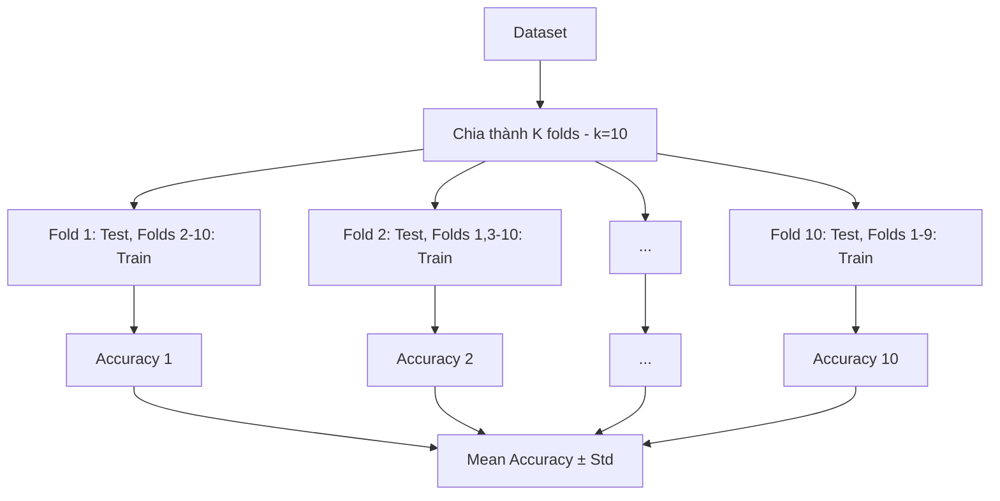
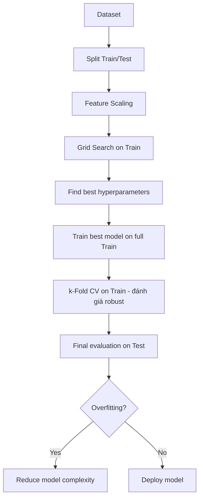

# Bài 9: Model Selection & Boosting

## Phần 1: Model Selection (Chọn và đánh giá model)

### Tổng quan
Sau khi train model, cần đánh giá **chính xác** performance để tránh **overfitting**.

**2 kỹ thuật chính**:
1. **k-Fold Cross Validation**: đánh giá model robust
2. **Grid Search**: tìm hyperparameters tốt nhất

---

## 1. k-Fold Cross Validation

### Vấn đề với train/test split đơn giản
```python
X_train, X_test = train_test_split(X, y, test_size=0.2)
# Accuracy = 90%
```
**Vấn đề**:
- Accuracy phụ thuộc vào **random split**
- Nếu test set dễ → accuracy cao (may mắn)
- Nếu test set khó → accuracy thấp
- **Không đáng tin cậy**!

### k-Fold CV giải quyết như thế nào?



**Cách hoạt động**:
1. Chia data thành K folds (thường K=10)
2. Lặp K lần:
   - Fold i: test set
   - Folds còn lại: train set
   - Train model → đánh giá trên fold i
3. Tính **mean** và **standard deviation** của K accuracies

### Ví dụ: k-Fold CV
```python
# 1. Import
import numpy as np
import pandas as pd

# 2. Load data
dataset = pd.read_csv('Social_Network_Ads.csv')
X = dataset.iloc[:, :-1].values
y = dataset.iloc[:, -1].values

# 3. Split (vẫn cần để đánh giá final model)
from sklearn.model_selection import train_test_split
X_train, X_test, y_train, y_test = train_test_split(X, y, test_size=0.25, random_state=0)

# 4. Feature Scaling
from sklearn.preprocessing import StandardScaler
sc = StandardScaler()
X_train = sc.fit_transform(X_train)
X_test = sc.transform(X_test)

# 5. Train model
from sklearn.svm import SVC
classifier = SVC(kernel='rbf', random_state=0)
classifier.fit(X_train, y_train)

# 6. Evaluate với simple test set
from sklearn.metrics import accuracy_score
y_pred = classifier.predict(X_test)
test_accuracy = accuracy_score(y_test, y_pred)
print(f"Test Accuracy: {test_accuracy:.2f}")  # Ví dụ: 0.93

# 7. k-Fold Cross Validation (đánh giá robust)
from sklearn.model_selection import cross_val_score
accuracies = cross_val_score(
    estimator=classifier,
    X=X_train,           # Chỉ dùng train set
    y=y_train,
    cv=10                # 10-fold CV
)
print(f"Accuracy: {accuracies.mean():.2f} %")
print(f"Standard Deviation: {accuracies.std():.2f} %")
# Output: Accuracy: 90.33 %, Std: 6.57 %
```

### Chi tiết cross_val_score
```python
from sklearn.model_selection import cross_val_score
accuracies = cross_val_score(
    estimator=classifier,    # Model đã init (chưa fit)
    X=X_train,              # Training data
    y=y_train,              # Training labels
    cv=10,                  # Số folds
    scoring='accuracy'       # Metric (default='accuracy' cho classifier)
)
```

#### Parameters
- **estimator**: model instance (chưa fit)
- **X, y**: training data
- **cv**: số folds (thường 5 hoặc 10)
  - cv=5: nhanh hơn
  - cv=10: chính xác hơn (standard)
- **scoring**: metric
  - `'accuracy'`: accuracy (default cho classification)
  - `'precision'`, `'recall'`, `'f1'`
  - `'neg_mean_squared_error'`: RMSE (regression)

#### Return
- Array của K scores (accuracies)
- Tính mean và std:
  ```python
  print(f"Mean: {accuracies.mean():.2f}")
  print(f"Std: {accuracies.std():.2f}")
  ```

### Giải thích kết quả
```
Accuracy: 90.33 ± 6.57 %
```
- **Mean 90.33%**: model trung bình đạt 90.33% accuracy
- **Std 6.57%**: accuracy biến động trong khoảng ~[84%, 97%]
- **Std cao** → model **không stable** (có thể overfit hoặc data không đồng nhất)
- **Std thấp** → model **robust**

### k-Fold CV cho Regression
```python
from sklearn.model_selection import cross_val_score
from sklearn.linear_model import LinearRegression

regressor = LinearRegression()
scores = cross_val_score(
    estimator=regressor,
    X=X_train,
    y=y_train,
    cv=10,
    scoring='neg_mean_squared_error'  # MSE (negative vì sklearn minimize)
)
rmse_scores = np.sqrt(-scores)  # Convert to RMSE
print(f"RMSE: {rmse_scores.mean():.2f} ± {rmse_scores.std():.2f}")
```

---

## 2. Grid Search

### Tổng quan
**Hyperparameters**: parameters không học được từ data, phải set trước
- Ví dụ SVM: `C`, `gamma`, `kernel`
- Ví dụ Random Forest: `n_estimators`, `max_depth`

**Grid Search**: thử **tất cả combinations** của hyperparameters, tìm combination tốt nhất.

### Ví dụ: Grid Search cho Kernel SVM
```python
# 1-4. Load, split, scale (giống k-Fold CV)
...

# 5. Define parameter grid
param_grid = [
    {
        'C': [0.25, 0.5, 0.75, 1],
        'kernel': ['linear']
    },
    {
        'C': [0.25, 0.5, 0.75, 1],
        'gamma': [0.1, 0.2, 0.3, 0.4, 0.5, 0.6, 0.7, 0.8, 0.9],
        'kernel': ['rbf']
    }
]
# Total combinations:
# - Linear: 4 (C) = 4
# - RBF: 4 (C) × 9 (gamma) = 36
# → Total: 40 combinations

# 6. Grid Search
from sklearn.model_selection import GridSearchCV
from sklearn.svm import SVC

grid_search = GridSearchCV(
    estimator=SVC(),
    param_grid=param_grid,
    scoring='accuracy',
    cv=10,              # 10-fold CV cho mỗi combination
    n_jobs=-1           # Parallel processing (dùng tất cả CPUs)
)
grid_search.fit(X_train, y_train)

# 7. Best parameters và best accuracy
print(f"Best Accuracy: {grid_search.best_score_:.2f}")
print(f"Best Parameters: {grid_search.best_params_}")
# Output:
# Best Accuracy: 0.90
# Best Parameters: {'C': 1, 'gamma': 0.7, 'kernel': 'rbf'}

# 8. Predict với best model
best_classifier = grid_search.best_estimator_
y_pred = best_classifier.predict(X_test)
test_accuracy = accuracy_score(y_test, y_pred)
print(f"Test Accuracy: {test_accuracy:.2f}")
```

### Chi tiết GridSearchCV
```python
from sklearn.model_selection import GridSearchCV
grid_search = GridSearchCV(
    estimator=SVC(),           # Base model
    param_grid=param_grid,     # Dict/list of dicts
    scoring='accuracy',        # Metric to optimize
    cv=10,                    # k-Fold CV
    n_jobs=-1,                # Parallel (-1 = all CPUs)
    verbose=2                 # Print progress (0, 1, 2, 3)
)
grid_search.fit(X_train, y_train)
```

#### Attributes
```python
grid_search.best_score_        # Best mean CV accuracy
grid_search.best_params_       # Best hyperparameters
grid_search.best_estimator_    # Best model (fitted)
grid_search.cv_results_        # All results (dict)
```

#### Ví dụ param_grid phức tạp
```python
# Random Forest
param_grid = {
    'n_estimators': [10, 50, 100, 200],
    'max_depth': [None, 10, 20, 30],
    'min_samples_split': [2, 5, 10],
    'min_samples_leaf': [1, 2, 4]
}
# Total: 4 × 4 × 3 × 3 = 144 combinations × 10 folds = 1440 fits!
```

### Grid Search cho Regression
```python
from sklearn.model_selection import GridSearchCV
from sklearn.ensemble import RandomForestRegressor

param_grid = {
    'n_estimators': [100, 200, 300],
    'max_depth': [10, 20, None]
}

grid_search = GridSearchCV(
    estimator=RandomForestRegressor(),
    param_grid=param_grid,
    scoring='neg_mean_squared_error',  # MSE
    cv=5
)
grid_search.fit(X_train, y_train)
print(grid_search.best_params_)
```

---

## Randomized Search (大alternative faster)

**Vấn đề Grid Search**: chậm với nhiều hyperparameters
- 10 params × 5 values each = 5^10 = ~10 triệu combinations!

**Randomized Search**: random sample N combinations thay vì thử tất cả

```python
from sklearn.model_selection import RandomizedSearchCV
from scipy.stats import randint, uniform

param_dist = {
    'n_estimators': randint(50, 500),      # Random int [50, 500)
    'max_depth': randint(5, 50),
    'min_samples_split': randint(2, 20),
    'min_samples_leaf': randint(1, 10),
    'max_features': uniform(0.1, 0.9)     # Random float [0.1, 1.0)
}

random_search = RandomizedSearchCV(
    estimator=RandomForestClassifier(),
    param_distributions=param_dist,
    n_iter=100,          # Chỉ thử 100 random combinations
    scoring='accuracy',
    cv=5,
    n_jobs=-1,
    random_state=0
)
random_search.fit(X_train, y_train)
print(random_search.best_params_)
```

---

## So sánh Grid Search vs Randomized Search

| Tiêu chí | Grid Search | Randomized Search |
|----------|-------------|-------------------|
| **Approach** | Exhaust all | Random sample |
| **Speed** | ⚡ Slow | ⚡⚡⚡ Fast |
| **Coverage** | 100% | Depends on n_iter |
| **Best for** | Few hyperparameters | Many hyperparameters |
| **Guarantee** | Find best in grid | Might miss best |

---

## Workflow đầy đủ



---

## Bài tập thực hành
1. Chạy [k_fold_cross_validation.py](k_fold_cross_validation.py)
   - Quan sát mean và std
   - Thử cv=5, 10, 20 → so sánh
2. Chạy [grid_search.py](grid_search.py)
   - Tìm best_params_
   - Thử thêm hyperparameter vào param_grid
3. Thử RandomizedSearchCV với n_iter=50, 100, 200
4. Áp dụng Grid Search cho Random Forest classifier

---

## Lưu ý cho .NET developers

### Save best model từ Grid Search
```python
import joblib

# Grid Search
grid_search.fit(X_train, y_train)
best_model = grid_search.best_estimator_

# Save
joblib.dump(best_model, 'best_model.pkl')
joblib.dump(sc, 'scaler.pkl')

# Metadata
import json
metadata = {
    'best_params': grid_search.best_params_,
    'best_score': grid_search.best_score_,
    'cv_folds': 10
}
with open('model_metadata.json', 'w') as f:
    json.dump(metadata, f)
```

### Load trong .NET service
```python
# Python Flask API
import joblib
from flask import Flask, request, jsonify

app = Flask(__name__)
model = joblib.load('best_model.pkl')
scaler = joblib.load('scaler.pkl')

@app.route('/predict', methods=['POST'])
def predict():
    data = request.json['features']
    scaled = scaler.transform([data])
    prediction = model.predict(scaled)[0]
    return jsonify({'prediction': int(prediction)})
```

---

## Tài liệu tham khảo
- [Cross Validation](https://scikit-learn.org/stable/modules/cross_validation.html)
- [GridSearchCV](https://scikit-learn.org/stable/modules/generated/sklearn.model_selection.GridSearchCV.html)
- [RandomizedSearchCV](https://scikit-learn.org/stable/modules/generated/sklearn.model_selection.RandomizedSearchCV.html)
