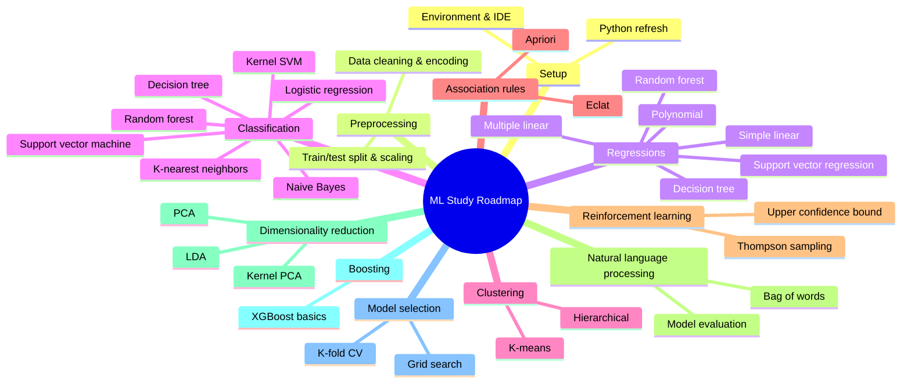

# ML Learning Guide (for .NET Backend Engineers)

## Mindmap Overview

## Quickstart
- Install Python 3.10+ and pip.
- Packages: `pip install numpy pandas scikit-learn matplotlib seaborn joblib` (and `xgboost` for boosting).
- Run a script: `python path/to/script.py` (e.g., `python 1-regressions/1-simple-linear-regression/simple_linear_regression.py`).
- Notebooks: open `.ipynb` in VS Code/Jupyter; prefer scripts for faster runs.

## Folder-to-Topic Map
- Preprocessing: [0-preprocessing/data_preprocessing_template.py](0-preprocessing/data_preprocessing_template.py), [0-preprocessing/data_preprocessing_tools.py](0-preprocessing/data_preprocessing_tools.py)
- Regressions: [1-regressions/1-simple-linear-regression/simple_linear_regression.py](1-regressions/1-simple-linear-regression/simple_linear_regression.py) → [1-regressions/6-random-forest-regression/random_forest_regression.py](1-regressions/6-random-forest-regression/random_forest_regression.py)
- Classification: [2-classifications/1-logistic-regressions/logistic_regression.py](2-classifications/1-logistic-regressions/logistic_regression.py) → [2-classifications/7-random-forest-classification/random_forest_classification.py](2-classifications/7-random-forest-classification/random_forest_classification.py)
- Clustering: [3-clustering/1-k-means-clustering/k_means_clustering.py](3-clustering/1-k-means-clustering/k_means_clustering.py), [3-clustering/2-hierachical-clustering/hierarchical_clustering.py](3-clustering/2-hierachical-clustering/hierarchical_clustering.py)
- Association rules: [4-association-rule-learning/1-apriori/apriori.py](4-association-rule-learning/1-apriori/apriori.py), [4-association-rule-learning/2-eclat/eclat.py](4-association-rule-learning/2-eclat/eclat.py)
- Reinforcement learning: [5-reinforcement-learning/1-upper-confidence-bound-ucb/upper_confidence_bound.py](5-reinforcement-learning/1-upper-confidence-bound-ucb/upper_confidence_bound.py), [5-reinforcement-learning/2-thompson-sampling/thompson_sampling.py](5-reinforcement-learning/2-thompson-sampling/thompson_sampling.py)
- NLP: [6-natural-language-processing/natural_language_processing.py](6-natural-language-processing/natural_language_processing.py)
- Deep learning: [7-deep-learning/1-artificial-neural-networks/artificial_neural_network.py](7-deep-learning/1-artificial-neural-networks/artificial_neural_network.py), [7-deep-learning/2-convolutional-neural-networks/convolutional_neural_network.py](7-deep-learning/2-convolutional-neural-networks/convolutional_neural_network.py)
- Dimensionality reduction: [8-dimentionality-reduction/1-principle-component-analysis-pca/principal_component_analysis.py](8-dimentionality-reduction/1-principle-component-analysis-pca/principal_component_analysis.py) → [8-dimentionality-reduction/3-kernel-pca/kernel_pca.py](8-dimentionality-reduction/3-kernel-pca/kernel_pca.py)
- Model selection: [9-model-selection/k_fold_cross_validation.py](9-model-selection/k_fold_cross_validation.py), [9-model-selection/grid_search.py](9-model-selection/grid_search.py)
- Boosting/XGBoost: [10-boosting-xg-boost/xg_boost.py](10-boosting-xg-boost/xg_boost.py)

## Suggested Order (hands-on)
1. Preprocessing template with a small CSV.
2. Regressions: simple → multiple → polynomial → SVR → trees → forests.
3. Classification: logistic → KNN → SVM (linear, kernel) → Naive Bayes → trees/forests.
4. Clustering: k-means vs hierarchical.
5. NLP: bag-of-words + evaluation.
6. Dimensionality reduction: PCA/LDA/Kernel PCA; rerun a classifier to see impact.
7. Boosting: XGBoost basics.
8. Model selection: k-fold CV and grid search on any earlier model.
9. Reinforcement learning: bandit demos (UCB, Thompson) last.

## Standard Pipeline (mirror in services)
1) Load data (CSV) → 2) Split train/test → 3) Encode/scale → 4) Fit model → 5) Predict → 6) Metrics/plots → 7) Persist model (optional).

## .NET Backend Tips
- Keep preprocessing identical at inference. If serving from .NET, replicate encoding and scaling steps before calling the model.
- Easiest path: expose a small Python service (FastAPI/Flask) loading `joblib`-saved model; call via HTTP/gRPC from ASP.NET.
- For pure .NET, consider ML.NET for simpler models; for complex ones (SVM, XGBoost), prefer Python service for parity.

## Validation Check
- Mermaid mindmap syntax validated.

## Detailed Lessons per Topic

Mỗi folder có file **LESSON.md** chi tiết:

1. **[0-preprocessing/LESSON.md](0-preprocessing/LESSON.md)** - Data Preprocessing đầy đủ
2. **[1-regressions/LESSON.md](1-regressions/LESSON.md)** - 6 loại Regression algorithms
3. **[2-classifications/LESSON.md](2-classifications/LESSON.md)** - 7 loại Classification algorithms
4. **[3-clustering/LESSON.md](3-clustering/LESSON.md)** - K-Means & Hierarchical Clustering
5. **[4-association-rule-learning/LESSON.md](4-association-rule-learning/LESSON.md)** - Apriori & Eclat
6. **[5-reinforcement-learning/LESSON.md](5-reinforcement-learning/LESSON.md)** - UCB & Thompson Sampling
7. **[6-natural-language-processing/LESSON.md](6-natural-language-processing/LESSON.md)** - NLP & Bag of Words
8. **[7-deep-learning/LESSON.md](7-deep-learning/LESSON.md)** - Neural Networks (ANN & CNN)
9. **[8-dimentionality-reduction/LESSON.md](8-dimentionality-reduction/LESSON.md)** - PCA, LDA, Kernel PCA
10. **[9-model-selection/LESSON.md](9-model-selection/LESSON.md)** - k-Fold CV & Grid Search
11. **[10-boosting-xg-boost/LESSON.md](10-boosting-xg-boost/LESSON.md)** - XGBoost

Mỗi LESSON.md bao gồm:
- ✅ Giải thích lý thuyết bằng tiếng Việt
- ✅ Syntax chi tiết của các thư viện (numpy, pandas, sklearn, keras, xgboost)
- ✅ Code examples với giải thích từng dòng
- ✅ Mermaid diagrams để visualize concepts
- ✅ Best practices & common pitfalls
- ✅ Tips cho .NET developers (deployment, API integration)
- ✅ Bài tập thực hành

## Next Steps
1. Đọc [0-preprocessing/LESSON.md](0-preprocessing/LESSON.md) → chạy code
2. Tiếp tục theo thứ tự 1 → 10
3. Mỗi bài: đọc lý thuyết → chạy .py → làm bài tập
4. Persist model với `joblib` và tích hợp vào .NET service
