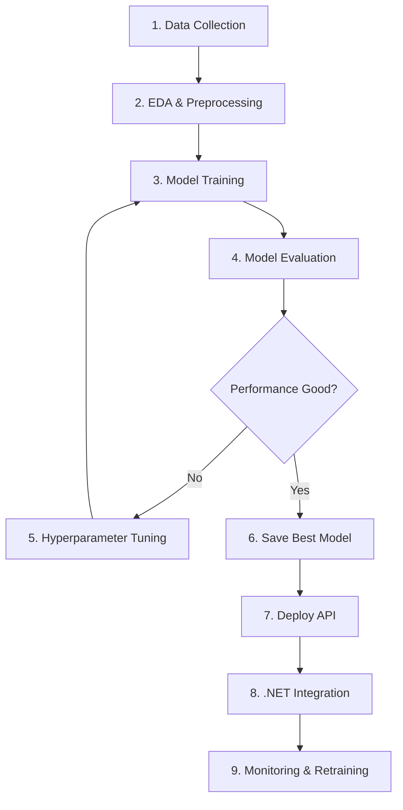

# End-to-End ML Project: Customer Churn Prediction & Deployment

## 📋 Project Overview

**Business Problem**: Một công ty viễn thông muốn dự đoán khách hàng nào sẽ rời khỏi dịch vụ (churn) để có chiến lược retention.

**Project Scope**: Fullflow từ data → train → evaluate → optimize → deploy → production API



---

## 📂 Project Structure

```
end-to-end-project/
├── data/
│   ├── raw/
│   │   └── telecom_churn.csv
│   └── processed/
│       ├── X_train.npy
│       ├── X_test.npy
│       ├── y_train.npy
│       └── y_test.npy
├── notebooks/
│   ├── 01_eda.ipynb
│   └── 02_modeling.ipynb
├── src/
│   ├── data_preprocessing.py
│   ├── train.py
│   ├── evaluate.py
│   └── predict.py
├── models/
│   ├── best_model.pkl
│   ├── scaler.pkl
│   ├── encoder.pkl
│   └── model_metadata.json
├── api/
│   ├── app.py                    # Flask API
│   ├── requirements.txt
│   └── Dockerfile
├── dotnet-client/
│   ├── ChurnPrediction.sln
│   └── ChurnPredictionAPI/
│       ├── Services/
│       │   └── MLPredictionService.cs
│       └── Controllers/
│           └── PredictionController.cs
├── config/
│   └── config.yaml
├── tests/
│   ├── test_preprocessing.py
│   └── test_model.py
├── README.md
├── requirements.txt
└── run_pipeline.py               # Full pipeline script
```

---

## 🚀 PHASE 1: Setup & Data Preparation

### 1.1 Create Project Structure

```bash
# Create directories
mkdir -p end-to-end-project/{data/{raw,processed},notebooks,src,models,api,dotnet-client,config,tests}
cd end-to-end-project
```

### 1.2 Generate Synthetic Dataset

**File: `data/generate_data.py`**

```python
import pandas as pd
import numpy as np

np.random.seed(42)

n_samples = 5000

data = {
    'CustomerID': range(1, n_samples + 1),
    'Age': np.random.randint(18, 70, n_samples),
    'Gender': np.random.choice(['Male', 'Female'], n_samples),
    'Tenure': np.random.randint(1, 72, n_samples),  # months
    'MonthlyCharges': np.random.uniform(20, 150, n_samples),
    'TotalCharges': None,  # Will calculate
    'Contract': np.random.choice(['Month-to-month', 'One year', 'Two year'], n_samples, p=[0.5, 0.3, 0.2]),
    'InternetService': np.random.choice(['DSL', 'Fiber optic', 'No'], n_samples, p=[0.3, 0.4, 0.3]),
    'TechSupport': np.random.choice(['Yes', 'No'], n_samples),
    'OnlineSecurity': np.random.choice(['Yes', 'No'], n_samples),
    'PaymentMethod': np.random.choice(['Electronic check', 'Mailed check', 'Bank transfer', 'Credit card'], n_samples),
    'Churn': None  # Will calculate
}

df = pd.DataFrame(data)

# Calculate TotalCharges
df['TotalCharges'] = df['MonthlyCharges'] * df['Tenure']

# Simulate Churn logic (higher churn for month-to-month, high charges, low tenure)
churn_prob = np.zeros(n_samples)
churn_prob += (df['Contract'] == 'Month-to-month') * 0.4
churn_prob += (df['Tenure'] < 12) * 0.3
churn_prob += (df['MonthlyCharges'] > 100) * 0.2
churn_prob += (df['TechSupport'] == 'No') * 0.15

df['Churn'] = (np.random.random(n_samples) < churn_prob).astype(int)

# Add some missing values (realistic)
df.loc[np.random.choice(df.index, 50), 'TotalCharges'] = np.nan

# Save
df.to_csv('data/raw/telecom_churn.csv', index=False)
print(f"Dataset created: {len(df)} rows, {df['Churn'].sum()} churned customers ({df['Churn'].mean()*100:.1f}%)")
```

**Run**: `python data/generate_data.py`

---

## 📊 PHASE 2: EDA & Preprocessing

### 2.1 Data Preprocessing Module

**File: `src/data_preprocessing.py`**

```python
import pandas as pd
import numpy as np
from sklearn.preprocessing import StandardScaler, LabelEncoder
from sklearn.compose import ColumnTransformer
from sklearn.preprocessing import OneHotEncoder
from sklearn.impute import SimpleImputer
from sklearn.model_selection import train_test_split
import joblib
import json
import os

class DataPreprocessor:
    def __init__(self):
        self.scaler = None
        self.label_encoders = {}
        self.onehot_encoder = None
        self.imputer = None
        self.feature_names = None

    def fit_transform(self, df, target_col='Churn', test_size=0.2):
        """Full preprocessing pipeline"""

        # 1. Separate features and target
        X = df.drop([target_col, 'CustomerID'], axis=1, errors='ignore')
        y = df[target_col]

        print(f"Original shape: {X.shape}")
        print(f"Missing values:\n{X.isnull().sum()}")

        # 2. Identify column types
        numerical_cols = X.select_dtypes(include=['int64', 'float64']).columns.tolist()
        categorical_cols = X.select_dtypes(include=['object']).columns.tolist()

        print(f"\nNumerical columns: {numerical_cols}")
        print(f"Categorical columns: {categorical_cols}")

        # 3. Handle missing values in numerical columns
        self.imputer = SimpleImputer(strategy='median')
        X[numerical_cols] = self.imputer.fit_transform(X[numerical_cols])

        # 4. Encode categorical features
        # Binary categorical → LabelEncoder
        binary_cats = [col for col in categorical_cols
                      if X[col].nunique() == 2]

        for col in binary_cats:
            self.label_encoders[col] = LabelEncoder()
            X[col] = self.label_encoders[col].fit_transform(X[col])

        # Multi-class categorical → OneHotEncoder
        multi_cats = [col for col in categorical_cols
                     if X[col].nunique() > 2]

        if multi_cats:
            self.onehot_encoder = ColumnTransformer(
                transformers=[('onehot', OneHotEncoder(drop='first', sparse=False), multi_cats)],
                remainder='passthrough'
            )
            X_encoded = self.onehot_encoder.fit_transform(X)

            # Get feature names
            onehot_features = self.onehot_encoder.named_transformers_['onehot'].get_feature_names_out(multi_cats)
            other_features = [col for col in X.columns if col not in multi_cats]
            self.feature_names = list(onehot_features) + other_features

            X = pd.DataFrame(X_encoded, columns=self.feature_names)

        # 5. Split train/test
        X_train, X_test, y_train, y_test = train_test_split(
            X, y, test_size=test_size, random_state=42, stratify=y
        )

        print(f"\nTrain set: {X_train.shape}, Churn rate: {y_train.mean():.2%}")
        print(f"Test set: {X_test.shape}, Churn rate: {y_test.mean():.2%}")

        # 6. Feature Scaling
        self.scaler = StandardScaler()
        X_train_scaled = self.scaler.fit_transform(X_train)
        X_test_scaled = self.scaler.transform(X_test)

        return X_train_scaled, X_test_scaled, y_train.values, y_test.values

    def transform(self, df):
        """Transform new data using fitted preprocessor"""
        X = df.drop(['Churn', 'CustomerID'], axis=1, errors='ignore')

        # Impute
        numerical_cols = X.select_dtypes(include=['int64', 'float64']).columns.tolist()
        X[numerical_cols] = self.imputer.transform(X[numerical_cols])

        # Encode categorical
        for col, encoder in self.label_encoders.items():
            if col in X.columns:
                X[col] = encoder.transform(X[col])

        if self.onehot_encoder:
            X_encoded = self.onehot_encoder.transform(X)
            X = pd.DataFrame(X_encoded, columns=self.feature_names)

        # Scale
        X_scaled = self.scaler.transform(X)

        return X_scaled

    def save(self, path='models/'):
        """Save all preprocessing objects"""
        os.makedirs(path, exist_ok=True)
        joblib.dump(self.scaler, f'{path}/scaler.pkl')
        joblib.dump(self.label_encoders, f'{path}/label_encoders.pkl')
        joblib.dump(self.onehot_encoder, f'{path}/onehot_encoder.pkl')
        joblib.dump(self.imputer, f'{path}/imputer.pkl')

        with open(f'{path}/feature_names.json', 'w') as f:
            json.dump(self.feature_names if self.feature_names else [], f)

        print(f"✅ Preprocessing objects saved to {path}")

    @classmethod
    def load(cls, path='models/'):
        """Load preprocessing objects"""
        preprocessor = cls()
        preprocessor.scaler = joblib.load(f'{path}/scaler.pkl')
        preprocessor.label_encoders = joblib.load(f'{path}/label_encoders.pkl')
        preprocessor.onehot_encoder = joblib.load(f'{path}/onehot_encoder.pkl')
        preprocessor.imputer = joblib.load(f'{path}/imputer.pkl')

        with open(f'{path}/feature_names.json', 'r') as f:
            preprocessor.feature_names = json.load(f)

        return preprocessor

# Usage example
if __name__ == '__main__':
    df = pd.read_csv('data/raw/telecom_churn.csv')

    preprocessor = DataPreprocessor()
    X_train, X_test, y_train, y_test = preprocessor.fit_transform(df)

    # Save
    os.makedirs('data/processed', exist_ok=True)
    np.save('data/processed/X_train.npy', X_train)
    np.save('data/processed/X_test.npy', X_test)
    np.save('data/processed/y_train.npy', y_train)
    np.save('data/processed/y_test.npy', y_test)

    preprocessor.save('models/')

    print("\n✅ Data preprocessing complete!")
    print(f"X_train shape: {X_train.shape}")
    print(f"X_test shape: {X_test.shape}")
```

**Run**: `python src/data_preprocessing.py`

---

## 🎯 PHASE 3: Model Training

### 3.1 Training Module

**File: `src/train.py`**

```python
import numpy as np
from sklearn.linear_model import LogisticRegression
from sklearn.ensemble import RandomForestClassifier, GradientBoostingClassifier
from sklearn.svm import SVC
from xgboost import XGBClassifier
from sklearn.model_selection import cross_val_score, GridSearchCV
from sklearn.metrics import classification_report, confusion_matrix, roc_auc_score
import joblib
import json
import time

class ModelTrainer:
    def __init__(self):
        self.models = {}
        self.best_model = None
        self.best_model_name = None
        self.results = {}

    def train_multiple_models(self, X_train, y_train, X_test, y_test):
        """Train and compare multiple models"""

        # Define models
        models_to_train = {
            'Logistic Regression': LogisticRegression(max_iter=1000, random_state=42),
            'Random Forest': RandomForestClassifier(n_estimators=100, random_state=42),
            'Gradient Boosting': GradientBoostingClassifier(n_estimators=100, random_state=42),
            'XGBoost': XGBClassifier(n_estimators=100, random_state=42, use_label_encoder=False, eval_metric='logloss')
        }

        print("="*70)
        print("TRAINING MULTIPLE MODELS")
        print("="*70)

        for name, model in models_to_train.items():
            print(f"\n🔹 Training {name}...")
            start_time = time.time()

            # Train
            model.fit(X_train, y_train)
            train_time = time.time() - start_time

            # Predict
            y_pred = model.predict(X_test)
            y_pred_proba = model.predict_proba(X_test)[:, 1]

            # Evaluate
            train_score = model.score(X_train, y_train)
            test_score = model.score(X_test, y_test)
            roc_auc = roc_auc_score(y_test, y_pred_proba)

            # Cross-validation
            cv_scores = cross_val_score(model, X_train, y_train, cv=5, scoring='accuracy')

            # Store results
            self.models[name] = model
            self.results[name] = {
                'train_accuracy': train_score,
                'test_accuracy': test_score,
                'roc_auc': roc_auc,
                'cv_mean': cv_scores.mean(),
                'cv_std': cv_scores.std(),
                'train_time': train_time
            }

            print(f"   Train Accuracy: {train_score:.4f}")
            print(f"   Test Accuracy: {test_score:.4f}")
            print(f"   ROC-AUC: {roc_auc:.4f}")
            print(f"   CV Score: {cv_scores.mean():.4f} ± {cv_scores.std():.4f}")
            print(f"   Training Time: {train_time:.2f}s")

        # Select best model based on ROC-AUC
        self.best_model_name = max(self.results, key=lambda k: self.results[k]['roc_auc'])
        self.best_model = self.models[self.best_model_name]

        print("\n" + "="*70)
        print(f"🏆 BEST MODEL: {self.best_model_name}")
        print(f"   ROC-AUC: {self.results[self.best_model_name]['roc_auc']:.4f}")
        print("="*70)

        return self.best_model

    def hyperparameter_tuning(self, X_train, y_train):
        """Tune best model hyperparameters"""

        print(f"\n🔧 Hyperparameter Tuning for {self.best_model_name}...")

        if self.best_model_name == 'XGBoost':
            param_grid = {
                'n_estimators': [100, 200, 300],
                'max_depth': [3, 5, 7],
                'learning_rate': [0.01, 0.1, 0.3],
                'subsample': [0.8, 1.0]
            }
            base_model = XGBClassifier(random_state=42, use_label_encoder=False, eval_metric='logloss')

        elif self.best_model_name == 'Random Forest':
            param_grid = {
                'n_estimators': [100, 200, 300],
                'max_depth': [10, 20, None],
                'min_samples_split': [2, 5, 10]
            }
            base_model = RandomForestClassifier(random_state=42)
        else:
            print("   No tuning defined for this model")
            return self.best_model

        grid_search = GridSearchCV(
            base_model, param_grid,
            cv=5, scoring='roc_auc',
            n_jobs=-1, verbose=1
        )

        grid_search.fit(X_train, y_train)

        print(f"\n   Best params: {grid_search.best_params_}")
        print(f"   Best CV ROC-AUC: {grid_search.best_score_:.4f}")

        self.best_model = grid_search.best_estimator_

        return self.best_model

    def save_model(self, path='models/'):
        """Save best model and metadata"""
        joblib.dump(self.best_model, f'{path}/best_model.pkl')

        metadata = {
            'model_name': self.best_model_name,
            'model_params': str(self.best_model.get_params()),
            'results': self.results
        }

        with open(f'{path}/model_metadata.json', 'w') as f:
            json.dump(metadata, f, indent=2)

        print(f"\n✅ Model saved to {path}/best_model.pkl")

# Usage
if __name__ == '__main__':
    # Load data
    X_train = np.load('data/processed/X_train.npy')
    X_test = np.load('data/processed/X_test.npy')
    y_train = np.load('data/processed/y_train.npy')
    y_test = np.load('data/processed/y_test.npy')

    # Train
    trainer = ModelTrainer()
    trainer.train_multiple_models(X_train, y_train, X_test, y_test)

    # Tune (optional - comment out if slow)
    # trainer.hyperparameter_tuning(X_train, y_train)

    # Save
    trainer.save_model()
```

**Run**: `python src/train.py`

---

_Tiếp tục phần 2 với Evaluation, Deployment, và .NET Integration..._
